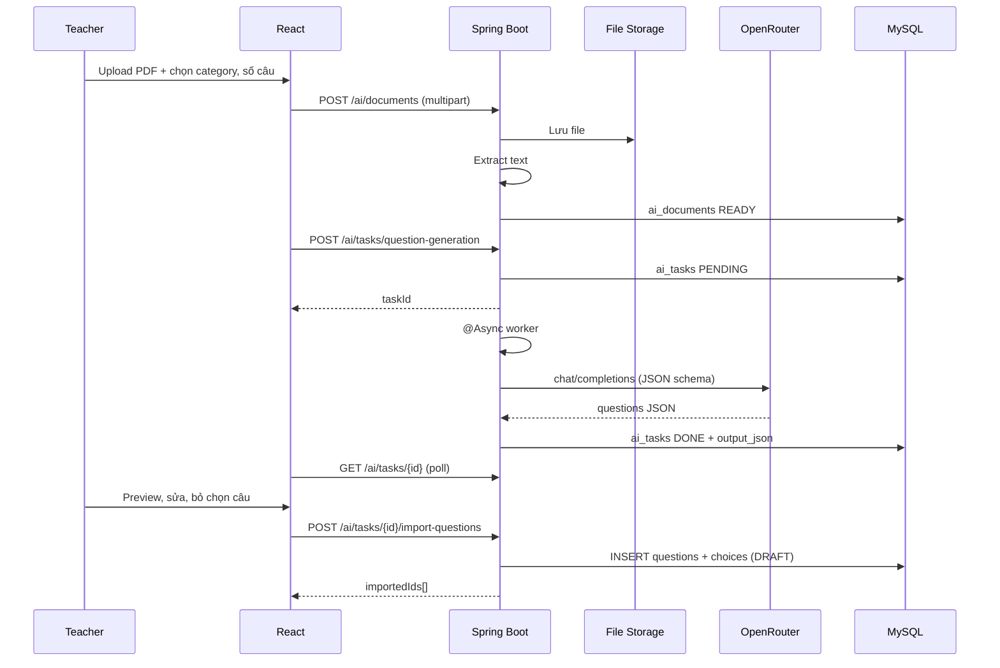

# Kế hoạch tích hợp AI (OpenRouter) — Course English LMS

> Cập nhật: **23/06/2026**  
> Tham chiếu ý tưởng: `promt.md` (AI-first LMS vision)  
> Repo: `course_english_backend` + `course_english_frontend`  
> LLM gateway: [OpenRouter](https://openrouter.ai/) — API key **chỉ** trên backend  

---

## Mục tiêu sản phẩm

Biến AI thành **lợi thế cạnh tranh** cho trung tâm tiếng Anh — không clone ChatGPT generic, mà gắn chặt LMS:

| Đối tượng | Giá trị cốt lõi |
|-----------|-----------------|
| Giáo viên | Upload tài liệu → sinh câu hỏi → preview → import ngân hàng đề (human-in-the-loop) |
| Giáo viên | Chat AI có ngữ cảnh (grammar, lesson plan, giải thích bài) |
| Học sinh | (Phase sau) Coach ngữ pháp / ôn tập gắn lesson đang học |
| Admin | Bật/tắt AI, quota token, theo dõi chi phí |

**Nguyên tắc kỹ thuật:**

```
React  →  Spring Boot  →  OpenRouter
              ↑
        JWT auth, quota, prompt, persist DB
```

- Mỗi tin nhắn = **1 bản ghi** `ai_messages` (user / assistant tách dòng).
- Load chat = **phân trang** (không load cả thread).
- Nội dung gen nặng (JSON 50 câu hỏi) → `ai_tasks.output_json`, bubble chat chỉ hiện summary + link preview.
- Gửi context cho LLM: **10–20 tin gần nhất**, không đọc full lịch sử DB.

---

## Baseline hiện tại (tận dụng)

| Đã có | Dùng cho AI |
|-------|-------------|
| `Question`, `QuestionChoice`, `QuestionCategory`, `QuestionTypeEnum` | Import output AI |
| `QuestionController` + `ManageQuestionsPage` | Mở rộng flow import |
| `apiUploadFile` + file storage | Upload PDF/DOCX/ảnh |
| `LessonSlideImportServiceImpl` + `PdfRenderService` | Tham khảo extract PDF |
| `SystemConfig` + `SystemConfigKeyEnum` | Feature flag, model name, quota |
| Google JWT auth, role admin/teacher/student | Phân quyền API AI |

| Chưa có |
|---------|
| Module `ai` (entity, service, controller) |
| OpenRouter client |
| UI AI Assistant |
| Async job queue (có thể dùng `@Async` + DB task trước, Redis/Rabbit sau) |

---

## Tổng quan các Phase

| Phase | Thời gian ước tính | Mục tiêu | Đối tượng |
|-------|-------------------|----------|-----------|
| **Phase 1** | 1–2 tuần | Nền AI: chat streaming, lưu hội thoại, quota cơ bản | Admin / Teacher |
| **Phase 2** | 2–3 tuần | Killer flow: PDF/Word → sinh câu hỏi → preview → import Question Bank | Teacher |
| **Phase 3** | 1–2 tháng | AI có context LMS + quick actions + attach file/ảnh | Teacher + Student |
| **Phase 4** | 2–4 tháng | Exam generator, writing feedback, personalization, RAG (nếu cần) | Toàn platform |

**Thứ tự ưu tiên:** Phase 1 (nền) → Phase 2 (giá trị nghiệp vụ rõ nhất) → Phase 3 → Phase 4.

---

## Phase 1 — Trạng thái triển khai (cập nhật 23/06/2026)

**Đã hoàn thành (commit Phase 1):**

| Hạng mục | Ghi chú |
|----------|---------|
| Entity + API chat | `ai_conversations`, `ai_messages`, OpenRouter sync + **SSE stream** |
| LinguistAI UI | Trang `/admin/ai-assistant` + widget FAB |
| Markdown | `react-markdown` + `remark-gfm` cho tin assistant |
| System prompt | `.env` `AI_SYSTEM_PROMPT`, mặc định xưng "cô" |
| Quota | `AI_DAILY_REQUEST_LIMIT` — đếm tin USER/ngày |
| Thống kê token | `GET /api/v1/ai/usage/stats` — dashboard admin toàn hệ thống |
| **Đổi tên / xóa hội thoại** | `PATCH` + `DELETE` `/api/v1/ai/conversations/{id}` (soft delete) |

**Defer sang Phase 1.1 / Phase 2:**

| Hạng mục | Ghi chú |
|----------|---------|
| FE scroll load-more tin | BE `before`/`hasMore` sẵn; FE chưa nối |
| `AI_ENABLED` ẩn menu/FAB | BE check; FE chưa ẩn entry |
| Unit test quota/pagination | Chưa viết |
| Tối ưu context token (§1.11) | Khi chat dài / pilot mở rộng |
| Admin UI chỉnh prompt (§1.12) | Env đủ cho dev |

**Tiếp theo:** Phase 2 — PDF/Word → sinh câu hỏi → import Question Bank.

---

# PHASE 1 — Nền AI & Chat Assistant (chi tiết)

## 1.1 Mục tiêu Phase 1

Sau Phase 1, **teacher/admin** có thể:

1. Mở trang **AI Assistant** trong admin workspace.
2. Tạo cuộc hội thoại mới, chat tiếng Anh / tiếng Việt.
3. Nhận phản hồi **streaming** (SSE) giống ChatGPT.
4. Xem lại lịch sử chat (phân trang).
5. Bị giới hạn quota ngày (tránh tốn token OpenRouter).

**Chưa làm trong Phase 1:** upload file, sinh câu hỏi, import bank, student UI.

---

## 1.2 Phạm vi tính năng

### Trong phạm vi

- Entity + API: `ai_conversations`, `ai_messages`
- `OpenRouterClient` (chat + stream)
- `AiConversationController`, `AiMessageController`
- Config: API key, default model, timeout
- Quota: N request / user / ngày (hard limit)
- FE: layout chat (sidebar conversations + message list + input)
- Markdown render cho assistant message

### Ngoài phạm vi (defer Phase 2+)

| Tính năng | Phase |
|-----------|-------|
| Upload PDF / sinh câu hỏi | 2 |
| `ai_documents`, `ai_tasks` | 2 |
| Quick actions (grammar, lesson plan) | 3 |
| Student-facing chat | 3 |
| Vector DB / RAG | 4 |
| Redis cache | Khi > 100 users |

---

## 1.3 Data model

### `ai_conversations`

Kế thừa `BaseObject`.

| Cột | Kiểu | Bắt buộc | Mô tả |
|-----|------|----------|-------|
| `user_id` | UUID | ✓ | Chủ conversation |
| `title` | VARCHAR(255) | — | Auto từ tin đầu hoặc user đặt |
| `context_type` | VARCHAR(32) | — | `GENERAL` (mặc định); sau: `LESSON`, `CLASSROOM` |
| `context_id` | UUID | — | FK mềm tới entity LMS |
| `last_message_at` | TIMESTAMPTZ | — | Sort sidebar |
| `message_count` | INT | — | Denormalize, optional |

Index: `(user_id, last_message_at DESC)`.

### `ai_messages`

| Cột | Kiểu | Bắt buộc | Mô tả |
|-----|------|----------|-------|
| `conversation_id` | UUID | ✓ | FK → `ai_conversations` |
| `role` | ENUM | ✓ | `USER`, `ASSISTANT`, `SYSTEM` |
| `content_type` | VARCHAR(32) | ✓ | `TEXT`, `MARKDOWN` (Phase 1); `ARTIFACT_REF` (Phase 2) |
| `content` | TEXT | ✓ | Nội dung hiển thị chat (giữ ngắn) |
| `content_preview` | VARCHAR(300) | — | Preview cho list |
| `model` | VARCHAR(64) | — | Model OpenRouter đã dùng |
| `prompt_tokens` | INT | — | Từ response OpenRouter |
| `completion_tokens` | INT | — | |
| `artifact_task_id` | UUID | — | Phase 2: FK `ai_tasks` |
| `status` | VARCHAR(20) | ✓ | `COMPLETED`, `FAILED`, `STREAMING` |

Index: `(conversation_id, created_at DESC)`.

**Quy ước lưu:** mỗi lần user gửi = 1 row `USER`; mỗi lần AI trả lời = 1 row `ASSISTANT`.

---

## 1.4 System config (Phase 1)

Thêm key vào `SystemConfigKeyEnum` (hoặc `application.yml` cho dev):

| Key | Mô tả | Ví dụ |
|-----|-------|-------|
| `AI_ENABLED` | Bật/tắt toàn module | `true` |
| `AI_OPENROUTER_API_KEY` | Secret (env override) | — |
| `AI_DEFAULT_CHAT_MODEL` | Model chat | `google/gemini-2.0-flash-001` |
| `AI_DAILY_REQUEST_LIMIT` | Max request/user/ngày | `50` |
| `AI_MAX_CONTEXT_MESSAGES` | Số tin gửi lại LLM | `20` |
| `AI_REQUEST_TIMEOUT_SEC` | Timeout HTTP | `120` |

---

## 1.5 Backend — cấu trúc package

```
com.courseenglish.api
├── domain
│   ├── AiConversation.java
│   └── AiMessage.java
├── repository
│   ├── AiConversationRepository.java
│   └── AiMessageRepository.java
├── service
│   ├── AiConversationService.java
│   ├── AiChatService.java
│   ├── AiUsageQuotaService.java
│   └── impl/
├── integration
│   └── openrouter
│       ├── OpenRouterClient.java
│       ├── OpenRouterProperties.java
│       └── dto/
└── controller
    └── AiConversationController.java
```

### `OpenRouterClient`

- `POST https://openrouter.ai/api/v1/chat/completions`
- Header: `Authorization: Bearer {key}`, `HTTP-Referer`, `X-Title` (theo policy OpenRouter)
- Hỗ trợ `stream: true` → map sang `Flux<String>` hoặc SSE emitter

### `AiChatService.sendMessage(conversationId, userId, content)`

1. Check `AI_ENABLED`, quota.
2. `INSERT ai_messages` (USER).
3. Load **N tin gần nhất** (`AI_MAX_CONTEXT_MESSAGES`) + system prompt EdTech.
4. Gọi OpenRouter stream.
5. Stream chunk về client; khi xong `INSERT ai_messages` (ASSISTANT) + token count.
6. Update `ai_conversations.last_message_at`, `title` (nếu tin đầu).

**System prompt (gợi ý):** trợ lý tiếng Anh cho giáo viên trung tâm Anh ngữ; trả lời rõ ràng; không bịa nội dung giáo trình.

---

## 1.6 API contract (Phase 1)

Base: `/api/v1/ai`

| Method | Path | Mô tả |
|--------|------|-------|
| `GET` | `/conversations` | List của user hiện tại. Query: `page`, `size` |
| `POST` | `/conversations` | Tạo mới. Body: `{ title?, contextType?, contextId? }` |
| `GET` | `/conversations/{id}` | Chi tiết (không kèm full messages) |
| `PATCH` | `/conversations/{id}` | Đổi title. Body: `{ title }` — **đã implement** |
| `DELETE` | `/conversations/{id}` | Soft delete (`voided`) — **đã implement** |
| `GET` | `/conversations/{id}/messages` | Phân trang. Query: `limit` (default 30), `before` (message UUID) |
| `POST` | `/conversations/{id}/messages` | Gửi tin (sync fallback) |
| `POST` | `/conversations/{id}/messages/stream` | Gửi tin + **SSE stream** |
| `GET` | `/usage/stats` | Thống kê token toàn hệ thống (admin/teacher) |

### `GET .../messages` — pagination

```
GET /api/v1/ai/conversations/{id}/messages?limit=30&before={oldestLoadedMessageId}
```

Response:

```json
{
  "items": [
    {
      "id": "uuid",
      "role": "USER",
      "contentType": "TEXT",
      "content": "Hôm nay ăn gì?",
      "createdAt": "2026-06-22T10:00:00Z"
    },
    {
      "id": "uuid",
      "role": "ASSISTANT",
      "contentType": "MARKDOWN",
      "content": "Bạn có thể ăn cơm kèm rau...",
      "model": "google/gemini-2.0-flash-001",
      "createdAt": "2026-06-22T10:00:05Z"
    }
  ],
  "hasMore": true,
  "nextBefore": "uuid-oldest-in-page"
}
```

- Lần đầu mở chat: không truyền `before` → lấy **30 tin mới nhất**.
- Scroll lên: truyền `before` = id tin cũ nhất đang hiển thị.

### `POST .../messages` — streaming

Request:

```json
{ "content": "Giải thích Present Perfect cho học sinh lớp 8" }
```

Response: `Content-Type: text/event-stream`

```
event: chunk
data: {"delta":"Present"}

event: chunk
data: {"delta":" Perfect is..."}

event: done
data: {"messageId":"uuid","promptTokens":120,"completionTokens":340}
```

Lỗi quota / AI tắt:

```json
{ "statusCode": 429, "message": "Đã hết lượt AI hôm nay" }
```

---

## 1.7 Frontend (Phase 1)

### Route & menu

| Item | Giá trị |
|------|---------|
| Path | `/admin/ai-assistant` |
| Constant | `paths.AI_ASSISTANT` |
| Menu | Admin sidebar — **AI Assistant** (icon SmartToy hoặc tương đương) |
| Role | `ADMIN`, `TEACHER` (chưa mở student) |

### Cấu trúc file gợi ý

```
src/
├── pages/admin/AiAssistantPage.tsx
├── admin/components/ai/
│   ├── AiConversationSidebar.tsx
│   ├── AiMessageList.tsx
│   ├── AiMessageBubble.tsx
│   ├── AiChatInput.tsx
│   └── useAiChatStream.ts
├── shared/api/ai.ts
└── styles/admin-ai-assistant.css
```

### UX

- Layout 2 cột: trái danh sách conversation, phải chat.
- Tin assistant: render Markdown (`react-markdown`).
- Streaming: append delta vào bubble cuối; khi `done` finalize.
- Scroll lên đầu list → load `before` (prepend, giữ scroll position).
- Empty state: gợi ý prompt (“Giải thích cấu trúc If clause type 1”, “Soạn outline bài Speaking 5 phút”).

---

## 1.8 Acceptance criteria — Phase 1

| # | Tiêu chí | Pass khi |
|---|----------|----------|
| AC1 | Chat streaming | User gửi tin → thấy chữ hiện dần trong < 3s (mạng ổn) |
| AC2 | Lưu lịch sử | F5 trang → conversation + messages load lại đúng |
| AC3 | Phân trang | Conversation > 40 tin → mở chat chỉ load 30 tin; scroll lên load thêm |
| AC4 | Quota | Vượt `AI_DAILY_REQUEST_LIMIT` → 429 + message tiếng Việt |
| AC5 | Bảo mật | API key không có trong FE bundle; user A không đọc conversation user B |
| AC6 | Feature flag | `AI_ENABLED=false` → menu ẩn hoặc thông báo tắt |

---

## 1.9 Checklist triển khai Phase 1

### Backend (tuần 1)

- [x] Entity `AiConversation`, `AiMessage` + repository
- [x] `OpenRouterClient` (sync + stream + `include_usage`)
- [x] Quota đếm tin USER/ngày trong `AiChatServiceImpl`
- [x] `AiChatService` + `AiConversationController` + SSE endpoint
- [x] `PATCH` / `DELETE` conversation
- [x] `GET /ai/usage/stats` — thống kê token hệ thống
- [x] Env `OPENROUTER_API_KEY`, `AI_SYSTEM_PROMPT`
- [ ] Unit test: quota, pagination query

### Frontend (tuần 2)

- [x] `shared/api/ai.ts` + `useAiChat` (fetch SSE stream)
- [x] `AiAssistantPage` + widget FAB + markdown
- [x] Route + sidebar + CSS
- [x] Đổi tên / xóa hội thoại (sidebar)
- [x] Dashboard thống kê AI (`AiUsageDashboardSection`)
- [ ] Scroll load-more tin (`before`)
- [ ] `AI_ENABLED` ẩn menu/FAB
- [ ] Manual test với 2 user, 50+ tin trong 1 conversation

---

## 1.10 Rủi ro Phase 1

| Rủi ro | Giảm thiểu |
|--------|------------|
| OpenRouter timeout | Timeout config; hiện “Thử lại” trên FE |
| SSE qua proxy | Dev: CRA proxy; prod: nginx `proxy_buffering off` cho `/messages` |
| Chi phí token | Quota cứng Phase 1; log `prompt_tokens` / `completion_tokens` |
| Message quá dài | Giới hạn input FE 8KB; backend validate `content.length` |

---

## 1.11 Tối ưu message / context — **defer** (ghi nhận, chưa làm)

> Quyết định: **giữ history** khi gọi OpenRouter (model stateless cần context).  
> Phase 1 chấp nhận convention đơn giản; tối ưu token/cost khi chat dài hoặc pilot mở rộng.

### Hiện trạng Phase 1 (đã implement)

| Hạng mục | Cách làm |
|----------|----------|
| Lưu DB | 1 tin = 1 row (`USER` / `ASSISTANT`), phân trang khi load UI |
| Gửi OpenRouter | `system` + tối đa `AI_MAX_CONTEXT_MESSAGES` (20) cặp tin gần nhất + tin user hiện tại |
| Lỗi AI (429…) | Chỉ lưu DB khi AI trả lời thành công; lọc tin user lẻ khi build context |
| Artifact nặng | Chưa có (Phase 2: JSON câu hỏi → `ai_tasks`, không nhét vào bubble) |

### Vì sao có thể “nặng” sau này

- Mỗi request gửi lại N tin cũ → **token tăng tuyến tính** theo độ dài hội thoại.
- Assistant trả lời dài (giải thích grammar, sinh draft) → context request sau càng phình.
- System prompt cố định mỗi lần gọi (~30–50 token) — nhỏ nhưng lặp mọi request.

### Backlog tối ưu (ưu tiên khi cần)

| # | Hạng mục | Mô tả | Khi làm |
|---|----------|-------|---------|
| O1 | **Conversation summary** | Cột `ai_conversations.summary`; sau ~15–20 tin, AI tóm tắt 1 đoạn; prompt = summary + 5–10 tin gần nhất | Chat > 30 tin / user |
| O2 | **Sliding window có cấu hình** | Giảm `AI_MAX_CONTEXT_MESSAGES` theo role (student 10, teacher 20) | Pilot 15+ user |
| O3 | **Truncate content trong context** | Gửi LLM: assistant message > 2KB → cắt + `...`; DB vẫn full | Response AI thường dài |
| O4 | **Artifact tách khỏi context** | Tin `ARTIFACT_REF` không đưa JSON vào prompt; chỉ summary 1 dòng | Phase 2 |
| O5 | **Token budget guard** | Trước khi gọi API: ước lượng token; drop tin cũ nhất cho đến khi < budget | Cost control |
| O6 | **Streaming SSE** | Phase 1 sync; stream giảm perceived latency, không giảm token | UX polish |
| O7 | **Dọn UI history orphan** | Script/API void tin user lẻ còn sót từ giai đoạn dev | One-time cleanup |

### Nguyên tắc giữ khi tối ưu

```
DB (MySQL)     = lưu FULL lịch sử — không cắt
OpenRouter     = gửi SUBSET thông minh — summary + window + truncate
UI             = phân trang — không load hết
```

**Không** chuyển sang “chỉ gửi 1 tin” — mất multi-turn chat.

---

## 1.12 System prompt & message roles — **defer** (ghi nhận, có thể sửa sau)

> Phase 1: system prompt **hard-code** trong backend. Sau này có thể đưa ra `.env`, `system_configs`, hoặc file prompt riêng để admin/teacher tùy chỉnh brand & nghiệp vụ.

### Vị trí code hiện tại

| Thành phần | File | Ghi chú |
|------------|------|---------|
| System prompt | `AiChatServiceImpl.buildHistoryPayload()` | Inject mỗi request, **không lưu DB** |
| Enum role | `AiMessageRoleEnum` | `USER`, `ASSISTANT`, `SYSTEM` |
| Entity | `AiMessage.role` | DB chỉ lưu `USER` / `ASSISTANT` (Phase 1) |

### System prompt Phase 1 (tạm thời)

```
You are an English learning assistant for teachers and students.
Answer clearly, practical, and do not fabricate lesson facts.
```

Model trả lời theo vai trợ lý EdTech (vocabulary, grammar, lesson plan…) vì prompt này — **không** phải model “biết” LMS từ DB.

### Ba role — phân vai

| Role | Nguồn | Lưu `ai_messages`? | Gửi OpenRouter? |
|------|-------|-------------------|-----------------|
| `system` | Backend hard-code | ❌ | ✅ Luôn ở đầu payload |
| `user` | Người dùng chat | ✅ | ✅ History + tin hiện tại |
| `assistant` | Model trả lời | ✅ | ✅ History |

**Lưu ý:** Tên persona (vd. model tự gọi “OWL”) **không** có trong prompt — model tự đặt; nếu cần brand cố định thì ghi rõ trong system prompt sau này.

### Backlog refactor prompt (chưa làm)

| # | Hạng mục | Mô tả |
|---|----------|-------|
| P1 | **Env `AI_SYSTEM_PROMPT`** | Đổi prompt không cần rebuild (dev/staging) |
| P2 | **`system_configs` / admin UI** | GV/admin chỉnh tone, ngôn ngữ, phạm vi trả lời |
| P3 | **Prompt theo context** | `context_type` = `LESSON` / `CLASSROOM` → prompt khác nhau |
| P4 | **Prompt registry** | File `prompts/ai-chat-system.txt`, `ai-question-gen.txt` tách riêng |
| P5 | **Lưu system vào DB** (optional) | Chỉ khi cần audit/version prompt — thường không cần |

### Hướng mong muốn (khi làm P1–P3)

- Tên assistant: **Course English** (hoặc tên trung tâm)
- Phân biệt teacher vs student trong prompt khi mở student chat (Phase 3)
- Tiếng Việt / tiếng Anh: trả lời theo ngôn ngữ user hoặc config

---

# PHASE 2 — PDF/Word → Question Bank (chi tiết)

## 2.1 Mục tiêu Phase 2

**Killer flow cho giáo viên:**

```
Upload PDF hoặc Word
  → Extract text
  → AI sinh câu hỏi (JSON có cấu trúc)
  → Preview / sửa / xóa từng câu
  → Import vào Question Bank (status DRAFT)
  → Teacher publish từ Manage Questions
```

Đây là differentiation so với Moodle/Canvas — gắn trực tiếp entity `Question` đã có.

---

## 2.2 Phạm vi tính năng

### Trong phạm vi

- Bảng `ai_documents`, `ai_tasks`
- Upload PDF (.pdf), Word (.docx) — tối đa theo config (vd. 20 trang / 10MB)
- Extract text: PDFBox / Apache POI (đã có kinh nghiệm PDF từ slide import)
- Task async: `QUESTION_GENERATION`
- Prompt structured JSON → map `QuestionTypeEnum` + `QuestionChoice`
- UI preview table + bulk import
- Message chat kiểu `ARTIFACT_REF` (“Đã sinh 25 câu — Xem preview”) — tùy chọn gắn Phase 1 chat hoặc wizard riêng

### Ngoài phạm vi

| Tính năng | Phase |
|-----------|-------|
| OCR ảnh scan chất lượng thấp | 3 (vision model) |
| Import trực tiếp vào Lesson block | 3 |
| Sinh đề thi full (exam paper) | 4 |
| Auto publish không review | Không — luôn human review |

---

## 2.3 Data model (bổ sung)

### `ai_documents`

| Cột | Kiểu | Mô tả |
|-----|------|-------|
| `user_id` | UUID | Người upload |
| `file_name` | VARCHAR(255) | Tên gốc |
| `mime_type` | VARCHAR(64) | `application/pdf`, `application/vnd...docx` |
| `storage_folder` | VARCHAR(128) | Folder storage hiện có |
| `storage_file_name` | VARCHAR(255) | |
| `file_size_bytes` | BIGINT | |
| `page_count` | INT | PDF |
| `extracted_text` | LONGTEXT | Text đã extract (chunk nếu quá dài) |
| `status` | ENUM | `UPLOADED`, `EXTRACTING`, `READY`, `FAILED` |
| `error_message` | TEXT | |

### `ai_tasks`

| Cột | Kiểu | Mô tả |
|-----|------|-------|
| `user_id` | UUID | |
| `conversation_id` | UUID | Nullable — nếu trigger từ chat |
| `document_id` | UUID | Nullable — nếu từ file |
| `task_type` | ENUM | `QUESTION_GENERATION` |
| `status` | ENUM | `PENDING`, `PROCESSING`, `DONE`, `FAILED` |
| `input_json` | TEXT | `{ categoryId, questionTypes[], count, difficulty, language }` |
| `output_json` | LONGTEXT | Mảng câu hỏi draft |
| `model` | VARCHAR(64) | Model sinh câu (mạnh hơn chat) |
| `prompt_tokens` | INT | |
| `completion_tokens` | INT | |
| `error_message` | TEXT | |
| `started_at`, `finished_at` | TIMESTAMPTZ | |

### Output JSON schema (draft question)

```json
{
  "questions": [
    {
      "tempId": "q1",
      "questionType": "MULTIPLE_CHOICE",
      "promptText": "Choose the correct answer: She ___ to school every day.",
      "promptLang": "en",
      "explanation": "Present simple for habits.",
      "difficulty": 2,
      "choices": [
        { "text": "go", "isCorrect": false },
        { "text": "goes", "isCorrect": true },
        { "text": "going", "isCorrect": false }
      ],
      "selected": true
    }
  ],
  "meta": {
    "sourcePageRange": "1-3",
    "model": "anthropic/claude-3.5-sonnet"
  }
}
```

Chỉ hỗ trợ Phase 2: `MULTIPLE_CHOICE`, `TRUE_FALSE`, `FILL_BLANK` — mở rộng type sau.

---

## 2.4 Luồng nghiệp vụ



**Vì sao async:** PDF 15 trang + sinh 30 câu có thể 30–90s — không block HTTP.

**Polling:** FE poll mỗi 2s, tối đa 3 phút; sau đó hiện “Xử lý lâu, thử lại sau”.

---

## 2.5 Backend services

```
com.courseenglish.api
├── service
│   ├── AiDocumentService.java       // upload, extract
│   ├── AiTaskService.java           // create, poll, cancel
│   ├── AiQuestionGenerationService.java
│   ├── DocumentTextExtractor.java   // PDF + DOCX
│   └── AiQuestionImportService.java // map → Question entity
├── worker
│   └── AiTaskWorker.java            // @Async PROCESSING
└── controller
    ├── AiDocumentController.java
    └── AiTaskController.java
```

### `DocumentTextExtractor`

- PDF: Apache PDFBox `PDFTextStripper`
- DOCX: Apache POI `XWPFDocument`
- Giới hạn: `AI_MAX_DOCUMENT_PAGES` (config, default 20)
- Nếu text > 100KB: chỉ gửi LLM **chunk đầu** + cảnh báo “chỉ xử lý N trang đầu” (Phase 2); full chunking Phase 4

### `AiQuestionGenerationService`

- Model gợi ý: `anthropic/claude-3.5-sonnet` hoặc `openai/gpt-4o` (config `AI_QUESTION_GEN_MODEL`)
- Prompt: system + user (extracted text + params)
- **Bắt buộc** parse JSON + validate schema trước lưu `output_json`
- Retry 1 lần nếu JSON invalid

### `AiQuestionImportService`

- Input: `taskId` + list `tempId` được chọn
- Map → `ReqQuestionDTO` / `QuestionService.create`
- `status = DRAFT` (đã có `QuestionStatusEnum`)
- Gắn `category_id` từ `input_json`
- Transaction: all or nothing per batch

---

## 2.6 API contract (Phase 2)

Base: `/api/v1/ai`

| Method | Path | Mô tả |
|--------|------|-------|
| `POST` | `/documents` | Multipart: `file`, optional `conversationId` |
| `GET` | `/documents/{id}` | Metadata + `status` (không trả full `extracted_text` mặc định) |
| `POST` | `/tasks/question-generation` | Body bên dưới |
| `GET` | `/tasks/{id}` | Status + `outputJson` khi DONE |
| `POST` | `/tasks/{id}/import-questions` | Import các câu đã chọn |
| `DELETE` | `/tasks/{id}` | Hủy nếu PENDING |

### `POST /tasks/question-generation`

```json
{
  "documentId": "uuid",
  "categoryId": "uuid",
  "questionCount": 20,
  "questionTypes": ["MULTIPLE_CHOICE", "TRUE_FALSE"],
  "difficulty": 2,
  "promptLang": "en",
  "conversationId": null
}
```

Response `202`:

```json
{
  "taskId": "uuid",
  "status": "PENDING"
}
```

### `POST /tasks/{id}/import-questions`

```json
{
  "selectedTempIds": ["q1", "q3", "q5"],
  "overrides": {
    "q3": { "promptText": "Sửa lại stem câu hỏi..." }
  }
}
```

Response:

```json
{
  "importedCount": 3,
  "questionIds": ["uuid", "uuid", "uuid"],
  "skipped": []
}
```

---

## 2.7 Frontend (Phase 2)

### Entry points

1. **Trang riêng (khuyến nghị MVP):** `/admin/ai-question-import` — wizard 4 bước.
2. **Tùy chọn:** nút “Import bằng AI” trên `ManageQuestionsPage`.

### Wizard steps

| Bước | UI |
|------|-----|
| 1. Upload | Drag-drop PDF/DOCX; hiện page count sau upload |
| 2. Cấu hình | Category, số câu (5–50), loại câu, độ khó |
| 3. Processing | Progress spinner + poll task |
| 4. Preview | Table: stem, choices, checkbox chọn, inline edit, nút Import |

### Component gợi ý

```
src/pages/admin/AiQuestionImportPage.tsx
src/admin/components/ai/
├── AiDocumentUploadStep.tsx
├── AiQuestionGenConfigStep.tsx
├── AiTaskProgressStep.tsx
├── AiQuestionPreviewTable.tsx
└── aiQuestionImportUtils.ts
```

### Preview table columns

- Chọn (checkbox)
- Loại câu
- Stem (`promptText`)
- Đáp án đúng (highlight)
- Explanation (collapse)
- Sửa nhanh (dialog)

Sau import thành công → link “Mở ngân hàng câu hỏi” filter `status=DRAFT`.

---

## 2.8 Prompt engineering (Phase 2)

**System prompt (tóm tắt):**

- Bạn là chuyên gia biên soạn đề tiếng Anh cho trung tâm.
- Chỉ trả về JSON hợp lệ theo schema.
- Câu hỏi phải bám nội dung tài liệu, không bịa fact.
- Mỗi MULTIPLE_CHOICE: đúng 1 đáp án đúng, 3–4 lựa chọn.
- Ngôn ngữ stem theo `promptLang`.
- Độ khó 1–5 theo CEFR gợi ý.

**User prompt template:**

```
Document excerpt:
---
{extractedText}
---

Generate {questionCount} questions.
Types: {questionTypes}
Difficulty: {difficulty}
Category context: {categoryName}

Return JSON only.
```

---

## 2.9 System config (bổ sung Phase 2)

| Key | Mô tả | Default |
|-----|-------|---------|
| `AI_QUESTION_GEN_MODEL` | Model sinh câu | `anthropic/claude-3.5-sonnet` |
| `AI_MAX_DOCUMENT_MB` | Max file | `10` |
| `AI_MAX_DOCUMENT_PAGES` | Max trang extract | `20` |
| `AI_MAX_QUESTIONS_PER_TASK` | Max câu / lần | `50` |
| `AI_DAILY_GEN_TASK_LIMIT` | Max task sinh câu / user / ngày | `5` |

---

## 2.10 Acceptance criteria — Phase 2

| # | Tiêu chí | Pass khi |
|---|----------|----------|
| AC1 | Upload PDF 5 trang | Extract text thành công, status READY |
| AC2 | Sinh 15 câu MCQ | Task DONE trong < 2 phút (model ổn định) |
| AC3 | Preview | Teacher sửa stem, bỏ chọn 3 câu, import 12 câu |
| AC4 | Import | 12 `questions` DRAFT + `question_choices` đúng trong DB |
| AC5 | Validation | JSON lỗi từ AI → task FAILED, không import rác |
| AC6 | Manage Questions | Câu import hiện trong search filter DRAFT |
| AC7 | Không lag chat | `output_json` không nằm trong `ai_messages.content` — chỉ summary |

---

## 2.11 Checklist triển khai Phase 2

### Backend

- [ ] Entity `AiDocument`, `AiTask`
- [ ] `DocumentTextExtractor` (PDF + DOCX)
- [ ] `AiDocumentController`, `AiTaskController`
- [ ] `AiQuestionGenerationService` + prompt template
- [ ] `AiTaskWorker` (@Async)
- [ ] `AiQuestionImportService` → `QuestionService`
- [ ] Config limits + daily gen quota
- [ ] Integration test: sample PDF → import 5 câu

### Frontend

- [ ] `AiQuestionImportPage` wizard
- [ ] API client `aiDocument.ts`, `aiTask.ts`
- [ ] Preview table + inline edit
- [ ] Link từ `ManageQuestionsPage`
- [ ] Error states: file quá lớn, extract fail, gen fail

---

# PHASE 3 — Tóm tắt (chưa triển khai chi tiết)

**Thời gian:** 1–2 tháng sau Phase 2.

| Khối tính năng | Mô tả |
|---------------|-------|
| Context LMS | Chat gắn `lessonId`, `classroomId`; inject metadata lesson vào prompt |
| Quick actions | “Giải thích đoạn này”, “Tạo 5 câu từ lesson”, “Gợi ý lesson plan tuần này” |
| File attach trong chat | Ảnh → vision model; PDF → reuse `ai_documents` |
| Student AI Coach | UI học sinh: grammar Q&A trong `LessonReaderPage` |
| `ai_conversations.summary` | Tóm tắt thread dài để giảm token context |

---

# PHASE 4 — Tóm tắt (chưa triển khai chi tiết)

**Thời gian:** 2–4 tháng.

| Khối tính năng | Mô tả |
|---------------|-------|
| Exam generator | Chọn category + blueprint → sinh đề + answer key |
| Writing correction | Rubric JSON + feedback có cấu trúc |
| Weak skill detection | Từ `LessonPracticeAttempt`, `StudentSupport` |
| Learning path / revision | Gợi ý ôn theo lịch |
| RAG / Vector DB | Khi tài liệu lớn, nhiều lớp — Qdrant hoặc pgvector |
| Analytics dashboard | Token cost, task success rate, câu import / reject rate |

---

## Model routing (tham chiếu chung)

| Task | Model OpenRouter gợi ý | Phase |
|------|------------------------|-------|
| Chat thường | `google/gemini-2.0-flash-001` | 1 |
| Sinh câu hỏi JSON | `anthropic/claude-3.5-sonnet` | 2 |
| Vision / screenshot | `openai/gpt-4o` | 3 |
| Fallback khi timeout | Model rẻ hơn cùng family | 1+ |

---

## Ước lượng chi phí pilot (10–15 users)

| Hạng mục | Ghi chú |
|----------|---------|
| DB | < 100 MB/năm — không đáng kể |
| OpenRouter | ~$5–30/tháng nếu quota 50 chat + 5 gen task / user / ngày (tùy model) |
| Bottleneck | Latency API AI, không phải MySQL |

---

## Tài liệu liên quan

| File | Nội dung |
|------|----------|
| `promt.md` | Vision AI-first LMS đầy đủ (11 parts) |
| `docs/TEACHER_TEACHING_PLAN.md` | Mẫu format kế hoạch feature |
| `Question.java`, `QuestionTypeEnum.java` | Entity import Phase 2 |
| `shared/api/file.ts` | Upload storage Phase 2 |

---

## Bước tiếp theo đề xuất

1. Implement **Phase 1** backend trước (OpenRouter + SSE + entity).
2. FE chat tối thiểu để validate streaming end-to-end.
3. Phase 2 song song thiết kế prompt + JSON schema với 2–3 PDF mẫu thật của trung tâm.
4. Pilot với 2–3 giáo viên trước khi mở student.
