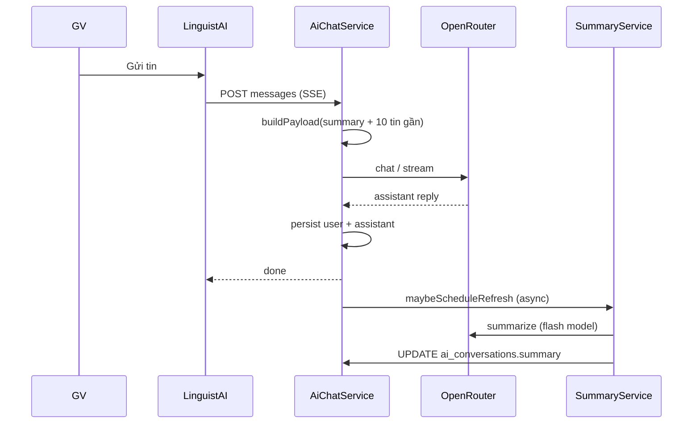
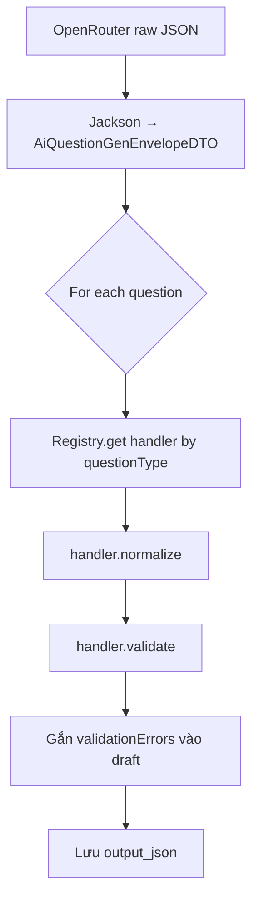
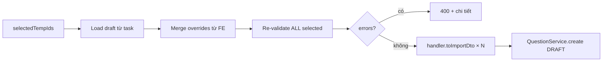
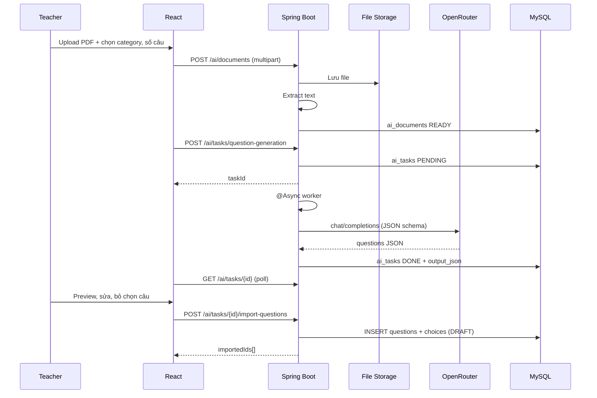

# Kế hoạch tích hợp AI (OpenRouter) — Course English LMS

> Cập nhật: **24/06/2026**  
> Tham chiếu ý tưởng: `promt.md` (AI-first LMS vision)  
> Repo: `course_english_backend` + `course_english_frontend`  
> LLM gateway: [OpenRouter](https://openrouter.ai/) — API key **chỉ** trên backend  

---

## Mục tiêu sản phẩm

Biến AI thành **lợi thế cạnh tranh** cho trung tâm tiếng Anh — không clone ChatGPT generic, mà gắn chặt LMS:

| Đối tượng | Giá trị cốt lõi |
|-----------|-----------------|
| Giáo viên | Upload tài liệu → sinh câu hỏi → preview → import ngân hàng đề (human-in-the-loop) |
| Giáo viên | Chat AI có ngữ cảnh (grammar, lesson plan, giải thích bài) |
| Học sinh | (Phase sau) Coach ngữ pháp / ôn tập gắn lesson đang học |
| Admin | Bật/tắt AI, quota token, theo dõi chi phí |

**Nguyên tắc kỹ thuật:**

```
React  →  Spring Boot  →  OpenRouter
              ↑
        JWT auth, quota, prompt, persist DB
```

- Mỗi tin nhắn = **1 bản ghi** `ai_messages` (user / assistant tách dòng).
- Load chat = **phân trang** (không load cả thread).
- Nội dung gen nặng (JSON 50 câu hỏi) → `ai_tasks.output_json`, bubble chat chỉ hiện summary + link preview.
- Gửi context cho LLM: **10–20 tin gần nhất**, không đọc full lịch sử DB.

---

## Baseline hiện tại (tận dụng)

| Đã có | Dùng cho AI |
|-------|-------------|
| `Question`, `QuestionChoice`, `QuestionCategory`, `QuestionTypeEnum` | Import output AI |
| `QuestionController` + `ManageQuestionsPage` | Mở rộng flow import |
| `apiUploadFile` + file storage | Upload PDF/DOCX/ảnh |
| `LessonSlideImportServiceImpl` + `PdfRenderService` | Tham khảo extract PDF |
| `SystemConfig` + `SystemConfigKeyEnum` | Feature flag, model name, quota |
| Google JWT auth, role admin/teacher/student | Phân quyền API AI |

| Chưa có |
|---------|
| Module `ai` (entity, service, controller) |
| OpenRouter client |
| UI AI Assistant |
| Async job queue (có thể dùng `@Async` + DB task trước, Redis/Rabbit sau) |

---

## Tổng quan các Phase

| Phase | Thời gian ước tính | Mục tiêu | Đối tượng |
|-------|-------------------|----------|-----------|
| **Phase 1** | 1–2 tuần | Nền AI: chat streaming, lưu hội thoại, quota cơ bản | Admin / Teacher |
| **Phase 2** | 2–3 tuần | Killer flow: PDF/Word → sinh câu hỏi → preview → import Question Bank | Teacher |
| **Phase 3** | 1–2 tháng | AI có context LMS + quick actions + attach file/ảnh | Teacher + Student |
| **Phase 4** | 2–4 tháng | Exam generator, writing feedback, personalization, RAG (nếu cần) | Toàn platform |

**Thứ tự ưu tiên:** Phase 1 (nền) → Phase 2 (giá trị nghiệp vụ rõ nhất) → Phase 3 → Phase 4.

---

## Phase 1 — Trạng thái triển khai (cập nhật 23/06/2026)

**Đã hoàn thành (commit Phase 1):**

| Hạng mục | Ghi chú |
|----------|---------|
| Entity + API chat | `ai_conversations`, `ai_messages`, OpenRouter sync + **SSE stream** |
| LinguistAI UI | Trang `/admin/ai-assistant` + widget FAB |
| Markdown | `react-markdown` + `remark-gfm` cho tin assistant |
| System prompt | `.env` `AI_SYSTEM_PROMPT`, mặc định xưng "cô" |
| Quota | `AI_DAILY_REQUEST_LIMIT` — đếm tin USER/ngày |
| Thống kê token | `GET /api/v1/ai/usage/stats` — dashboard admin toàn hệ thống |
| **Đổi tên / xóa hội thoại** | `PATCH` + `DELETE` `/api/v1/ai/conversations/{id}` (soft delete) |

**Defer sang Phase 1.1 / Phase 2:**

| Hạng mục | Ghi chú |
|----------|---------|
| FE scroll load-more tin | BE `before`/`hasMore` sẵn; FE chưa nối |
| `AI_ENABLED` ẩn menu/FAB | BE check; FE chưa ẩn entry |
| Unit test quota/pagination | Chưa viết |
| Tối ưu context token (§1.11) | Khi chat dài / pilot mở rộng |
| Admin UI chỉnh prompt (§1.12) | Env đủ cho dev |

**Tiếp theo (sản phẩm):** Ưu tiên Lesson Player / Student UI / nội dung bài học — xem `docs/REVIEW.html` mục 14, tab Student.

**AI — kế hoạch sau (chưa triển khai):** Phase 3 Sprint 1 (context LMS + quick actions + attach file). Spec chi tiết §3 bên dưới; checklist §3.7 **defer** cho đến khi nền LMS ổn định.

---

## Phase 2 — Trạng thái triển khai (cập nhật 24/06/2026)

**Phase 2 MVP — đã xong (đủ pilot GV):**

| Hạng mục | Ghi chú |
|----------|---------|
| `ai_documents`, `ai_tasks` + extract PDF/DOCX / paste text | Migrations 022–023 |
| Sinh câu async + poll + activity log | `AiTaskWorker`, `AiExerciseGenDialog` trong ExerciseSetEditor |
| Preview + PATCH draft + thêm thẳng vào bài tập | Shortcut, chưa qua Question Bank |
| Poll timeout | FE 300s, BE question-gen 180s × retry, `AI_CLIENT_POLL_TIMEOUT_MS` |
| Inline preview edit | Expand row: stem, đáp án MCQ/TF, passage đọc hiểu |

**Defer Phase 2.1 (sau Phase 3 hoặc khi cần tái sử dụng câu):**

| Hạng mục | Ghi chú |
|----------|---------|
| `POST /tasks/{id}/import-questions` → Question Bank DRAFT | `AiQuestionImportService` |
| Wizard `/admin/ai-question-import` | Entry riêng + link Manage Questions |
| Integration test PDF → import 5 câu | AC6 Manage Questions |

---

# PHASE 1 — Nền AI & Chat Assistant (chi tiết)

## 1.1 Mục tiêu Phase 1

Sau Phase 1, **teacher/admin** có thể:

1. Mở trang **AI Assistant** trong admin workspace.
2. Tạo cuộc hội thoại mới, chat tiếng Anh / tiếng Việt.
3. Nhận phản hồi **streaming** (SSE) giống ChatGPT.
4. Xem lại lịch sử chat (phân trang).
5. Bị giới hạn quota ngày (tránh tốn token OpenRouter).

**Chưa làm trong Phase 1:** upload file, sinh câu hỏi, import bank, student UI.

---

## 1.2 Phạm vi tính năng

### Trong phạm vi

- Entity + API: `ai_conversations`, `ai_messages`
- `OpenRouterClient` (chat + stream)
- `AiConversationController`, `AiMessageController`
- Config: API key, default model, timeout
- Quota: N request / user / ngày (hard limit)
- FE: layout chat (sidebar conversations + message list + input)
- Markdown render cho assistant message

### Ngoài phạm vi (defer Phase 2+)

| Tính năng | Phase |
|-----------|-------|
| Upload PDF / sinh câu hỏi | 2 |
| `ai_documents`, `ai_tasks` | 2 |
| Quick actions (grammar, lesson plan) | 3 |
| Student-facing chat | 3 |
| Vector DB / RAG | 4 |
| Redis cache | Khi > 100 users |

---

## 1.3 Data model

### `ai_conversations`

Kế thừa `BaseObject`.

| Cột | Kiểu | Bắt buộc | Mô tả |
|-----|------|----------|-------|
| `user_id` | UUID | ✓ | Chủ conversation |
| `title` | VARCHAR(255) | — | Auto từ tin đầu hoặc user đặt |
| `context_type` | VARCHAR(32) | — | `GENERAL` (mặc định); sau: `LESSON`, `CLASSROOM` |
| `context_id` | UUID | — | FK mềm tới entity LMS |
| `last_message_at` | TIMESTAMPTZ | — | Sort sidebar |
| `message_count` | INT | — | Denormalize, optional |

Index: `(user_id, last_message_at DESC)`.

### `ai_messages`

| Cột | Kiểu | Bắt buộc | Mô tả |
|-----|------|----------|-------|
| `conversation_id` | UUID | ✓ | FK → `ai_conversations` |
| `role` | ENUM | ✓ | `USER`, `ASSISTANT`, `SYSTEM` |
| `content_type` | VARCHAR(32) | ✓ | `TEXT`, `MARKDOWN` (Phase 1); `ARTIFACT_REF` (Phase 2) |
| `content` | TEXT | ✓ | Nội dung hiển thị chat (giữ ngắn) |
| `content_preview` | VARCHAR(300) | — | Preview cho list |
| `model` | VARCHAR(64) | — | Model OpenRouter đã dùng |
| `prompt_tokens` | INT | — | Từ response OpenRouter |
| `completion_tokens` | INT | — | |
| `artifact_task_id` | UUID | — | Phase 2: FK `ai_tasks` |
| `status` | VARCHAR(20) | ✓ | `COMPLETED`, `FAILED`, `STREAMING` |

Index: `(conversation_id, created_at DESC)`.

**Quy ước lưu:** mỗi lần user gửi = 1 row `USER`; mỗi lần AI trả lời = 1 row `ASSISTANT`.

---

## 1.4 System config (Phase 1)

Thêm key vào `SystemConfigKeyEnum` (hoặc `application.yml` cho dev):

| Key | Mô tả | Ví dụ |
|-----|-------|-------|
| `AI_ENABLED` | Bật/tắt toàn module | `true` |
| `AI_OPENROUTER_API_KEY` | Secret (env override) | — |
| `AI_DEFAULT_CHAT_MODEL` | Model chat | `google/gemini-2.0-flash-001` |
| `AI_DAILY_REQUEST_LIMIT` | Max request/user/ngày | `50` |
| `AI_MAX_CONTEXT_MESSAGES` | Số tin gửi lại LLM | `20` |
| `AI_REQUEST_TIMEOUT_SEC` | Timeout HTTP | `120` |

---

## 1.5 Backend — cấu trúc package

```
com.courseenglish.api
├── domain
│   ├── AiConversation.java
│   └── AiMessage.java
├── repository
│   ├── AiConversationRepository.java
│   └── AiMessageRepository.java
├── service
│   ├── AiConversationService.java
│   ├── AiChatService.java
│   ├── AiUsageQuotaService.java
│   └── impl/
├── integration
│   └── openrouter
│       ├── OpenRouterClient.java
│       ├── OpenRouterProperties.java
│       └── dto/
└── controller
    └── AiConversationController.java
```

### `OpenRouterClient`

- `POST https://openrouter.ai/api/v1/chat/completions`
- Header: `Authorization: Bearer {key}`, `HTTP-Referer`, `X-Title` (theo policy OpenRouter)
- Hỗ trợ `stream: true` → map sang `Flux<String>` hoặc SSE emitter

### `AiChatService.sendMessage(conversationId, userId, content)`

1. Check `AI_ENABLED`, quota.
2. `INSERT ai_messages` (USER).
3. Load **N tin gần nhất** (`AI_MAX_CONTEXT_MESSAGES`) + system prompt EdTech.
4. Gọi OpenRouter stream.
5. Stream chunk về client; khi xong `INSERT ai_messages` (ASSISTANT) + token count.
6. Update `ai_conversations.last_message_at`, `title` (nếu tin đầu).

**System prompt (gợi ý):** trợ lý tiếng Anh cho giáo viên trung tâm Anh ngữ; trả lời rõ ràng; không bịa nội dung giáo trình.

---

## 1.6 API contract (Phase 1)

Base: `/api/v1/ai`

| Method | Path | Mô tả |
|--------|------|-------|
| `GET` | `/conversations` | List của user hiện tại. Query: `page`, `size` |
| `POST` | `/conversations` | Tạo mới. Body: `{ title?, contextType?, contextId? }` |
| `GET` | `/conversations/{id}` | Chi tiết (không kèm full messages) |
| `PATCH` | `/conversations/{id}` | Đổi title. Body: `{ title }` — **đã implement** |
| `DELETE` | `/conversations/{id}` | Soft delete (`voided`) — **đã implement** |
| `GET` | `/conversations/{id}/messages` | Phân trang. Query: `limit` (default 30), `before` (message UUID) |
| `POST` | `/conversations/{id}/messages` | Gửi tin (sync fallback) |
| `POST` | `/conversations/{id}/messages/stream` | Gửi tin + **SSE stream** |
| `GET` | `/usage/stats` | Thống kê token toàn hệ thống (admin/teacher) |

### `GET .../messages` — pagination

```
GET /api/v1/ai/conversations/{id}/messages?limit=30&before={oldestLoadedMessageId}
```

Response:

```json
{
  "items": [
    {
      "id": "uuid",
      "role": "USER",
      "contentType": "TEXT",
      "content": "Hôm nay ăn gì?",
      "createdAt": "2026-06-22T10:00:00Z"
    },
    {
      "id": "uuid",
      "role": "ASSISTANT",
      "contentType": "MARKDOWN",
      "content": "Bạn có thể ăn cơm kèm rau...",
      "model": "google/gemini-2.0-flash-001",
      "createdAt": "2026-06-22T10:00:05Z"
    }
  ],
  "hasMore": true,
  "nextBefore": "uuid-oldest-in-page"
}
```

- Lần đầu mở chat: không truyền `before` → lấy **30 tin mới nhất**.
- Scroll lên: truyền `before` = id tin cũ nhất đang hiển thị.

### `POST .../messages` — streaming

Request:

```json
{ "content": "Giải thích Present Perfect cho học sinh lớp 8" }
```

Response: `Content-Type: text/event-stream`

```
event: chunk
data: {"delta":"Present"}

event: chunk
data: {"delta":" Perfect is..."}

event: done
data: {"messageId":"uuid","promptTokens":120,"completionTokens":340}
```

Lỗi quota / AI tắt:

```json
{ "statusCode": 429, "message": "Đã hết lượt AI hôm nay" }
```

---

## 1.7 Frontend (Phase 1)

### Route & menu

| Item | Giá trị |
|------|---------|
| Path | `/admin/ai-assistant` |
| Constant | `paths.AI_ASSISTANT` |
| Menu | Admin sidebar — **AI Assistant** (icon SmartToy hoặc tương đương) |
| Role | `ADMIN`, `TEACHER` (chưa mở student) |

### Cấu trúc file gợi ý

```
src/
├── pages/admin/AiAssistantPage.tsx
├── admin/components/ai/
│   ├── AiConversationSidebar.tsx
│   ├── AiMessageList.tsx
│   ├── AiMessageBubble.tsx
│   ├── AiChatInput.tsx
│   └── useAiChatStream.ts
├── shared/api/ai.ts
└── styles/admin-ai-assistant.css
```

### UX

- Layout 2 cột: trái danh sách conversation, phải chat.
- Tin assistant: render Markdown (`react-markdown`).
- Streaming: append delta vào bubble cuối; khi `done` finalize.
- Scroll lên đầu list → load `before` (prepend, giữ scroll position).
- Empty state: gợi ý prompt (“Giải thích cấu trúc If clause type 1”, “Soạn outline bài Speaking 5 phút”).

---

## 1.8 Acceptance criteria — Phase 1

| # | Tiêu chí | Pass khi |
|---|----------|----------|
| AC1 | Chat streaming | User gửi tin → thấy chữ hiện dần trong < 3s (mạng ổn) |
| AC2 | Lưu lịch sử | F5 trang → conversation + messages load lại đúng |
| AC3 | Phân trang | Conversation > 40 tin → mở chat chỉ load 30 tin; scroll lên load thêm |
| AC4 | Quota | Vượt `AI_DAILY_REQUEST_LIMIT` → 429 + message tiếng Việt |
| AC5 | Bảo mật | API key không có trong FE bundle; user A không đọc conversation user B |
| AC6 | Feature flag | `AI_ENABLED=false` → menu ẩn hoặc thông báo tắt |

---

## 1.9 Checklist triển khai Phase 1

### Backend (tuần 1)

- [x] Entity `AiConversation`, `AiMessage` + repository
- [x] `OpenRouterClient` (sync + stream + `include_usage`)
- [x] Quota đếm tin USER/ngày trong `AiChatServiceImpl`
- [x] `AiChatService` + `AiConversationController` + SSE endpoint
- [x] `PATCH` / `DELETE` conversation
- [x] `GET /ai/usage/stats` — thống kê token hệ thống
- [x] Env `OPENROUTER_API_KEY`, `AI_SYSTEM_PROMPT`
- [ ] Unit test: quota, pagination query

### Frontend (tuần 2)

- [x] `shared/api/ai.ts` + `useAiChat` (fetch SSE stream)
- [x] `AiAssistantPage` + widget FAB + markdown
- [x] Route + sidebar + CSS
- [x] Đổi tên / xóa hội thoại (sidebar)
- [x] Dashboard thống kê AI (`AiUsageDashboardSection`)
- [ ] Scroll load-more tin (`before`)
- [ ] `AI_ENABLED` ẩn menu/FAB
- [ ] Manual test với 2 user, 50+ tin trong 1 conversation

---

## 1.10 Rủi ro Phase 1

| Rủi ro | Giảm thiểu |
|--------|------------|
| OpenRouter timeout | Timeout config; hiện “Thử lại” trên FE |
| SSE qua proxy | Dev: CRA proxy; prod: nginx `proxy_buffering off` cho `/messages` |
| Chi phí token | Quota cứng Phase 1; log `prompt_tokens` / `completion_tokens` |
| Message quá dài | Giới hạn input FE 8KB; backend validate `content.length` |

---

## 1.11 Tối ưu message / context — **defer** (ghi nhận, chưa làm)

> Quyết định: **giữ history** khi gọi OpenRouter (model stateless cần context).  
> Phase 1 chấp nhận convention đơn giản; tối ưu token/cost khi chat dài hoặc pilot mở rộng.

### Hiện trạng Phase 1 (đã implement)

| Hạng mục | Cách làm |
|----------|----------|
| Lưu DB | 1 tin = 1 row (`USER` / `ASSISTANT`), phân trang khi load UI |
| Gửi OpenRouter | `system` + tối đa `AI_MAX_CONTEXT_MESSAGES` (20) cặp tin gần nhất + tin user hiện tại |
| Lỗi AI (429…) | Chỉ lưu DB khi AI trả lời thành công; lọc tin user lẻ khi build context |
| Artifact nặng | Chưa có (Phase 2: JSON câu hỏi → `ai_tasks`, không nhét vào bubble) |

### Vì sao có thể “nặng” sau này

- Mỗi request gửi lại N tin cũ → **token tăng tuyến tính** theo độ dài hội thoại.
- Assistant trả lời dài (giải thích grammar, sinh draft) → context request sau càng phình.
- System prompt cố định mỗi lần gọi (~30–50 token) — nhỏ nhưng lặp mọi request.

### Backlog tối ưu (ưu tiên khi cần)

| # | Hạng mục | Mô tả | Khi làm |
|---|----------|-------|---------|
| O1 | **Conversation summary** | Cột `ai_conversations.summary`; sau ~15–20 tin, AI tóm tắt 1 đoạn; prompt = summary + 5–10 tin gần nhất | Chat > 30 tin / user → **§1.13** |
| O2 | **Sliding window có cấu hình** | Giảm `AI_MAX_CONTEXT_MESSAGES` theo role (student 10, teacher 20) | Pilot 15+ user |
| O3 | **Truncate content trong context** | Gửi LLM: assistant message > 2KB → cắt + `...`; DB vẫn full | Response AI thường dài |
| O4 | **Artifact tách khỏi context** | Tin `ARTIFACT_REF` không đưa JSON vào prompt; chỉ summary 1 dòng | Phase 2 |
| O5 | **Token budget guard** | Trước khi gọi API: ước lượng token; drop tin cũ nhất cho đến khi < budget | Cost control |
| O6 | **Streaming SSE** | Phase 1 sync; stream giảm perceived latency, không giảm token | UX polish |
| O7 | **Dọn UI history orphan** | Script/API void tin user lẻ còn sót từ giai đoạn dev | One-time cleanup |

### Nguyên tắc giữ khi tối ưu

```
DB (MySQL)     = lưu FULL lịch sử — không cắt
OpenRouter     = gửi SUBSET thông minh — summary + window + truncate
UI             = phân trang — không load hết
```

**Không** chuyển sang “chỉ gửi 1 tin” — mất multi-turn chat.

---

## 1.12 System prompt & message roles — **defer** (ghi nhận, có thể sửa sau)

> Phase 1: system prompt **hard-code** trong backend. Sau này có thể đưa ra `.env`, `system_configs`, hoặc file prompt riêng để admin/teacher tùy chỉnh brand & nghiệp vụ.

### Vị trí code hiện tại

| Thành phần | File | Ghi chú |
|------------|------|---------|
| System prompt | `AiChatServiceImpl.buildHistoryPayload()` | Inject mỗi request, **không lưu DB** |
| Enum role | `AiMessageRoleEnum` | `USER`, `ASSISTANT`, `SYSTEM` |
| Entity | `AiMessage.role` | DB chỉ lưu `USER` / `ASSISTANT` (Phase 1) |

### System prompt Phase 1 (tạm thời)

```
You are an English learning assistant for teachers and students.
Answer clearly, practical, and do not fabricate lesson facts.
```

Model trả lời theo vai trợ lý EdTech (vocabulary, grammar, lesson plan…) vì prompt này — **không** phải model “biết” LMS từ DB.

### Ba role — phân vai

| Role | Nguồn | Lưu `ai_messages`? | Gửi OpenRouter? |
|------|-------|-------------------|-----------------|
| `system` | Backend hard-code | ❌ | ✅ Luôn ở đầu payload |
| `user` | Người dùng chat | ✅ | ✅ History + tin hiện tại |
| `assistant` | Model trả lời | ✅ | ✅ History |

**Lưu ý:** Tên persona (vd. model tự gọi “OWL”) **không** có trong prompt — model tự đặt; nếu cần brand cố định thì ghi rõ trong system prompt sau này.

### Backlog refactor prompt (chưa làm)

| # | Hạng mục | Mô tả |
|---|----------|-------|
| P1 | **Env `AI_SYSTEM_PROMPT`** | Đổi prompt không cần rebuild (dev/staging) |
| P2 | **`system_configs` / admin UI** | GV/admin chỉnh tone, ngôn ngữ, phạm vi trả lời |
| P3 | **Prompt theo context** | `context_type` = `LESSON` / `CLASSROOM` → prompt khác nhau |
| P4 | **Prompt registry** | File `prompts/ai-chat-system.txt`, `ai-question-gen.txt` tách riêng |
| P5 | **Lưu system vào DB** (optional) | Chỉ khi cần audit/version prompt — thường không cần |

### Hướng mong muốn (khi làm P1–P3)

- Tên assistant: **Course English** (hoặc tên trung tâm)
- Phân biệt teacher vs student trong prompt khi mở student chat (Phase 3)
- Tiếng Việt / tiếng Anh: trả lời theo ngôn ngữ user hoặc config

---

## 1.13 Conversation summary — plan triển khai (O1)

> **Trạng thái:** Plan — chưa code.  
> **Ưu tiên:** Có thể làm **độc lập Phase 3** (chỉ chat Phase 1), ước tính **3–5 ngày** BE + 0–1 ngày FE tùy chọn.  
> **Mục tiêu:** Hội thoại dài vẫn giữ ngữ cảnh mà **không** gửi lại toàn bộ 20+ tin lên OpenRouter mỗi lần.

### 1.13.1 Vấn đề hiện tại

```
Hiện tại (AiChatServiceImpl.buildHistoryPayload):
  system prompt
  + tối đa 20 tin gần nhất (AI_MAX_CONTEXT_MESSAGES)
  + tin user mới

Hội thoại > 20 tin → tin cũ BIẾN MẤT khỏi context (không tóm tắt).
Assistant trả lời dài → mỗi request sau càng nặng token → chậm + đắt.
```

**DB vẫn lưu full** (`ai_messages`) — UI load-more không đổi. Chỉ thay **payload gửi OpenRouter**.

### 1.13.2 Giải pháp (rolling summary)

```
┌─────────────────────────────────────────────────────────────┐
│  OpenRouter payload (mỗi lần chat)                          │
├─────────────────────────────────────────────────────────────┤
│  1. system prompt (LinguistAI)                               │
│  2. [optional] block "Conversation summary so far: …"        │
│     ← ai_conversations.summary (TEXT, cập nhật định kỳ)      │
│  3. N tin gần nhất (AI_SUMMARY_RECENT_MESSAGES, mặc định 10) │
│  4. tin user hiện tại                                         │
└─────────────────────────────────────────────────────────────┘

DB: toàn bộ ai_messages giữ nguyên — không xóa, không cắt.
```

**Nguyên tắc:** Summary = **nén phần đã qua**, recent window = **chi tiết đoạn gần đây**. Giống §1.11 — không chuyển sang single-turn.

### 1.13.3 Khi nào tạo / cập nhật summary

| Trigger | Điều kiện | Hành vi |
|---------|-----------|---------|
| **T1 — Ngưỡng tin** | `messageCount >= AI_SUMMARY_TRIGGER_MESSAGES` (mặc định **16** cặp user+assistant ≈ 32 row) | Chạy summarizer |
| **T2 — Sau mỗi chunk** | Có summary cũ + thêm `>= AI_SUMMARY_REFRESH_EVERY` tin mới kể từ `summary_updated_at` (mặc định **10** tin) | **Merge** summary cũ + tin “đã rời window” |
| **T3 — Không block chat** | Mọi T1/T2 | Chạy **async** sau khi lưu turn thành công; chat tiếp dùng summary cũ đến khi refresh xong |

**Lần đầu (chưa có summary):** Lấy các tin **cũ hơn** recent window (ví dụ tin 1…N-10), gửi model rẻ → paragraph summary.

**Lần sau (đã có summary):** Input = `summary hiện tại` + batch tin mới “rời window” → summary mới (rolling merge).

**Không summarize** khi conversation < trigger (giữ behavior Phase 1).

### 1.13.4 Data model

**Migration `027_ai_conversation_summary.sql`:**

```sql
ALTER TABLE ai_conversations
  ADD COLUMN summary TEXT NULL COMMENT 'Rolling summary for OpenRouter context',
  ADD COLUMN summary_updated_at DATETIME(6) NULL,
  ADD COLUMN summary_covers_through_message_id CHAR(36) NULL COMMENT 'Last message id included in summary',
  ADD COLUMN summary_message_count INT NOT NULL DEFAULT 0 COMMENT 'Paired turns covered at last refresh';
```

| Cột | Mô tả |
|-----|--------|
| `summary` | Đoạn tóm tắt tiếng Việt/Anh (theo ngôn ngữ chủ đạo hội thoại) |
| `summary_updated_at` | Lần refresh cuối |
| `summary_covers_through_message_id` | Cursor — tin cuối đã đưa vào summary |
| `summary_message_count` | Số turn đã cover (debug / trigger T2) |

**Không** tạo bảng `ai_conversation_summaries` lịch sử v1 — chỉ 1 summary hiện tại/conv. (Audit sau nếu cần.)

### 1.13.5 Backend — component mới

```
service/ai/chat/
├── AiConversationSummaryService.java    // orchestration: shouldRefresh?, refreshAsync
├── AiConversationSummaryPrompt.java     // system + user template summarize
└── AiChatContextAssembler.java          // tách từ AiChatServiceImpl.buildHistoryPayload
```

#### `AiChatContextAssembler.buildPayload(conversation, currentUserContent)`

1. Load `AiConversation` (+ `summary` nếu có).
2. Load recent `AI_SUMMARY_RECENT_MESSAGES` tin (paired only, giữ `keepCompletedTurnsOnly`).
3. Nếu `summary` không blank → inject sau system prompt:

```
Previous conversation summary (for context only):
---
{summary}
---
```

4. Append recent messages + current user message.

#### `AiConversationSummaryService`

- `maybeScheduleRefresh(conversationId)` — gọi sau `persistTurnAfterAiSuccess` (sync + stream).
- `@Async` `refreshSummary(conversationId)`:
  - Lock optimistic: `summary_updated_at` hoặc version (tránh 2 job song song).
  - Query messages **older than** recent window, **newer than** `summary_covers_through_message_id`.
  - Gọi `OpenRouterClient.chat()` model **`AI_SUMMARY_MODEL`** (mặc định `google/gemini-2.0-flash-001` — rẻ, nhanh).
  - Lưu `summary`, cập nhật cursor + `summary_updated_at`.
  - Activity log `AI_CHAT_SUMMARY` (mới).

**Prompt summarize (gợi ý):**

```
System: You compress chat history for an English-teaching assistant.
Keep: topics discussed, user goals, corrections, vocabulary/grammar points, open questions.
Drop: greetings, filler. Same language as the transcript. Max 400 words. Plain text only.

User:
[Existing summary — if any]
---
[New messages to merge]
---
Update the summary.
```

### 1.13.6 Config (`.env` / `application.properties`)

| Key | Mặc định | Mô tả |
|-----|----------|--------|
| `AI_SUMMARY_ENABLED` | `true` | Feature toggle |
| `AI_SUMMARY_MODEL` | `google/gemini-2.0-flash-001` | Model chỉ cho summarize |
| `AI_SUMMARY_TRIGGER_MESSAGES` | `16` | Số **cặp** turn trước khi bật summary |
| `AI_SUMMARY_RECENT_MESSAGES` | `10` | Số tin gần nhất gửi kèm summary |
| `AI_SUMMARY_REFRESH_EVERY` | `10` | Mỗi N tin mới → refresh summary |
| `AI_SUMMARY_MAX_CHARS` | `4000` | Cắt summary khi inject context |
| `AI_MAX_CONTEXT_MESSAGES` | `20` | Giữ; khi summary ON, effective recent = `RECENT_MESSAGES` |

**Quan hệ:** `RECENT_MESSAGES` ≤ `MAX_CONTEXT_MESSAGES`. Khi summary bật, `buildPayload` dùng `RECENT_MESSAGES` thay vì 20 full.

### 1.13.7 Luồng end-to-end



### 1.13.8 Activity log

| Action | Khi | context_json |
|--------|-----|----------------|
| `AI_CHAT_SUMMARY` | Refresh bắt đầu / xong / lỗi | `conversationId`, `durationMs`, `inputMessageCount`, `summaryChars`, `model` |

Thêm vào `ActivityLogActionEnum` + FE `activityLog.ts`.

### 1.13.9 Frontend (tùy chọn v1)

| Hạng mục | Bắt buộc? | Ghi chú |
|----------|-----------|---------|
| Chat UX | Không đổi | User không cần thấy summary |
| Admin debug | Tuỳ chọn | `GET /conversations/{id}` trả `summaryPreview` (truncate 200 chars) — chỉ admin |
| Activity log | Có (filter) | GV xem refresh có chạy / mất bao lâu |

**Không** hiện summary trong bubble chat v1.

### 1.13.10 Kết hợp O3 (truncate tin dài) — phase nhỏ cùng sprint

Trong `AiChatContextAssembler`, trước khi add message vào payload:

- `assistant` content > `AI_CONTEXT_MESSAGE_MAX_CHARS` (2048) → `substring + "\n...(truncated for context)"`
- DB vẫn full content

Làm cùng sprint summary vì cùng file assembler — **~0.5 ngày thêm**.

### 1.13.11 Acceptance criteria

| ID | Tiêu chí |
|----|----------|
| AC-SUM-1 | Hội thoại 40+ tin: AI vẫn nhắc chủ đề từ **đầu thread** (manual test 3 câu hỏi follow-up) |
| AC-SUM-2 | `ai_messages` không mất dòng; UI load-more vẫn đủ lịch sử |
| AC-SUM-3 | Conversation < 16 turn: behavior giống hiện tại (không summary block) |
| AC-SUM-4 | Summary refresh **không** làm chậm response chat (async) |
| AC-SUM-5 | Activity log có `AI_CHAT_SUMMARY` + `durationMs` |
| AC-SUM-6 | `AI_SUMMARY_ENABLED=false` → fallback window 20 tin như Phase 1 |

### 1.13.12 Checklist triển khai

**Database**

- [ ] Migration `027_ai_conversation_summary.sql`

**Backend**

- [ ] Entity `AiConversation` + DTO fields
- [ ] `AiChatContextAssembler` — summary block + recent window + O3 truncate
- [ ] Refactor `AiChatServiceImpl` dùng assembler (sync + stream)
- [ ] `AiConversationSummaryService` + `@Async` executor (reuse `aiStreamExecutor` hoặc `aiTaskExecutor`)
- [ ] `AI_CHAT_SUMMARY` activity log
- [ ] Config keys + `.env.example`
- [ ] Unit test: `buildPayload` with/without summary; trigger threshold

**Frontend**

- [ ] (Optional) `summaryPreview` trên GET conversation
- [ ] `AI_CHAT_SUMMARY` label trong Activity Logs filter

**Test thủ công**

- [ ] Script/chat 25 turn → kiểm tra DB `summary` populated
- [ ] Hỏi “Ở đầu ta bàn gì?” sau turn 30 → AI trả lời đúng chủ đề đầu
- [ ] So sánh token usage (usage stats) trước/sau trên cùng 30 turn

### 1.13.13 Rủi ro & giảm thiểu

| Rủi ro | Giảm thiểu |
|--------|------------|
| Summary sai / mất chi tiết | Recent window 10 tin giữ chi tiết gần; prompt nhấn “keep corrections, open questions” |
| 2 refresh song song | Cursor `summary_covers_through_message_id` + skip nếu job đang chạy (in-memory set hoặc DB flag) |
| Thêm 1 call OpenRouter/10 tin | Model flash rẻ; `AI_SUMMARY_ENABLED` tắt được |
| Summary quá dài | `AI_SUMMARY_MAX_CHARS` cắt khi inject |

### 1.13.14 Phạm vi ngoài (v1)

- Summary theo **lesson/classroom context** (Phase 3 Sprint 1) — summary chỉ nén **lịch sử chat**, không inject LMS metadata.
- Hiển thị summary cho user chỉnh sửa.
- Vector RAG / tìm tin cũ theo semantic.
- Student coach persona — cùng engine, khác prompt summarize (Phase sau).

### 1.13.15 Thứ tự làm (đề xuất)

```
Ngày 1   Migration + entity + AiChatContextAssembler (không summary, chỉ tách code + O3 truncate)
Ngày 2   Summary service + async refresh + config
Ngày 3   Wire AiChatServiceImpl + activity log + manual test 30 turn
Ngày 4   (Optional) admin preview + tune prompt/threshold
```

**Sau khi xong O1:** có thể bật **O5 token budget** nếu vẫn nặng; **O2** role-based window ít ưu tiên hơn.

---

# PHASE 2 — PDF/Word → Question Bank (chi tiết)

## 2.1 Mục tiêu Phase 2

**Killer flow cho giáo viên:**

```
Upload PDF hoặc Word
  → Extract text
  → AI sinh câu hỏi (JSON có cấu trúc)
  → Preview / sửa / xóa từng câu
  → Import vào Question Bank (status DRAFT)
  → Teacher publish từ Manage Questions
```

Đây là differentiation so với Moodle/Canvas — gắn trực tiếp entity `Question` đã có.

---

## 2.2 Phạm vi tính năng

### Trong phạm vi

- Bảng `ai_documents`, `ai_tasks`
- Upload PDF (.pdf), Word (.docx) — tối đa theo config (vd. 20 trang / 10MB)
- Extract text: PDFBox / Apache POI (đã có kinh nghiệm PDF từ slide import)
- Task async: `QUESTION_GENERATION`
- Prompt structured JSON → map `QuestionTypeEnum` + `QuestionChoice`
- UI preview table + bulk import
- Message chat kiểu `ARTIFACT_REF` (“Đã sinh 25 câu — Xem preview”) — tùy chọn gắn Phase 1 chat hoặc wizard riêng

### Ngoài phạm vi

| Tính năng | Phase |
|-----------|-------|
| OCR ảnh scan chất lượng thấp | 3 (vision model) |
| Import trực tiếp vào Lesson block | 3 |
| Sinh đề thi full (exam paper) | 4 |
| Auto publish không review | Không — luôn human review |

---

## 2.3 Data model (bổ sung)

### `ai_documents`

| Cột | Kiểu | Mô tả |
|-----|------|-------|
| `user_id` | UUID | Người upload |
| `file_name` | VARCHAR(255) | Tên gốc |
| `mime_type` | VARCHAR(64) | `application/pdf`, `application/vnd...docx` |
| `storage_folder` | VARCHAR(128) | Folder storage hiện có |
| `storage_file_name` | VARCHAR(255) | |
| `file_size_bytes` | BIGINT | |
| `page_count` | INT | PDF |
| `extracted_text` | LONGTEXT | Text đã extract (chunk nếu quá dài) |
| `status` | ENUM | `UPLOADED`, `EXTRACTING`, `READY`, `FAILED` |
| `error_message` | TEXT | |

### `ai_tasks`

| Cột | Kiểu | Mô tả |
|-----|------|-------|
| `user_id` | UUID | |
| `conversation_id` | UUID | Nullable — nếu trigger từ chat |
| `document_id` | UUID | Nullable — nếu từ file |
| `task_type` | ENUM | `QUESTION_GENERATION` |
| `status` | ENUM | `PENDING`, `PROCESSING`, `DONE`, `FAILED` |
| `input_json` | TEXT | `{ categoryId, questionTypes[], count, difficulty, language }` |
| `output_json` | LONGTEXT | Mảng câu hỏi draft |
| `model` | VARCHAR(64) | Model sinh câu (mạnh hơn chat) |
| `prompt_tokens` | INT | |
| `completion_tokens` | INT | |
| `error_message` | TEXT | |
| `started_at`, `finished_at` | TIMESTAMPTZ | |

### Output JSON envelope (`ai_tasks.output_json`)

**Nguyên tắc:** mỗi phần tử trong `questions[]` = **`ReqQuestionDTO` / `QuestionFormPayload`** (field names khớp API Question Bank) + metadata preview. Không dùng alias riêng (`isCorrect`, `text`…) — tránh mapper lệch khi scale.

```json
{
  "schemaVersion": 1,
  "questions": [
    {
      "tempId": "q1",
      "selected": true,
      "validationErrors": [],
      "questionType": "MULTIPLE_CHOICE",
      "promptText": "She ___ to school every day.",
      "promptLang": "en",
      "explanation": "Present simple, third person.",
      "difficulty": 2,
      "choices": [
        { "choiceKey": "a", "choiceText": "go", "correct": false, "displayOrder": 0 },
        { "choiceKey": "b", "choiceText": "goes", "correct": true, "displayOrder": 1 },
        { "choiceKey": "c", "choiceText": "going", "correct": false, "displayOrder": 2 },
        { "choiceKey": "d", "choiceText": "went", "correct": false, "displayOrder": 3 }
      ]
    },
    {
      "tempId": "q2",
      "selected": true,
      "validationErrors": [],
      "questionType": "TRUE_FALSE",
      "promptText": "London is the capital of France.",
      "promptLang": "en",
      "explanation": "Paris is the capital of France.",
      "difficulty": 1,
      "contentJson": { "correctAnswer": false }
    },
    {
      "tempId": "q3",
      "selected": true,
      "validationErrors": [],
      "questionType": "FILL_BLANK",
      "promptText": "I ___ (go) to the park yesterday.",
      "promptLang": "en",
      "explanation": "Past simple of go.",
      "difficulty": 2,
      "contentJson": {
        "blanks": [{ "id": "b1", "acceptedAnswers": ["went"] }],
        "caseSensitive": false
      }
    }
  ],
  "meta": {
    "sourcePageRange": "1-3",
    "model": "anthropic/claude-3.5-sonnet",
    "requestedTypes": ["MULTIPLE_CHOICE", "TRUE_FALSE", "FILL_BLANK"]
  }
}
```

| Field | Lưu DB? | Ghi chú |
|-------|---------|---------|
| `tempId`, `selected`, `validationErrors` | Không | Chỉ preview / import filter |
| `questionType` … `tags` | Có | Map 1:1 `ReqQuestionDTO` |
| `choices` | Có (MCQ) | `choiceKey` = `a/b/c/d`, đúng 1 `correct: true` |
| `contentJson` | Có (TF, FILL) | Trong draft có thể là **object**; BE stringify trước khi `Question.content_json` |

**Phase 2 implement:** `MULTIPLE_CHOICE`, `TRUE_FALSE`, `FILL_BLANK`.  
**Phase 2.5+:** thêm handler mới — không đổi envelope, không đổi API import.

---

## 2.3.1 Kiến trúc mở rộng theo loại câu (Type Handler Registry)

Mục tiêu: thêm `READING_COMPREHENSION`, `MATCHING`, … chỉ bằng **1 handler BE + 1 entry FE registry**, không sửa core pipeline.

### Phân loại storage (3 tier — quyết định khi thêm type mới)

| Tier | Loại | Lưu trữ Question Bank | Ví dụ Phase 2 |
|------|------|------------------------|---------------|
| **A — Choices** | Đáp án trong `question_choices` | `choices[]` trên draft | `MULTIPLE_CHOICE` |
| **B — ContentJson flat** | Payload nhỏ, 1 object | `contentJson` stringify | `TRUE_FALSE`, `FILL_BLANK` |
| **C — ContentJson nested** | Câu con / cấu trúc sâu | `contentJson` stringify | `READING_COMPREHENSION` (sau), `GAP_FILL_MCQ` (sau) |

Tier C dùng cùng cột `content_json` — chỉ khác schema bên trong và validator.

### Backend — `AiQuestionTypeHandler` (Strategy + Registry)

```
com.courseenglish.api.service.ai.question
├── AiQuestionTypeHandler.java          // interface
├── AiQuestionTypeHandlerRegistry.java  // Map<QuestionTypeEnum, Handler>
├── AiQuestionGenResultValidator.java   // orchestrator: gọi từng handler
├── AiQuestionPromptAssembler.java      // ghép prompt từ handlers được chọn
├── dto/
│   ├── AiQuestionGenEnvelopeDTO.java
│   ├── AiDraftQuestionDTO.java         // ReqQuestionDTO fields + tempId, selected, validationErrors
│   └── content/
│       ├── TrueFalseContentDTO.java    // { correctAnswer: boolean }
│       └── FillBlankContentDTO.java    // { blanks[], caseSensitive? }
└── impl/
    ├── McqQuestionTypeHandler.java
    ├── TrueFalseQuestionTypeHandler.java
    └── FillBlankQuestionTypeHandler.java
```

```java
public interface AiQuestionTypeHandler {
    QuestionTypeEnum supportedType();

    /** Fragment JSON schema + rules — ghép vào system prompt */
    String promptSchemaFragment();

    /** Ví dụ 1 câu hoàn chỉnh — few-shot trong prompt */
    String promptExampleJson();

    /** Sau parse Jackson: normalize (gán choiceKey a/b/c, sync blank ids…) */
    void normalize(AiDraftQuestionDTO draft);

    /** Trả về lỗi tiếng Việt; rỗng = hợp lệ */
    List<String> validate(AiDraftQuestionDTO draft);

    /** Map sang ReqQuestionDTO (contentJson đã stringify nếu cần) */
    ReqQuestionDTO toImportDto(AiDraftQuestionDTO draft, ImportContext ctx);
}
```

**Luồng generation:**



**Luồng import:**



**Mở rộng type mới (ví dụ READING_COMPREHENSION):**

1. Thêm `ReadingComprehensionContentDTO` (passage + `subQuestions[]`)
2. Implement `ReadingComprehensionQuestionTypeHandler` (`@Component`)
3. Đăng ký tự động qua `AiQuestionTypeHandlerRegistry`
4. Bật type trong `AI_SUPPORTED_GEN_TYPES` config
5. FE: thêm 1 entry `aiQuestionTypeRegistry` + canvas preview có sẵn

Không sửa: `AiTaskWorker`, `AiQuestionImportService` (chỉ gọi registry), API contract.

### `contentJson` schema — Phase 2 (khớp exercise player)

| Type | `contentJson` object (trước stringify) | Khớp FE |
|------|----------------------------------------|---------|
| `TRUE_FALSE` | `{ "correctAnswer": true \| false }` | `TrueFalseQuestion.correctAnswer`, ids `true`/`false` khi render |
| `FILL_BLANK` | `{ "blanks": [{ "id": "b1", "acceptedAnswers": ["went"], "placeholder?": "" }], "caseSensitive?": false }` | `FillBlankQuestion`, `fillBlankUtils` |

`FILL_BLANK` rules (reuse `validateFillBlankQuestion`):

- `promptText` có ít nhất một `___`
- `blanks.length` = số `___` (tối đa 12)
- Mỗi blank có ≥ 1 `acceptedAnswers` không rỗng

`TRUE_FALSE` rules:

- `contentJson.correctAnswer` bắt buộc boolean
- Không dùng `choices[]` (tránh trùng với MCQ)

### Prompt assembly — scale khi thêm type

`AiQuestionPromptAssembler` build system prompt động:

```
BASE_RULES (JSON only, no markdown, bám tài liệu)
+ for each type in request.questionTypes:
    handler.promptSchemaFragment()
    handler.promptExampleJson()
+ OUTPUT_ENVELOPE { schemaVersion, questions[], meta }
```

User prompt giữ nguyên (excerpt + count + difficulty).  
`questionTypes` trong request quyết định fragment nào được đưa vào — AI không sinh type ngoài danh sách.

### Frontend — `aiQuestionTypeRegistry`

```
src/shared/ai/questionGen/
├── types.ts                    // AiDraftQuestion, AiQuestionGenEnvelope
├── aiQuestionTypeRegistry.ts   // Record<QuestionType, AiQuestionTypeDef>
├── draftValidators.ts          // delegate → exercisePayload validate*
├── draftToExercise.ts          // draft → ExerciseQuestion (preview)
├── draftToFormPayload.ts       // draft → QuestionFormPayload (import)
└── handlers/
    ├── mcqHandler.ts
    ├── trueFalseHandler.ts
    └── fillBlankHandler.ts
```

```typescript
export type AiQuestionTypeDef = {
  type: QuestionType;
  label: string;
  summaryLine: (draft: AiDraftQuestion) => string;
  validate: (draft: AiDraftQuestion) => string[];
  toExerciseQuestion: (draft: AiDraftQuestion) => ExerciseQuestion;
  toFormPayload: (draft: AiDraftQuestion) => QuestionFormPayload;
  PreviewEditor: React.FC<{ draft: AiDraftQuestion; onChange: (d: AiDraftQuestion) => void }>;
};
```

**Preview wizard bước 4:**

```
AiQuestionPreviewTable
  ├── row: checkbox, type badge, summaryLine, validationErrors chips
  └── expand row → registry[type].PreviewEditor
        MCQ  → McqQuestionCanvas (reuse)
        TF   → TrueFalse inline editor (prompt + Đúng/Sai toggle)
        FILL → FillBlankQuestionCanvas (reuse)
```

**Import:** `selected` + `validationErrors.length === 0` → `POST import-questions`.  
Sửa trên preview → `PATCH /tasks/{id}/draft` (cập nhật `output_json` whole hoặc merge theo `tempId`).

### API bổ sung cho preview/edit

| Method | Path | Mô tả |
|--------|------|-------|
| `PATCH` | `/tasks/{id}/draft` | Body: `{ questions: AiDraftQuestion[] }` — sau khi GV sửa preview |
| `GET` | `/tasks/{id}` | `outputJson` khi DONE; mỗi câu có `validationErrors` |

### Config — supported types (feature flag scale)

| Key | Mô tả | Default Phase 2 |
|-----|-------|-----------------|
| `AI_SUPPORTED_GEN_TYPES` | CSV enum được phép gen | `MULTIPLE_CHOICE,TRUE_FALSE,FILL_BLANK` |

Request gửi `questionTypes` ⊆ `AI_SUPPORTED_GEN_TYPES`; BE từ chối type chưa có handler.

### Checklist thêm type mới (template)

| # | Backend | Frontend |
|---|---------|----------|
| 1 | `XxxContentDTO` | — |
| 2 | `XxxQuestionTypeHandler` | `xxxHandler.ts` trong registry |
| 3 | Unit test validate + toImportDto | Test `draftToExercise` |
| 4 | Prompt fragment + example | `PreviewEditor` → canvas có sẵn |
| 5 | Thêm vào `AI_SUPPORTED_GEN_TYPES` | Bật checkbox config step |

### Roadmap type (sau Phase 2)

| Phase | Types | Tier |
|-------|-------|------|
| **2** | MCQ, TF, FILL | A + B |
| **2.5** | `READING_COMPREHENSION` | C |
| **3** | `MATCHING`, `GAP_FILL_MCQ`, `REORDER_SENTENCE` | C |
| **4** | `LISTEN_*`, `SPELLING` | C + media pipeline |

---

## 2.4 Luồng nghiệp vụ



**Vì sao async:** PDF 15 trang + sinh 30 câu có thể 30–90s — không block HTTP.

**Polling:** FE poll mỗi 2s, tối đa 3 phút; sau đó hiện “Xử lý lâu, thử lại sau”.

---

## 2.5 Backend services

```
com.courseenglish.api
├── service
│   ├── AiDocumentService.java
│   ├── AiTaskService.java
│   ├── AiQuestionGenerationService.java   // orchestrator: prompt → OR → validate envelope
│   ├── AiQuestionImportService.java       // registry.toImportDto → QuestionService
│   ├── DocumentTextExtractor.java
│   └── ai/question/                       // §2.3.1 Type Handler Registry
│       ├── AiQuestionTypeHandler.java
│       ├── AiQuestionTypeHandlerRegistry.java
│       ├── AiQuestionGenResultValidator.java
│       ├── AiQuestionPromptAssembler.java
│       └── impl/{Mcq,TrueFalse,FillBlank}QuestionTypeHandler.java
├── worker
│   └── AiTaskWorker.java
└── controller
    ├── AiDocumentController.java
    └── AiTaskController.java
```

### `DocumentTextExtractor`

- PDF: Apache PDFBox `PDFTextStripper`
- DOCX: Apache POI `XWPFDocument`
- Giới hạn: `AI_MAX_DOCUMENT_PAGES` (config, default 20)
- Nếu text > 100KB: chỉ gửi LLM **chunk đầu** + cảnh báo “chỉ xử lý N trang đầu” (Phase 2); full chunking Phase 4

### `AiQuestionGenerationService`

- Model: config `AI_QUESTION_GEN_MODEL`
- `AiQuestionPromptAssembler` ghép schema từ handlers theo `questionTypes` request
- Sync completion (không stream) — JSON only
- Parse → `AiQuestionGenResultValidator` (registry per type) → gắn `validationErrors`
- Retry 1 lần nếu JSON không parse được; task `FAILED` nếu vẫn lỗi

### `AiQuestionImportService`

- Input: `taskId` + `selectedTempIds` + optional `overrides`
- Re-validate qua registry trước import
- `handler.toImportDto` → `QuestionService.create`, `status = DRAFT`
- Transaction batch; skip câu có `validationErrors` (hoặc reject cả batch — khuyến nghị reject nếu còn lỗi)

---

## 2.6 API contract (Phase 2)

Base: `/api/v1/ai`

| Method | Path | Mô tả |
|--------|------|-------|
| `POST` | `/documents` | Multipart: `file`, optional `conversationId` |
| `GET` | `/documents/{id}` | Metadata + `status` (không trả full `extracted_text` mặc định) |
| `POST` | `/tasks/question-generation` | Body bên dưới |
| `GET` | `/tasks/{id}` | Status + `outputJson` khi DONE |
| `PATCH` | `/tasks/{id}/draft` | GV sửa câu trên preview → cập nhật `output_json` |
| `POST` | `/tasks/{id}/import-questions` | Import các câu đã chọn |
| `DELETE` | `/tasks/{id}` | Hủy nếu PENDING |

### `POST /tasks/question-generation`

```json
{
  "documentId": "uuid",
  "categoryId": "uuid",
  "questionCount": 20,
  "questionTypes": ["MULTIPLE_CHOICE", "TRUE_FALSE", "FILL_BLANK"],
  "difficulty": 2,
  "promptLang": "en",
  "conversationId": null
}
```

Response `202`:

```json
{
  "taskId": "uuid",
  "status": "PENDING"
}
```

### `POST /tasks/{id}/import-questions`

```json
{
  "selectedTempIds": ["q1", "q3", "q5"],
  "overrides": {
    "q3": { "promptText": "Sửa lại stem câu hỏi..." }
  }
}
```

Response:

```json
{
  "importedCount": 3,
  "questionIds": ["uuid", "uuid", "uuid"],
  "skipped": []
}
```

---

## 2.7 Frontend (Phase 2)

### Entry points

1. **Trang riêng (khuyến nghị MVP):** `/admin/ai-question-import` — wizard 4 bước.
2. **Tùy chọn:** nút “Import bằng AI” trên `ManageQuestionsPage`.

### Wizard steps

| Bước | UI |
|------|-----|
| 1. Upload | Drag-drop PDF/DOCX; hiện page count sau upload |
| 2. Cấu hình | Category, số câu (5–50), loại câu, độ khó |
| 3. Processing | Progress spinner + poll task |
| 4. Preview | Table: stem, choices, checkbox chọn, inline edit, nút Import |

### Component gợi ý

```
src/pages/admin/AiQuestionImportPage.tsx
src/shared/ai/questionGen/           // §2.3.1 registry + validators + mappers
src/admin/components/ai/
├── AiDocumentUploadStep.tsx
├── AiQuestionGenConfigStep.tsx      // checkbox 3 loại: MCQ / TF / FILL
├── AiTaskProgressStep.tsx
├── AiQuestionPreviewTable.tsx       // expand row → PreviewEditor từ registry
└── AiQuestionPreviewEditors/        // thin wrappers quanh canvas có sẵn
    ├── McqDraftEditor.tsx           // → McqQuestionCanvas
    ├── TrueFalseDraftEditor.tsx
    └── FillBlankDraftEditor.tsx     // → FillBlankQuestionCanvas
```

### Preview table columns

- Chọn (checkbox)
- Loại câu
- Stem (`promptText`)
- Đáp án đúng (highlight)
- Explanation (collapse)
- Sửa nhanh (dialog)

Sau import thành công → link “Mở ngân hàng câu hỏi” filter `status=DRAFT`.

---

## 2.8 Prompt engineering (Phase 2)

**System prompt** — do `AiQuestionPromptAssembler` sinh, gồm:

- Chuyên gia biên soạn đề tiếng Anh; **chỉ JSON**, không markdown
- Câu bám nội dung tài liệu
- Envelope: `{ "schemaVersion": 1, "questions": [...], "meta": {...} }`
- Mỗi câu: field names **đúng** `ReqQuestionDTO` (`choiceKey`, `choiceText`, `correct` — không `isCorrect`)
- Fragment theo type (từ handler):
  - **MCQ:** 4 choices `a`–`d`, đúng 1 `correct: true`
  - **TF:** `contentJson: { "correctAnswer": boolean }`, không `choices`
  - **FILL:** `promptText` có `___`, `contentJson.blanks[].acceptedAnswers`
- 1 example JSON hoàn chỉnh / type được chọn (few-shot)

**User prompt template:**

```
Document excerpt:
---
{extractedText}
---

Generate {questionCount} questions.
Types: {questionTypes}
Difficulty: {difficulty}
Category context: {categoryName}

Return JSON only.
```

---

## 2.9 System config (bổ sung Phase 2)

| Key | Mô tả | Default |
|-----|-------|---------|
| `AI_QUESTION_GEN_MODEL` | Model sinh câu | `anthropic/claude-3.5-sonnet` |
| `AI_MAX_DOCUMENT_MB` | Max file | `10` |
| `AI_MAX_DOCUMENT_PAGES` | Max trang extract | `20` |
| `AI_MAX_QUESTIONS_PER_TASK` | Max câu / lần | `50` |
| `AI_DAILY_GEN_TASK_LIMIT` | Max task sinh câu / user / ngày | `5` |
| `AI_SUPPORTED_GEN_TYPES` | Enum được phép gen | `MULTIPLE_CHOICE,TRUE_FALSE,FILL_BLANK` |

## 2.10 Acceptance criteria — Phase 2

| # | Tiêu chí | Pass khi |
|---|----------|----------|
| AC1 | Upload PDF 5 trang | Extract text thành công, status READY |
| AC2 | Sinh mix MCQ+TF+FILL | Task DONE; mỗi type validate đúng qua handler |
| AC3 | Preview | Sửa stem TF/FILL, bỏ chọn câu, import phần còn lại |
| AC4 | Import | Câu DRAFT: MCQ có `choices`; TF/FILL có `content_json` đúng schema |
| AC5 | Validation | JSON lỗi từ AI → task FAILED, không import rác |
| AC6 | Manage Questions | Câu import hiện trong search filter DRAFT |
| AC7 | Không lag chat | `output_json` không nằm trong `ai_messages.content` — chỉ summary |

---

## 2.11 Checklist triển khai Phase 2

### Backend

- [x] Entity `AiDocument`, `AiTask`
- [x] `DocumentTextExtractor` (PDF + DOCX)
- [x] `AiDocumentController`, `AiTaskController`
- [x] `AiQuestionTypeHandler` + registry (MCQ, TF, FILL, READING)
- [x] `AiQuestionPromptAssembler` + `AiQuestionGenResultValidator`
- [x] `AiQuestionGenerationService` + prompt template
- [x] `AiTaskWorker` (@Async)
- [ ] `AiQuestionImportService` → registry → `QuestionService` **(Phase 2.1)**
- [x] `PATCH /tasks/{id}/draft`
- [x] Config limits + daily gen quota
- [x] Poll timeout config (`question-gen-timeout-sec`, `client-poll-timeout-ms`)
- [ ] Integration test: sample PDF → import 5 câu **(Phase 2.1)**

### Frontend

- [ ] `AiQuestionImportPage` wizard **(Phase 2.1)**
- [x] API client `aiTask.ts` (+ documents trong cùng module)
- [x] `src/shared/ai/questionGen/` types + draft mappers
- [x] Preview expand row → inline stem / choices / passage (`AiDraftPreviewRow`)
- [x] Entry từ `ExerciseSetEditor` (`AiExerciseGenDialog`)
- [ ] Link từ `ManageQuestionsPage` **(Phase 2.1)**
- [x] Error states: file quá lớn, extract fail, gen fail, poll timeout

---

# PHASE 3 — Context LMS & Teacher AI (chi tiết)

> **Trạng thái 24/06/2026:** **Chưa triển khai** — tài liệu spec + checklist cho Sprint 1/2.  
> Đồng bộ quyết định sản phẩm: `docs/REVIEW.html` §17.2. Phase 1 + Phase 2 MVP đã đủ pilot GV cơ bản.

**Thời gian:** 1–2 tháng (khi bắt đầu). **Sprint 1** (3–4 tuần) ưu tiên **giáo viên**; Sprint 2 mở **học sinh** + tối ưu token.

## 3.1 Mục tiêu Phase 3

Biến LinguistAI từ chat generic thành **trợ lý gắn LMS**:

```
GV mở chat từ ngữ cảnh (bài học / lớp / kế hoạch dạy)
  → AI biết lesson title, objectives, vocabulary
  → Quick actions (1 click) thay vì gõ prompt dài
  → Đính kèm PDF/ảnh trong chat → vision / extract
  → (Sprint 2) HS coach trong Lesson Reader
```

**Không làm trong Sprint 1:** Student UI, RAG vector, exam generator, conversation summary (O1 §1.11).

---

## 3.2 Sprint 1 — Phạm vi (Teacher only)

| # | Khối | Mô tả ngắn | Ưu tiên |
|---|------|------------|---------|
| S1-A | **Context LMS** | `lessonId` / `classroomId` / `classSessionId` trên conversation; inject metadata vào system prompt | P0 |
| S1-B | **Quick actions** | Chip gợi ý + API gửi tin có `actionKey` | P0 |
| S1-C | **File attach chat** | Upload ảnh/PDF trong composer → `ai_documents` + message `ARTIFACT_REF` | P1 |
| S1-D | **Entry points GV** | FAB / drawer từ Lesson editor, Teaching plan, Exercise editor | P0 |
| S1-E | **ARTIFACT_REF gen câu** | Từ chat: “Sinh 10 câu từ file vừa gửi” → mở preview / link task | P1 |

**Defer Sprint 2:** Student coach, `ai_conversations.summary`, token budget O1–O5, admin prompt UI (P2).

---

## 3.3 Data model (migration Sprint 1)

### `ai_conversations` — thêm cột

| Cột | Kiểu | Mô tả |
|-----|------|-------|
| `context_type` | VARCHAR(32) | `GENERAL` \| `LESSON` \| `CLASSROOM` \| `CLASS_SESSION` \| `TEACHING_PLAN` |
| `lesson_id` | CHAR(36) NULL | FK logic tới `lessons` |
| `classroom_id` | CHAR(36) NULL | FK logic tới `classrooms` |
| `class_session_id` | CHAR(36) NULL | Buổi học trên teaching plan |
| `context_snapshot_json` | TEXT NULL | Cache metadata đã load lúc tạo hội thoại (title, level, …) |

Index: `(user_id, context_type, lesson_id)`.

### `ai_messages` — mở rộng

| Cột | Kiểu | Mô tả |
|-----|------|-------|
| `message_kind` | VARCHAR(24) | `TEXT` (default) \| `ARTIFACT_REF` |
| `artifact_type` | VARCHAR(32) NULL | `AI_DOCUMENT` \| `AI_TASK` \| `FILE` |
| `artifact_id` | CHAR(36) NULL | UUID tham chiếu |
| `action_key` | VARCHAR(64) NULL | Quick action đã dùng (audit) |

**Quy tắc:** `ARTIFACT_REF.content` = summary 1–2 dòng cho UI; JSON nặng **không** đưa vào OpenRouter context (O4 §1.11).

---

## 3.4 Backend — Sprint 1

### `AiContextResolverService`

Input: `contextType` + ids. Output: `AiLmsContextDTO` (plain text block cho prompt).

| Context | Nguồn dữ liệu | Inject vào prompt |
|---------|---------------|-------------------|
| `LESSON` | `Lesson`, `LessonBlock` (text), `Subject` | Title, mô tả, danh sách block (truncate 4KB) |
| `CLASSROOM` | `Classroom`, `Enrollment` count | Tên lớp, trình độ, sĩ số |
| `CLASS_SESSION` | `ClassSession` + linked `Lesson` | Buổi học, ngày, lesson gắn buổi |
| `TEACHING_PLAN` | Tuần hiện tại từ `ClassSession` search | Lịch 7 ngày tóm tắt |

Staff-only; validate user có quyền xem entity (teacher của lớp / admin).

### `AiChatPromptAssembler` (mới)

```
system = base AI_SYSTEM_PROMPT
       + teacher persona block
       + optional LMS context block (từ AiContextResolver)
       + hướng dẫn quick actions có sẵn
history = window 20 tin (giữ Phase 1)
user = tin hiện tại (+ optional selected text từ client)
```

### API contract (bổ sung Phase 1)

Base: `/api/v1/ai`

| Method | Path | Thay đổi |
|--------|------|----------|
| `POST` | `/conversations` | Body thêm `contextType`, `lessonId`, `classroomId`, `classSessionId` |
| `GET` | `/conversations/{id}` | Response thêm context fields + `availableQuickActions[]` |
| `POST` | `/conversations/{id}/messages` | Body thêm `actionKey`, `selectedText`, `attachmentDocumentIds[]` |
| `POST` | `/conversations/{id}/attachments` | Multipart ảnh/PDF → `ai_documents`, trả `documentId` |

### Quick actions (Sprint 1)

| `actionKey` | Label UI | Hành vi server |
|-------------|----------|----------------|
| `EXPLAIN_GRAMMAR` | Giải thích ngữ pháp | User message template + context |
| `EXPLAIN_SELECTION` | Giải thích đoạn đã chọn | Cần `selectedText` từ FE |
| `SUGGEST_LESSON_ACTIVITIES` | Gợi ý hoạt động bài học | Dùng lesson blocks |
| `DRAFT_WEEKLY_PLAN` | Gợi ý plan tuần | `CLASSROOM` / teaching plan context |
| `GEN_QUESTIONS_FROM_DOC` | Sinh câu từ file đính kèm | Tạo `ai_task`, trả `ARTIFACT_REF` |

Mỗi action: `AiQuickActionHandler` registry (mở rộng sau không sửa controller).

### File attach

- Ảnh (png/jpg/webp, max 5MB): model vision `openai/gpt-4o` hoặc `google/gemini-2.0-flash` (config `AI_VISION_MODEL`).
- PDF/DOCX: reuse `AiDocumentService` extract text; **không** gửi full text vào chat — chỉ excerpt 2KB + link document.
- Quota: tối đa 3 attachment / conversation / ngày (config).

---

## 3.5 Frontend — Sprint 1

### Entry points (teacher)

| Màn hình | Hành vi |
|----------|---------|
| `AiAssistantPage` | Chat general (giữ nguyên) |
| `ManageLessonPage` / lesson editor | Nút “Hỏi AI về bài này” → tạo conv `LESSON` |
| `TeacherSchedulePage` / teaching plan | Click buổi học → “AI gợi ý” → `CLASS_SESSION` |
| `ExerciseSetEditor` | Đã có gen câu; thêm “Mở chat về bài tập” (lesson link) |

### UI component

```
src/shared/ai/context/
├── types.ts                    // AiContextType, AiLmsContext
├── quickActions.ts             // actionKey → label, icon, requiredContext
└── useAiConversationContext.ts

src/admin/components/ai/
├── AiContextBanner.tsx         // Hiện lesson/lớp đang gắn
├── AiQuickActionChips.tsx      // Chip bar trên composer
├── AiChatAttachmentButton.tsx  // Upload ảnh/PDF
└── AiArtifactMessage.tsx       // Bubble link tới task/document
```

### Composer flow

1. User chọn quick action → prefill input (có thể chỉnh).
2. Attach file → `POST attachments` → hiện chip file.
3. Gửi → `POST messages` với `actionKey` + `attachmentDocumentIds`.
4. Nếu response `ARTIFACT_REF` + `AI_TASK` → nút “Xem preview câu hỏi” mở `AiExerciseGenDialog` read-only hoặc poll task.

### State

- `AiAssistantDrawerContext` nhận optional `initialContext` khi mở từ lesson/plan.
- Sidebar conversation list: badge icon theo `contextType`.

---

## 3.6 Acceptance criteria — Sprint 1

| ID | Tiêu chí |
|----|----------|
| AC-S1-1 | Tạo hội thoại từ lesson editor → AI trả lời có nhắc đúng **tên bài** (không bịa) |
| AC-S1-2 | Quick action “Giải thích ngữ pháp” hoạt động không cần gõ prompt dài |
| AC-S1-3 | Đính PDF trong chat → AI tóm tắt nội dung file; full text không nằm trong bubble |
| AC-S1-4 | `GEN_QUESTIONS_FROM_DOC` tạo task → user mở preview (reuse Phase 2 dialog) |
| AC-S1-5 | Conversation không có context vẫn hoạt động như Phase 1 |
| AC-S1-6 | Activity log: `AI_CHAT_CONTEXT`, `AI_CHAT_ATTACH`, `AI_QUICK_ACTION` |

---

## 3.7 Checklist triển khai — Sprint 1

### Database

- [ ] Migration `027_ai_conversation_context.sql`
- [ ] Migration `028_ai_message_artifact.sql`

### Backend

- [ ] `AiContextTypeEnum`, entity fields
- [ ] `AiContextResolverService` + lesson/classroom/session loaders
- [ ] `AiChatPromptAssembler` refactor từ `AiChatServiceImpl`
- [ ] `AiQuickActionRegistry` + 5 handlers Sprint 1
- [ ] `POST /conversations/{id}/attachments`
- [ ] Extend `POST /conversations`, `POST /messages`
- [ ] Vision path trong `OpenRouterClient` (multimodal content)
- [ ] Activity log actions mới

### Frontend

- [ ] `useAiConversationContext`, context banner, quick action chips
- [ ] Attachment button + artifact message bubble
- [ ] Entry: lesson editor + teaching plan
- [ ] Wire `GEN_QUESTIONS_FROM_DOC` → existing task poll UI
- [ ] API client updates `shared/api/aiChat.ts`

### Test / pilot

- [ ] 2 GV thử: 1 bài lesson + 1 file PDF trong chat
- [ ] Kiểm tra token usage không tăng > 2× so với chat không context (sample 10 tin)

---

## 3.8 Sprint 2 preview (không làm trong Sprint 1)

| Khối | Mô tả |
|------|-------|
| Student AI Coach | `LessonReaderPage` — grammar Q&A, prompt student persona |
| Conversation summary | O1 §1.11 — cột `summary` |
| Phase 2.1 import bank | Nếu pilot GV cần tái sử dụng câu |
| Admin prompt UI | P2 §1.12 |

---

# PHASE 3 — Tóm tắt (toàn phase)

**Thời gian:** 1–2 tháng sau Phase 2.

| Khối tính năng | Mô tả |
|---------------|-------|
| Context LMS | Chat gắn `lessonId`, `classroomId`; inject metadata lesson vào prompt |
| Quick actions | “Giải thích đoạn này”, “Tạo 5 câu từ lesson”, “Gợi ý lesson plan tuần này” |
| File attach trong chat | Ảnh → vision model; PDF → reuse `ai_documents` |
| Student AI Coach | UI học sinh: grammar Q&A trong `LessonReaderPage` |
| `ai_conversations.summary` | Tóm tắt thread dài để giảm token context |

---

# PHASE 4 — Tóm tắt (chưa triển khai chi tiết)

**Thời gian:** 2–4 tháng.

| Khối tính năng | Mô tả |
|---------------|-------|
| Exam generator | Chọn category + blueprint → sinh đề + answer key |
| Writing correction | Rubric JSON + feedback có cấu trúc |
| Weak skill detection | Từ `LessonPracticeAttempt`, `StudentSupport` |
| Learning path / revision | Gợi ý ôn theo lịch |
| RAG / Vector DB | Khi tài liệu lớn, nhiều lớp — Qdrant hoặc pgvector |
| Analytics dashboard | Token cost, task success rate, câu import / reject rate |

---

## Model routing (tham chiếu chung)

| Task | Model OpenRouter gợi ý | Phase |
|------|------------------------|-------|
| Chat thường | `google/gemini-2.0-flash-001` | 1 |
| Sinh câu hỏi JSON | `anthropic/claude-3.5-sonnet` | 2 |
| Vision / screenshot | `openai/gpt-4o` | 3 |
| Fallback khi timeout | Model rẻ hơn cùng family | 1+ |

---

## Ước lượng chi phí pilot (10–15 users)

| Hạng mục | Ghi chú |
|----------|---------|
| DB | < 100 MB/năm — không đáng kể |
| OpenRouter | ~$5–30/tháng nếu quota 50 chat + 5 gen task / user / ngày (tùy model) |
| Bottleneck | Latency API AI, không phải MySQL |

---

## Tài liệu liên quan

| File | Nội dung |
|------|----------|
| `promt.md` | Vision AI-first LMS đầy đủ (11 parts) |
| `docs/TEACHER_TEACHING_PLAN.md` | Mẫu format kế hoạch feature |
| `Question.java`, `QuestionTypeEnum.java` | Entity import Phase 2 |
| `shared/api/file.ts` | Upload storage Phase 2 |

---

## Bước tiếp theo đề xuất

1. ~~Phase 1~~ — done.
2. ~~Phase 2 MVP~~ — done (gen câu + preview + thêm bài tập).
3. **Sản phẩm ưu tiên:** Lesson blocks, Student UI, enrollment filter — `REVIEW.html` mục 13–14, tab Student.
4. **AI (khi sẵn sàng):** Phase 3 Sprint 1 — migration context → `AiContextResolver` → quick actions → attach file.
5. Pilot 2–3 GV trên AI; sau đó Sprint 2 (student coach) hoặc Phase 2.1 (import bank) tùy feedback.
