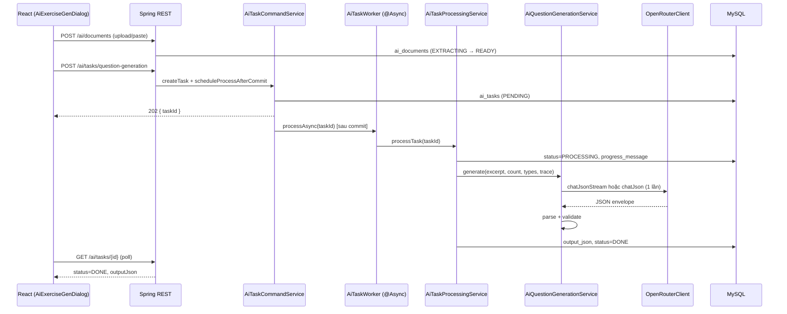

# AI Sinh câu hỏi — Quy trình & Kỹ thuật (Review / Tối ưu)

> **Cập nhật:** 26/06/2026  
> **Repo:** `course_english_backend` + `course_english_frontend`  
> **Phạm vi:** Pipeline sinh câu hỏi từ tài liệu (PDF/DOCX / paste text) qua OpenRouter  
> **Tài liệu liên quan:** [AI_INTEGRATION_PLAN.md](./AI_INTEGRATION_PLAN.md) (roadmap tổng thể)

---

## 1. Mục tiêu sản phẩm

Giáo viên upload hoặc dán nội dung → chọn loại câu + số lượng → hệ thống gọi LLM → preview JSON → chọn câu hợp lệ → thêm vào bài tập (human-in-the-loop).

**Nguyên tắc:**

- API key OpenRouter **chỉ** trên backend.
- Gen nặng chạy **async** (`ai_tasks`), FE **poll** trạng thái.
- Output lưu `ai_tasks.output_json` (envelope JSON), không nhét full JSON vào chat bubble.

---

## 2. Quy trình người dùng (UX)

```
┌─────────────┐    ┌──────────────┐    ┌─────────────┐    ┌─────────────┐
│ 1. Nguồn    │ →  │ 2. Cấu hình  │ →  │ 3. Xử lý    │ →  │ 4. Xem trước│
│ file / paste│    │ loại + số câu│    │ poll + bar  │    │ chọn + sửa  │
└─────────────┘    └──────────────┘    └─────────────┘    └─────────────┘
```

| Bước | Hành động user | FE | BE |
|------|----------------|----|----|
| 1 | Upload PDF/DOCX hoặc dán text | `POST /ai/documents` hoặc `POST /ai/documents/text` | Extract text → `ai_documents.extracted_text` |
| 2 | Tick loại câu (MCQ, TF, Fill, Reading), số câu 1–50, độ khó, ngôn ngữ stem | Validate form | — |
| 3 | Bấm **Sinh câu hỏi** | `POST /ai/tasks/question-generation` → poll `GET /ai/tasks/{id}` mỗi 2s | Worker async → OpenRouter → `DONE` |
| 4 | Preview, sửa inline, tick câu | `PATCH /ai/tasks/{id}/draft` (tuỳ chọn) | Cập nhật `output_json` |
| 5 | **Thêm vào bài tập** | Map draft → `Question` payload editor | (Phase sau: `POST import-questions`) |

**FE chính:** `course_english_frontend/src/admin/components/exercise/AiExerciseGenDialog.tsx`

---

## 3. Kiến trúc tổng quan



**Luồng dữ liệu text:**

```
File/Paste → extract (max 100k chars lưu DB) → full extracted_text vào user prompt OpenRouter
```

> **Lưu ý:** Hiện **không** cắt excerpt riêng cho gen (`AI_GEN_EXCERPT_CHARS` chưa implement). Toàn bộ `extracted_text` (trong giới hạn extract) đi vào prompt.

---

## 4. API

### 4.1 Documents

| Method | Path | Mô tả |
|--------|------|--------|
| `POST` | `/api/v1/ai/documents` | Upload PDF/DOCX (`multipart`) |
| `POST` | `/api/v1/ai/documents/text` | Dán text (`{ text, title? }`) |
| `GET` | `/api/v1/ai/documents/{id}` | Metadata + status |

**Service:** `AiDocumentService`  
**Trạng thái:** `UPLOADED` → `EXTRACTING` → `READY` | `FAILED`

### 4.2 Tasks (question generation)

| Method | Path | Mô tả |
|--------|------|--------|
| `POST` | `/api/v1/ai/tasks/question-generation` | Tạo task → `202 ACCEPTED` |
| `GET` | `/api/v1/ai/tasks/{id}` | Poll status + `outputJson` + `progressMessage` |
| `POST` | `/api/v1/ai/tasks/{id}/client-poll-timeout` | FE báo timeout UI |
| `PATCH` | `/api/v1/ai/tasks/{id}/draft` | Sửa draft sau preview |

**Body tạo task (`ReqCreateQuestionGenTaskDTO`):**

```json
{
  "documentId": "uuid",
  "questionCount": 20,
  "questionTypes": ["MULTIPLE_CHOICE", "TRUE_FALSE", "FILL_BLANK"],
  "difficulty": 3,
  "promptLang": "en"
}
```

**Poll response (`ResAiTaskDTO`):**

```json
{
  "id": "uuid",
  "status": "PENDING | PROCESSING | DONE | FAILED",
  "outputJson": { "schemaVersion": 1, "questions": [...], "meta": {} },
  "errorMessage": null,
  "progressMessage": "Đang sinh câu hỏi — đã nhận 1.2k ký tự",
  "progressPercent": 45
}
```

---

## 5. Backend — map file quan trọng

| File | Vai trò |
|------|---------|
| `controller/AiDocumentController.java` | REST documents |
| `controller/AiTaskController.java` | REST tasks |
| `service/ai/AiDocumentService.java` | Upload, extract PDF/DOCX, paste text |
| `service/ai/AiTaskCommandService.java` | Tạo task, poll, draft, redispatch safety |
| `service/ai/AiTaskWorker.java` | `@Async("aiTaskExecutor")` dispatch worker |
| `service/ai/AiTaskProcessingService.java` | Worker: đọc doc → gọi gen → lưu `output_json` |
| `service/ai/AiQuestionGenerationService.java` | Ghép prompt, gọi OpenRouter, retry JSON |
| `service/ai/question/AiQuestionPromptAssembler.java` | System + user prompt |
| `service/ai/question/AiQuestionGenResultValidator.java` | Normalize + validate từng câu |
| `service/ai/question/impl/*QuestionTypeHandler.java` | Schema fragment + example JSON theo loại |
| `service/impl/OpenRouterClient.java` | HTTP client OpenRouter (sync + stream) |
| `service/ai/AiTaskProgressReporter.java` | Ghi `progress_*` khi stream (throttle 400ms) |
| `service/ai/AiGenTraceContext.java` | Correlate activity log theo task |
| `util/AiJsonResponseSanitizer.java` | Bỏ markdown fence, cắt JSON object |

**FE:**

| File | Vai trò |
|------|---------|
| `admin/components/exercise/AiExerciseGenDialog.tsx` | Wizard 4 bước + poll + progress bar |
| `shared/api/aiTask.ts` | API client |
| `shared/ai/questionGen/aiTaskPolling.ts` | Poll interval 2s, max 300s |

---

## 6. Async task — chi tiết kỹ thuật

### 6.1 Tạo task

1. `AiTaskCommandService.createQuestionGenerationTask()` — validate quota, loại được hỗ trợ, document READY.
2. Lưu `ai_tasks` (`PENDING`, `input_json`).
3. `scheduleProcessAfterCommit()` → `AiTaskWorker.dispatchSafely()` **sau** transaction commit (tránh race worker đọc task chưa commit).

### 6.2 Worker

1. `AiTaskProcessingService.processTask()` — skip nếu voided / status ≠ PENDING.
2. Set `PROCESSING`, `started_at`, `progress_message`.
3. Gọi `AiQuestionGenerationService.generate(..., trace)`.
4. Lưu `output_json`, token counts, `DONE` hoặc `FAILED`.

### 6.3 Redispatch (safety net)

Nếu task `PENDING` > `app.ai.task-redispatch-sec` (default 20s) khi poll `getTask`:

- Gọi lại `dispatchSafely` **tối đa 1 lần** / task (tránh flood executor).
- `AiTaskWorker.dispatchSafely` bắt `RejectedExecutionException` — không làm fail API poll.

### 6.4 Thread pool

| Bean | Mục đích |
|------|----------|
| `aiTaskExecutor` | Worker xử lý task (core 2, max 4, queue 100) |
| `aiStreamExecutor` | Chat assistant SSE |
| `activityLogExecutor` | Ghi activity log async |

---

## 7. OpenRouter — gửi / nhận

### 7.1 Endpoint

`POST {OPENROUTER_BASE_URL}/chat/completions`

Headers: `Authorization`, `HTTP-Referer`, `X-Title`, `Content-Type: application/json`

### 7.2 Chế độ sinh câu (hiện tại: **single-shot**)

**Một request** cho toàn bộ `questionCount` + tất cả `questionTypes` đã chọn.

Payload chính:

```json
{
  "model": "deepseek/deepseek-v4-flash",
  "messages": [
    { "role": "system", "content": "..." },
    { "role": "user", "content": "Document excerpt:\n---\n...\n---\nGenerate exactly N questions..." }
  ],
  "temperature": 0.2,
  "stream": true,
  "response_format": { "type": "json_object" }
}
```

### 7.3 Sync vs Stream

| | `chatJson` (sync) | `chatJsonStream` (stream) |
|--|-------------------|---------------------------|
| Config | `AI_QUESTION_GEN_STREAM_ENABLED=false` | `true` (default) |
| UX | Chờ im lặng đến khi xong | Cập nhật `progress_message` theo chunk |
| Tổng thời gian | ~như nhau | ~như nhau (stream không rút ngắn generation) |
| Rủi ro | Thấp | Một số model kém ổn định với `stream` + `json_object` |

Stream flow (`OpenRouterClient.chatJsonStream`):

1. Đọc SSE từng dòng `data: {...}`.
2. Ghép `delta.content` → `fullContent`.
3. `AiJsonResponseSanitizer.extractJsonObject(raw)`.
4. Parse Jackson → `AiQuestionGenEnvelopeDTO`.

### 7.4 Retry JSON

`AiQuestionGenerationService.callWithJsonRetry`:

1. Gọi OpenRouter lần 1.
2. Nếu `parseEnvelope` fail → thêm message user *"Invalid JSON. Return ONLY..."* (+ assistant raw lần 1) → gọi lần 2.
3. Không retry tự động cho lỗi HTTP / timeout (task → `FAILED`).

### 7.5 Sanitize response

`AiJsonResponseSanitizer`:

- Bỏ ` ```json ... ``` `.
- Lấy substring từ `{` đầu tiên đến `}` cuối cùng.

---

## 8. Prompt engineering

### 8.1 System prompt (`AiQuestionPromptAssembler.buildSystemPrompt`)

- Hướng dẫn: JSON only, grounded in excerpt, field names (`choiceKey`, `correct`).
- Envelope schema: `{ schemaVersion, questions[], meta }`.
- **Với mỗi loại đã chọn:** `promptSchemaFragment()` + **`promptExampleJson()`** (example đầy đủ).

> **Trạng thái hiện tại:** Dùng **full prompt có example** (không dùng slim). Example giúp model bám schema nhưng **tăng input tokens** khi chọn nhiều loại.

### 8.2 User prompt

```
Document excerpt:
---
{full extracted_text}
---

Generate exactly {N} questions.
Allowed questionTypes: MCQ, TRUE_FALSE, ...
Difficulty (1-5): ...
promptLang: en
[+ READING_COMPREHENSION rules nếu có Reading]
Return the full JSON envelope only.
```

### 8.3 READING_COMPREHENSION

- `questionCount` = số item **top-level** trong `questions[]`.
- Khuyến nghị UI: 1–2 item Reading (mỗi item = 1 passage + nhiều sub-question trong `contentJson`).
- Handler: `ReadingComprehensionQuestionTypeHandler`.

---

## 9. Output envelope & validation

### 9.1 Envelope

```json
{
  "schemaVersion": 1,
  "questions": [
    {
      "tempId": "q1",
      "selected": true,
      "questionType": "MULTIPLE_CHOICE",
      "promptText": "...",
      "promptLang": "en",
      "explanation": "...",
      "difficulty": 2,
      "choices": [
        { "choiceKey": "a", "choiceText": "...", "correct": false, "displayOrder": 0 }
      ]
    }
  ],
  "meta": {
    "model": "...",
    "requestedTypes": ["MULTIPLE_CHOICE"]
  }
}
```

### 9.2 Validation (`AiQuestionGenResultValidator`)

- Mỗi loại có `AiQuestionTypeHandler.normalize()` + `validate()`.
- Lỗi gắn vào `draft.validationErrors[]` (không fail cả task nếu 1 câu lỗi).
- Ví dụ MCQ: `"Thiếu nội dung câu hỏi"` nếu `promptText` trống.

**Gap:** Chưa validate `questions.size() == questionCount` ở tầng envelope.

---

## 10. Activity log (Nhật ký hệ thống)

Các bước được log qua `ActivityLogService` (module `AI`):

| Action | Step | Ý nghĩa |
|--------|------|---------|
| `AI_DOC_READY` | — | Document extract xong |
| `AI_GEN_PROMPT` | `prompt_assembled` | Kích thước system/user prompt |
| `AI_OR_ROUND` | `openrouter_request` / `openrouter_response` | Gửi/nhận OpenRouter, tokens, duration |
| `AI_GEN_START` | `worker_start` | Worker bắt đầu |
| `AI_GEN_RESPONSE` | `task_done` | Hoàn thành task |
| `AI_GEN_SKIP` | — | Worker skip / redispatch |
| `AI_GEN_POLL_TIMEOUT` | — | FE poll quá lâu |

**FE:** `ActivityLogsPage` — cột Số liệu (chars/tokens).

---

## 11. Cấu hình (`.env` / `application.properties`)

| Key | Default | Mô tả |
|-----|---------|--------|
| `OPENROUTER_API_KEY` | — | Bắt buộc |
| `AI_QUESTION_GEN_MODEL` | `anthropic/claude-3.5-sonnet` | Model sinh câu (prod thường `deepseek/deepseek-v4-flash`) |
| `AI_QUESTION_GEN_TIMEOUT_SEC` | `180` | Timeout HTTP OpenRouter / task gen |
| `AI_CLIENT_POLL_TIMEOUT_MS` | `300000` | FE poll max (5 phút) |
| `AI_QUESTION_GEN_STREAM_ENABLED` | `true` | Bật stream + progress |
| `AI_MAX_EXTRACT_TEXT_CHARS` | `100000` | Cap text lưu DB sau extract |
| `AI_MAX_QUESTIONS_PER_TASK` | `50` | |
| `AI_DAILY_GEN_TASK_LIMIT` | `5` | Quota task/ngày/user |
| `AI_TASK_REDISPATCH_SEC` | `20` | Ngưỡng redispatch |
| `AI_LOG_REQUESTS` | `true` | Log OpenRouter INFO |

**Migration:** `migrations/027_ai_task_progress.sql` — cột `progress_message`, `progress_percent` trên `ai_tasks`.

---

## 12. Điểm nghẽn hiệu năng (để reviewer tập trung)

### 12.1 Thời gian chủ yếu = **output tokens**

Với 15–25 câu JSON đầy đủ schema:

- Input ~2–4k tokens (doc ~9k chars + system prompt béo khi 3–4 loại + examples).
- Output ~4–9k tokens → **1–7 phút** tuỳ model (DeepSeek Flash nhanh hơn Claude Sonnet).

**Không phải** do parse JSON hay poll FE.

### 12.2 System prompt scale theo số loại

Chọn 4 loại → system gồm 4 schema + 4 example JSON (Reading example rất dài).

### 12.3 Một shot lớn

Toàn bộ câu trong **1 response JSON** → latency = thời gian sinh hết output tuần tự.

### 12.4 Stream

Cải thiện **cảm nhận** (progress bar), không giảm wall-clock đáng kể.

---

## 13. Thử nghiệm đã revert (batch + slim) — bài học

Đã thử và **gỡ** (không còn trong code):

| Hướng | Ý tưởng | Vấn đề gặp |
|-------|---------|------------|
| **Batch theo loại** | Chia N câu → nhiều call OpenRouter, merge `questions[]` | Input lặp excerpt mỗi batch (~8.6k × 3 request); merge lệch số câu / skeleton JSON (`promptText` trống) |
| **Slim prompt** | Bỏ example JSON trong system | Giảm input nhưng model sinh JSON kém ổn định hơn |
| **Batch + slim** | Kết hợp | UI preview 5 MCQ toàn lỗi "Thiếu nội dung câu hỏi" |

**Quyết định hiện tại:** Giữ **single-shot + full prompt + stream/progress**.

Nếu tối ưu lại batch sau này, cần:

- Validate `count` **per batch** + retry cục bộ.
- Không lặp full excerpt (excerpt budget / window per batch).
- Feature flag rollback.
- Không đổi UX (user vẫn 1 lần bấm Sinh).

---

## 14. Hướng tối ưu đề xuất (cho reviewer)

### P0 — Impact cao, ít đổi UX

| # | Đề xuất | Ghi chú |
|---|---------|---------|
| 1 | `max_tokens` theo `questionCount` + loại | Tránh output phình, timeout |
| 2 | `AI_GEN_EXCERPT_CHARS` (tách khỏi storage 100k) | Doc dài: cap input; doc ngắn: không đổi |
| 3 | Validate `questions.size() == questionCount` sau parse | Fail task sớm thay vì preview lỗi hàng loạt |
| 4 | Stream fallback: nếu >50% câu invalid → retry sync 1 lần | Ổn định DeepSeek + json stream |

### P1 — Kiến trúc (cần thiết kế lại)

| # | Đề xuất | Ghi chú |
|---|---------|---------|
| 5 | Batch theo loại **có** planner + per-batch validate | Chỉ khi đã fix excerpt lặp + merge |
| 6 | Model routing: Flash cho MCQ/TF, model mạnh cho Reading | Config per-type |
| 7 | Parallel batch (max 2 concurrent) + rate limit | Giảm wall-clock |

### P2 — UX / vận hành

| # | Đề xuất |
|---|---------|
| 8 | Progress message theo phase rõ hơn (đang gọi OR / đang parse) |
| 9 | Cảnh báo UI khi doc > excerpt cap |
| 10 | `POST import-questions` (Phase 3) |

---

## 15. Checklist review

Reviewer có thể dùng checklist sau:

- [ ] Prompt có grounded đủ không? Có example thừa / thiếu không?
- [ ] `response_format: json_object` có phù hợp model đang dùng không?
- [ ] Stream + model combo có ổn định không? Có cần fallback sync không?
- [ ] Timeout 180s / poll 300s có đủ cho 25 câu + Reading không?
- [ ] Retry JSON (nhét full bad response) có quá nặng không?
- [ ] Redispatch + executor có còn edge case từ chối task không?
- [ ] Activity log có đủ metric để debug (promptChars, promptTokens, completionTokens, durationMs)?
- [ ] Có nên cap excerpt trước khi thử batch lại không?
- [ ] Validator có nên fail task khi thiếu câu / sai loại không?
- [ ] Chi phí OpenRouter: đo 1 shot vs batch (input tokens thật, không cộng chars log)

---

## 16. Lệnh dev / test nhanh

```bash
# Backend
cd course_english_backend
./gradlew bootRun

# Migration progress (nếu chưa)
# Chạy migrations/027_ai_task_progress.sql

# FE
cd course_english_frontend
npm run dev
```

**Test thủ công:**

1. Admin → Exercise editor → Sinh câu bằng AI.
2. Upload file ngắn (~2k chars), 10 câu MCQ only.
3. Xem Nhật ký hệ thống: `AI_GEN_PROMPT`, `AI_OR_ROUND`, `AI_GEN_RESPONSE`.
4. So sánh `AI_QUESTION_GEN_STREAM_ENABLED=true` vs `false`.

---

## 17. Liên hệ maintainer

- Plan tổng: `course_english_frontend/docs/AI_INTEGRATION_PLAN.md`
- Câu hỏi nghiệp vụ Reading / questionCount: xem `AiQuestionPromptAssembler` + `WeekScheduleGrid` hint trên FE.

---

*Tài liệu này mô tả trạng thái code sau khi revert batch/slim (26/06/2026), giữ stream + activity log + async task.*
