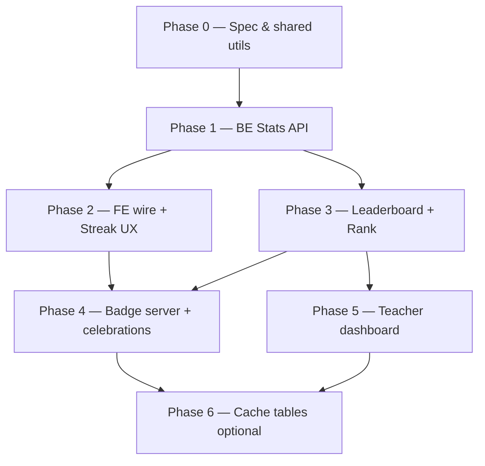

# Kế hoạch Gamification — XP · Level · Streak · Rank · Badge

> Cập nhật: **20/06/2026**  
> Tham chiếu: `promt.md` (vision), `docs/STUDENT_PROGRESS.md` (S8a baseline + S8b sketch)  
> Repo: `course_english_backend` + `course_english_frontend`

---

## Mục tiêu sản phẩm

Tăng **thói quen học hàng ngày**, **tỷ lệ hoàn thành bài**, **retention dài hạn** — giáo dục trước, cạnh tranh sau (`promt.md`).

| Hành vi mong muốn | Cơ chế |
|-------------------|--------|
| Học mỗi ngày | Streak liên tiếp + daily XP goal |
| Hoàn thành bài / quiz | XP + level up |
| Cảm giác tiến bộ | Level bar, badge, toast sau bài |
| Cạnh tranh tích cực | Leaderboard theo lớp (tuần / tháng / all-time) |
| GV theo dõi lớp | Dashboard read-only (top, at-risk streak) |

---

## Baseline hiện tại (S8a — FE-only)

| Có | Chưa / sai nghĩa |
|----|------------------|
| XP derive client (`studentStats.ts`) | Không lưu server, đổi thiết bị lệch |
| Level bar Home (`HomeLevelBar`, `levelUtils.ts`) | Profile chưa có level bar |
| “Streak tuần” = số ngày active T2–CN (`getWeeklyStudyDays`) | **Không phải** streak liên tiếp Duolingo |
| Daily goals checklist (`dailyGoalsUtils`) | Không có daily **XP target** |
| ~20 badge client (`badges.ts`) | `special_top_student` không unlock được |
| `/student/leaderboard` placeholder | Không API rank |

**Quyết định thuật ngữ:**

- **Weekly calendar** — lịch T2–CN có học hay không (giữ, đổi label rõ ràng).
- **Current streak** — số ngày học **liên tiếp** (mới, server-side).
- **Longest streak** — kỷ lục streak (mới).
- **Class rank** — hạng XP trong lớp theo kỳ (tuần/tháng/all).

---

## Quy tắc nghiệp vụ (chốt v1)

### XP — cộng dồn từ hoạt động học

| Hành động | XP | Ghi chú |
|-----------|-----|---------|
| Đọc xong bài (scroll ≥ 98%) | +10 | Mỗi lesson tính 1 lần (best progress) |
| Pass bài tập (≥ passScore) | +20 | Mỗi lesson tính 1 lần khi đã pass |
| Điểm 100% bài tập | +10 bonus | Cộng thêm 1 lần/lesson khi có attempt 100% |
| Mỗi lần nộp bài tập | +5 | Mọi attempt hợp lệ |
| Hoàn thành daily XP goal | +15 bonus | 1 lần/ngày |
| Streak 7 ngày liên tiếp | +50 bonus | 1 lần khi đạt mốc (optional phase 2) |
| Homework (Assignment) | +30 | Phase sau — khi có module Assignment |
| GV tặng XP | +20 | Phase sau — nếu cần |

> Migration từ S8a: công thức cũ `(pass×50 + read×20 + attempt×5)` **thay bằng bảng trên** — document trong API response `xpBreakdown` để debug.

### Level — ngưỡng XP tích lũy

| Level | XP tối thiểu |
|-------|--------------|
| 1 | 0 |
| 2 | 100 |
| 3 | 250 |
| 4 | 500 |
| 5 | 800 |
| 6+ | +300 mỗi level (800, 1100, 1400, …) |

FE: thay `LEVEL_THRESHOLDS` trong `levelUtils.ts` cho khớp server (hoặc gọi API trả sẵn `level`, `nextLevelXp`).

### Streak — ngày học liên tiếp

**“Học trong ngày”** nếu (timezone `Asia/Ho_Chi_Minh`, cutoff 00:00):

1. Có `lesson_reading_progress.updated_at` trong ngày với `scroll_percent ≥ 10`, hoặc
2. Có `lesson_practice_attempt.completed_at` trong ngày (`voided = false`).

**Logic:**

```
if studied(today):
  if studied(yesterday): currentStreak += 1
  elif lastActiveDate == today: giữ nguyên
  else: currentStreak = 1
else:
  if lastActiveDate < yesterday: currentStreak = 0  // đã mất streak
longestStreak = max(longestStreak, currentStreak)
```

Copy UX khi mất streak: nhẹ nhàng (“Ngày mới — bắt đầu lại nhé!”), không phạt / không đỏ gắt.

### Daily goal

- Target mặc định: **50 XP/ngày** (SystemConfig `DAILY_XP_GOAL`).
- `dailyXpToday` = tổng XP events phát sinh trong ngày (không tính bonus daily goal vào target trước khi đạt).
- Đạt target → +15 bonus XP + badge progress `special_daily_learner`.

### Leaderboard — phạm vi lớp

- Chỉ HS `enrollment.status = ACTIVE` trong `classroom_id`.
- Chỉ XP từ lesson thuộc subject của lớp đó.
- Kỳ: `week` (T2 00:00) | `month` | `all`.
- Trả về: top N (20) + `myRank`, `myXp`, `totalParticipants`.
- Không hiển thị “bottom students”.

### SystemConfig toggles

| Key | Default | Mục đích |
|-----|---------|----------|
| `GAMIFICATION_XP_ENABLED` | `true` | Ẩn XP/level trên UI |
| `LEADERBOARD_ENABLED` | `true` | Ẩn tab leaderboard (tiểu học có thể tắt) |
| `DAILY_XP_GOAL` | `50` | Mục tiêu XP/ngày |

---

## Tổng quan các Phase



| Phase | Tên | Ước lượng | Phụ thuộc |
|-------|-----|-----------|-----------|
| **0** | Spec freeze + shared XP/streak utils | 0.5 ngày | — |
| **1** | BE: `GET /students/me/stats` | 2–3 ngày | Phase 0 |
| **2** | FE: Home/Profile/Header streak + daily XP | 2–3 ngày | Phase 1 |
| **3** | Leaderboard + class rank | 2–3 ngày | Phase 1 |
| **4** | Badge server + post-lesson XP toast | 2 ngày | Phase 2, 3 |
| **5** | Teacher gamification view | 2–3 ngày | Phase 3 |
| **6** | Persistence cache (scale) | 2–4 ngày | Pilot lớp lớn |

**MVP ship:** Phase 0 → 1 → 2 → 3 (≈ 1.5–2 sprint).  
**Full:** thêm Phase 4 → 5; Phase 6 khi cần performance.

---

## Phase 0 — Spec freeze & shared utilities

**Mục tiêu:** Một bộ rule duy nhất, FE/BE dùng chung logic (test được).

### Backend

| Task | File gợi ý |
|------|------------|
| Enum XP event types | `util/constant/GamificationXpEventEnum.java` |
| `GamificationRules` — XP amounts, level thresholds | `service/gamification/GamificationRules.java` |
| Unit test streak + XP từ sample dates | `src/test/.../GamificationRulesTest.java` |

### Frontend

| Task | File gợi ý |
|------|------------|
| Mirror rules (hoặc chỉ consume API) | `shared/gamification/gamificationRules.ts` |
| Type `StudentGamificationStats` | `shared/api/studentStats.ts` |

### Acceptance criteria

- [ ] Bảng XP/level/streak documented ở đầu file này = code constants
- [ ] Test case: 7 ngày liên tiếp → streak 7; bỏ 1 ngày → reset
- [ ] Timezone VN documented

---

## Phase 1 — Backend Stats API (aggregate, không bảng mới)

**Mục tiêu:** Nguồn sự thật server cho XP, level, streak, daily XP.

### API

```
GET /api/v1/students/me/stats
GET /api/v1/students/me/stats?classroomId={uuid}   // optional: rank preview
```

**Response `ResStudentStatsDTO` (gợi ý):**

```json
{
  "totalXp": 420,
  "level": 3,
  "nextLevelXp": 500,
  "xpToNextLevel": 80,
  "currentStreak": 5,
  "longestStreak": 12,
  "studiedToday": true,
  "dailyXpToday": 35,
  "dailyXpGoal": 50,
  "dailyGoalCompleted": false,
  "weeklyActiveDays": [true, true, false, true, true, false, false],
  "lessonsReadComplete": 8,
  "practicePassedCount": 5,
  "totalAttempts": 14,
  "xpBreakdown": { "readComplete": 80, "practicePass": 100, "attempts": 70, "bonuses": 20 },
  "gamificationEnabled": true
}
```

### Backend tasks

| # | Task | Chi tiết |
|---|------|----------|
| 1.1 | `StudentGamificationService` | Aggregate từ `lesson_reading_progress` + `lesson_practice_attempt` |
| 1.2 | Repository queries | Active dates per user; sum XP theo rules |
| 1.3 | Streak calculator | Walk sorted unique study dates |
| 1.4 | `StudentStatsController` | `@PreAuthorize` student role |
| 1.5 | SystemConfig keys | 3 keys trong `SystemConfigKeyEnum` + `SystemConfigInitializer` |
| 1.6 | Public config endpoint | FE đọc `GAMIFICATION_XP_ENABLED`, `LEADERBOARD_ENABLED` (reuse `/system-configs/check` hoặc bundle trong stats) |

**File gợi ý (BE):**

```
controller/StudentStatsController.java
service/StudentGamificationService.java
service/impl/StudentGamificationServiceImpl.java
domain/response/ResStudentStatsDTO.java
repository/... (custom @Query trên reading progress + practice attempt)
```

### Acceptance criteria

- [ ] Cùng user, reload / thiết bị khác → stats giống nhau
- [ ] HS chỉ thấy stats của mình
- [ ] `studiedToday` đúng sau khi submit attempt / sync reading progress
- [ ] Performance: p95 < 300ms với ~500 attempt/user (index `user_id`, `updated_at`, `completed_at`)

---

## Phase 2 — Frontend: Wire API + Streak / Daily XP UX

**Mục tiêu:** UI phản ánh streak **liên tiếp** và daily XP goal; bỏ dần compute local.

### Tasks

| # | Task | File |
|---|------|------|
| 2.1 | API client `fetchStudentStats()` | `shared/api/studentStats.ts` |
| 2.2 | Hook `useStudentGamificationStats()` | `student/profile/useStudentStats.ts` (refactor) |
| 2.3 | Context/dashboard | `StudentDashboardContext.tsx` — load stats 1 lần, share Home/Header/Profile |
| 2.4 | **Streak pill** = `currentStreak` | `StudentHeaderStats.tsx` |
| 2.5 | **HomeWeeklyStreak** | Giữ calendar; title đổi “Tuần này”; thêm block **🔥 N ngày liên tiếp** + longest |
| 2.6 | **ProfileHeader** | Level badge + XP bar (`HomeLevelBar` reuse) + current/longest streak |
| 2.7 | **HomeDailyGoals** | Primary: Daily XP progress bar; secondary: checklist cũ |
| 2.8 | **levelUtils** | Sync thresholds với BE |
| 2.9 | Transition | `max(localXp, serverXp)` 1 sprint rồi remove `computeStudentStats` |

### Acceptance criteria

- [ ] Home XP/streak khớp Profile sau F5
- [ ] Label UI không còn gọi weekly count là “streak” duy nhất
- [ ] Khi `GAMIFICATION_XP_ENABLED=false` → ẩn XP/level, vẫn hiện streak (hoặc ẩn hết — chốt 1 cách)
- [ ] Loading skeleton khi fetch stats

---

## Phase 3 — Leaderboard + Class Rank

**Mục tiêu:** Bảng xếp hạng lớp thật; rank trên Profile.

### API

```
GET /api/v1/classrooms/{classroomId}/leaderboard?period=week|month|all&limit=20
```

**Response `ResClassroomLeaderboardDTO`:**

```json
{
  "classroomId": "...",
  "period": "week",
  "entries": [
    { "rank": 1, "userId": "...", "displayName": "Minh", "xp": 1200, "level": 5, "currentStreak": 7 }
  ],
  "myRank": 3,
  "myXp": 980,
  "totalParticipants": 28,
  "leaderboardEnabled": true
}
```

### Backend tasks

| # | Task |
|---|------|
| 3.1 | Query XP per user in classroom, filter ACTIVE enrollment |
| 3.2 | Rank tie-break: higher XP first, then earlier `lastActiveAt` |
| 3.3 | Authorization: student phải enrolled ACTIVE; teacher/admin xem lớp mình |
| 3.4 | Optional: include rank summary trong `GET /students/me/stats?classroomId=` |

### Frontend tasks

| # | Task | File |
|---|------|------|
| 3.5 | `LeaderboardPage` thay placeholder | `pages/student/StudentLeaderboardPage.tsx` → `student/leaderboard/` |
| 3.6 | Filter lớp | reuse `EnrollmentClassroomFilter` |
| 3.7 | Tabs Tuần / Tháng / Tất cả | |
| 3.8 | Highlight row current user | |
| 3.9 | Profile: chip “Hạng tuần #3/28” | `ProfileOverviewTab.tsx` |
| 3.10 | Nav: ẩn leaderboard item khi disabled | `studentNavItems.ts` |

### Acceptance criteria

- [ ] Top 20 + vị trí của mình đúng
- [ ] Chỉ HS ACTIVE trong lớp xuất hiện
- [ ] Đổi tab period → reload đúng XP kỳ
- [ ] Empty state: lớp chưa có ai học tuần này
- [ ] Không hiển thị danh sách “yếu nhất”

---

## Phase 4 — Badge server-side + Celebrations

**Mục tiêu:** Badge unlock đồng bộ; cảm giác reward sau học.

### Backend

| # | Task |
|---|------|
| 4.1 | `GET /students/me/badges` hoặc embed trong stats `unlockedBadgeIds[]` |
| 4.2 | Rule engine map `BadgeId` → điều kiện (port từ `badges.ts`) |
| 4.3 | `special_top_student`: rank = 1 tuần hiện tại |
| 4.4 | Optional `POST` event: persist `student_badge` khi unlock lần đầu |

### Frontend

| # | Task | File |
|---|------|------|
| 4.5 | Profile badges từ server | `ProfileBadgesTab.tsx`, `badges.ts` |
| 4.6 | Toast sau practice submit | `ExerciseResultScreen.tsx` — “+20 XP”, streak milestone |
| 4.7 | Level-up modal (optional) | component mới `LevelUpCelebration.tsx` |
| 4.8 | Notification type `BADGE_UNLOCKED` / `STREAK_MILESTONE` | extend WS notification (nếu đã có pipeline) |

### Acceptance criteria

- [ ] Badge unlock trên Profile khớp sau reload
- [ ] `special_top_student` chỉ unlock khi #1 tuần (server)
- [ ] Toast không spam khi retry cùng attempt

---

## Phase 5 — Teacher dashboard (read-only)

**Mục tiêu:** GV xem engagement lớp — **không** chỉnh XP thủ công.

### API

```
GET /api/v1/classrooms/{id}/gamification-insights?period=week
```

**Response gợi ý:**

| Block | Nội dung |
|-------|----------|
| `topStudents` | Top 5 XP tuần |
| `topStreaks` | Top 5 current streak |
| `atRiskStreaks` | Streak ≥ 3, chưa học hôm nay (cutoff configurable, default 18:00) |
| `mostImproved` | Top 5 delta XP vs tuần trước |
| `participationRate` | % HS ACTIVE có ≥1 activity trong kỳ |

### Frontend (admin/teacher zone)

| # | Task |
|---|------|
| 5.1 | Tab / widget trên classroom detail |
| 5.2 | Bảng compact + link HS profile (read-only) |
| 5.3 | Empty / loading states |

### Acceptance criteria

- [ ] Chỉ teacher của lớp / admin xem được
- [ ] Không có action edit XP
- [ ] At-risk list hợp lý (test: streak 5, 19h chưa học → có trong list)

---

## Phase 6 — Persistence & cache (khi scale)

**Mục tiêu:** Tránh aggregate nặng khi lớp > 50 HS hoặc leaderboard gọi thường xuyên.

### Migration

```sql
-- 007_student_gamification.sql
CREATE TABLE student_stats (
  user_id CHAR(36) PRIMARY KEY,
  total_xp INT NOT NULL DEFAULT 0,
  current_streak INT NOT NULL DEFAULT 0,
  longest_streak INT NOT NULL DEFAULT 0,
  last_active_date DATE,
  updated_at DATETIME(6)
);

CREATE TABLE student_badge (
  id CHAR(36) PRIMARY KEY,
  user_id CHAR(36) NOT NULL,
  badge_id VARCHAR(64) NOT NULL,
  unlocked_at DATETIME(6),
  UNIQUE (user_id, badge_id)
);

CREATE TABLE leaderboard_snapshot (
  id CHAR(36) PRIMARY KEY,
  classroom_id CHAR(36),
  period VARCHAR(16),
  period_start DATE,
  payload JSON,
  created_at DATETIME(6)
);
```

### Tasks

| # | Task |
|---|------|
| 6.1 | Update `student_stats` on attempt submit + reading progress sync |
| 6.2 | Nightly cron recompute streak (safety net timezone) |
| 6.3 | Weekly cron snapshot leaderboard |
| 6.4 | Feature flag: `GAMIFICATION_USE_CACHE=true` fallback aggregate |

### Acceptance criteria

- [ ] Stats API p95 < 100ms với cache
- [ ] Recompute job idempotent
- [ ] Rollback: cache off → vẫn đúng qua aggregate

---

## Ma trận màn hình × Phase

| Màn / Component | P1 | P2 | P3 | P4 | P5 |
|-----------------|:--:|:--:|:--:|:--:|:--:|
| HomeLevelBar | | ✅ wire | | ✅ level-up | |
| HomeWeeklyStreak | | ✅ redesign | | | |
| HomeDailyGoals | | ✅ XP bar | | | |
| StudentHeaderStats | | ✅ streak | ✅ rank pill | | |
| ProfileHeader / Overview | | ✅ level+streak | ✅ rank chip | | |
| ProfileBadgesTab | | | | ✅ server | |
| StudentLeaderboardPage | | | ✅ full | | |
| ExerciseResultScreen | | | | ✅ XP toast | |
| Teacher classroom | | | | | ✅ insights |

---

## Rủi ro & giảm thiểu

| Rủi ro | Giảm thiểu |
|--------|------------|
| XP cũ (S8a) lệch XP mới | Ship Phase 2 với banner “hệ thống XP mới”; không migrate retroactive phức tạp — tính lại từ attempt/progress server |
| Streak timezone | Hardcode `Asia/Ho_Chi_Minh`; test boundary 23:59 |
| Leaderboard toxic | Chỉ top + my rank; copy tích cực |
| Performance aggregate | Phase 1 index DB; Phase 6 cache nếu cần |
| Weekly calendar vs streak gây nhầm | Đổi label rõ; 2 metric riêng trên UI |

---

## Definition of Done — MVP (Phase 1–3)

- [ ] `GET /students/me/stats` production-ready
- [ ] `GET /classrooms/{id}/leaderboard` production-ready
- [ ] Home + Profile + Header dùng API server
- [ ] Streak liên tiếp + longest streak hiển thị đúng
- [ ] Daily XP goal progress bar
- [ ] Leaderboard page thay placeholder
- [ ] SystemConfig tắt gamification / leaderboard
- [ ] `STUDENT_PROGRESS.md` cập nhật trạng thái S8b → Done MVP

---

## Việc làm ngay (kickoff Phase 0 + 1)

1. Tạo `GamificationRules` BE + test streak.
2. Thêm 3 SystemConfig keys.
3. Implement `StudentGamificationServiceImpl` + controller.
4. FE: `fetchStudentStats` + wire `StudentDashboardContext`.
5. QA checklist: 2 user cùng lớp, 1 tuần activity → leaderboard đúng thứ hạng.

---

## Tài liệu liên quan

| File | Nội dung |
|------|----------|
| `promt.md` | Vision gamification đầy đủ |
| `docs/STUDENT_PROGRESS.md` | Tiến độ student zone |
| `docs/STUDENT_FE_STRUCTURE.md` | Cấu trúc FE |
| `migrations/005_*`, `006_*` | Nguồn aggregate XP/streak |

---

## Changelog

| Ngày | Ghi chú |
|------|---------|
| 20/06/2026 | Khởi tạo plan Phase 0–6 |
