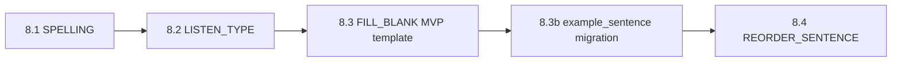

# Kế hoạch Phase 8 — 5 dạng bài tập mới

> Cập nhật: **2026-06-10**  
> Tham chiếu: [`LESSON_AUTHORING_PROGRESS.md`](./LESSON_AUTHORING_PROGRESS.md) · [`VOCABULARY_LIBRARY_DICTIONARY_PROGRESS.md`](./VOCABULARY_LIBRARY_DICTIONARY_PROGRESS.md) · pattern Phase 7 `LISTEN_CHOOSE`

---

## 1. Bối cảnh

### Đã có (tab **Bài tập**, `EXERCISE_SET`)

| Type | Mô tả | Sinh từ bộ từ |
|------|--------|----------------|
| `MULTIPLE_CHOICE` | Trắc nghiệm EN → chọn nghĩa VI | ✅ |
| `MATCHING` | Ghép cặp EN ↔ VI | ✅ |
| `LISTEN_CHOOSE` | Nghe audio → chọn nghĩa VI | ✅ |

### Mục tiêu Phase 8

Thêm **5 loại câu** vào cùng engine `ExercisePlayer` + có thể sinh từ bộ từ (nếu hợp lý):

| # | Type | Tên tiếng Việt | Ưu tiên |
|---|------|----------------|---------|
| 8.1 | `SPELLING` | Gõ chính tả từ | **P0** — dễ, tái dùng enrich |
| 8.2 | `LISTEN_TYPE` | Nghe → gõ từ (dictation) | **P0** — mở rộng LISTEN_CHOOSE |
| 8.3 | `FILL_BLANK` | Điền từ vào chỗ trống | **P1** — cần câu mẫu |
| 8.4 | `REORDER_SENTENCE` | Sắp xếp từ thành câu đúng | **P1** — UI drag-drop |
| 8.5 | *(alias)* | Cùng `REORDER_SENTENCE` | — |

> **REORDER_SENTENCE** = đúng nhu cầu “câu 10 từ bị đảo, HS kéo/thả sắp xếp lại”. Không tách type riêng.

---

## 2. Nguyên tắc kỹ thuật (giữ từ Phase 7)

Mỗi type mới đi theo **cùng pipeline**:

```text
types.ts → parseExerciseSet.ts → prepareExerciseItems.ts
→ exercisePayload.ts (validate/summary/clean)
→ ExercisePlayer + ExerciseReviewScreen + CSS
→ LessonPublishValidator (BE)
→ Admin: canvas soạn HOẶC read-only (nếu sinh từ bộ từ)
→ vocabActivityGenerator.ts (nếu auto-gen)
→ VocabAttachToLessonWizard + dialog sinh riêng (tuỳ chọn)
```

- Payload lưu trong `lesson_blocks.payload_json` — **không migration DB** (chỉ mở rộng JSON).
- `QuestionTypeEnum` (BE bank): thêm `SPELLING`, `LISTEN_TYPE`, `REORDER_SENTENCE` khi cần bank.
- Chấm điểm: **normalize** trước khi so (trim, lowercase, bỏ dấu câu thừa) — xem mục 3.

---

## 3. Chuẩn chấm điểm chung (`answerNormalize.ts`)

Tạo helper dùng chung cho `SPELLING`, `LISTEN_TYPE`, `FILL_BLANK`:

```ts
normalizeAnswer(input: string, options?: {
  caseSensitive?: boolean;      // mặc định false
  trim?: boolean;               // mặc định true
  collapseSpaces?: boolean;     // mặc định true
  stripPunctuation?: boolean;   // mặc định true (. , ! ?)
  acceptSynonyms?: string[];    // FILL_BLANK: ["colour", "color"]
}): string
```

| Type | So khớp |
|------|---------|
| SPELLING / LISTEN_TYPE | `normalize(user) === normalize(correctAnswer)` |
| FILL_BLANK | Mỗi blank: so 1 đáp án hoặc danh sách `acceptedAnswers[]` |
| REORDER_SENTENCE | So **thứ tự token id** (không so string ghép) |

---

## 4. Chi tiết từng dạng

### 8.1 — `SPELLING` (Gõ chính tả)

**HS thấy:** Nghĩa tiếng Việt (hoặc gợi ý EN ẩn) → ô nhập → Enter / Tiếp.

**Payload mẫu:**

```json
{
  "id": "spell-q1",
  "type": "SPELLING",
  "prompt": { "text": "chuối", "lang": "vi" },
  "correctAnswer": "banana",
  "wordEn": "banana",
  "hint": "b____a",
  "caseSensitive": false,
  "explanation": "banana = chuối"
}
```

**Sinh từ bộ từ (`generateSpellingFromVocabItems`):**

- Mỗi từ hợp lệ → 1 câu: `prompt` = `meaningVi`, `correctAnswer` = `wordEn`.
- Không cần audio; không cần ≥ 4 từ (sinh được từ 1 từ).
- Tuỳ chọn `hint`: hiện ký tự đầu + `___` (che phần giữa).

**Admin editor:** Form soạn tay (prompt, đáp án, hint) + read-only khi sinh từ bộ từ.

**Effort:** ~1 session (nhỏ nhất trong 4 type).

---

### 8.2 — `LISTEN_TYPE` (Nghe → gõ)

**HS thấy:** Nút **Nghe (US/UK)** → ô nhập tiếng Anh → chấm.

**Payload mẫu:**

```json
{
  "id": "listen-type-q1",
  "type": "LISTEN_TYPE",
  "audioUrl": "https://…",
  "audioAccent": "US",
  "wordEn": "banana",
  "prompt": { "text": "Nghe và gõ từ tiếng Anh", "lang": "vi" },
  "correctAnswer": "banana",
  "caseSensitive": false,
  "explanation": "banana = chuối"
}
```

**Sinh từ bộ từ:** Giống `LISTEN_CHOOSE` — cần `audioUkUrl` / `audioUsUrl`, accent từ system config. Không cần đáp án nhiễu → **≥ 1 từ có audio** là đủ.

**Khác LISTEN_CHOOSE:** Không có `choices[]`; chấm bằng `normalizeAnswer`.

**Effort:** ~1 session (tái dùng `ListenChooseQuestion` UI, bỏ grid đáp án).

---

### 8.3 — `FILL_BLANK` (Điền khuyết)

**HS thấy:** Câu có ô trống `___` hoặc dropdown (MVP: **1 ô input text**).

**Payload mẫu:**

```json
{
  "id": "fill-q1",
  "type": "FILL_BLANK",
  "prompt": { "text": "I ___ to school every day.", "lang": "en" },
  "blanks": [
    {
      "id": "b1",
      "acceptedAnswers": ["go", "Go"],
      "placeholder": "động từ"
    }
  ],
  "explanation": "go = đi"
}
```

**Hiển thị:** Parse `prompt.text` — token `___` hoặc `{{b1}}` → render `<input>` inline.

**Sinh từ bộ từ (hạn chế):**

| Cách | Mô tả |
|------|--------|
| **A — Template cố định** | `"This is a ___."` + answer = `wordEn` — đơn giản, câu hơi vô nghĩa |
| **B — `example_sentence` trên từ** | Migration thêm `example_sentence_en` trên `vocabulary_words`; GV/enrich điền câu → blank 1 từ |
| **C — Chỉ soạn tay / bank** | Không auto-gen; GV nhập câu + đáp án |

**Đề xuất MVP:** Cách **A** cho generator nhanh; Cách **B** là Phase 8.3b (migration nhỏ).

**Effort:** ~1.5 session (parser blank + chấm nhiều ô).

---

### 8.4 — `REORDER_SENTENCE` (Sắp xếp câu)

**HS thấy:** Các **mảnh từ** (chip) bị xáo trộn → kéo thả / bấm để xếp thành hàng → **Kiểm tra**.

**Payload mẫu:**

```json
{
  "id": "reorder-q1",
  "type": "REORDER_SENTENCE",
  "prompt": { "text": "Sắp xếp các từ thành câu đúng", "lang": "vi" },
  "tokens": [
    { "id": "t1", "text": "I" },
    { "id": "t2", "text": "go" },
    { "id": "t3", "text": "to" },
    { "id": "t4", "text": "school" },
    { "id": "t5", "text": "every" },
    { "id": "t6", "text": "day" }
  ],
  "correctOrder": ["t1", "t2", "t3", "t4", "t5", "t6"],
  "sourceSentence": "I go to school every day.",
  "explanation": "…"
}
```

**`prepareExerciseItems`:** Shuffle `tokens` → gán `displayOrder[]` (giống shuffle choices MCQ).

**Chấm điểm:** So mảng `selectedOrder: string[]` với `correctOrder` (từng phần tử `token.id`).

**UI:** `@dnd-kit` (đã có trong `QuestionListPanel`) — 2 vùng: **Đã chọn** (thứ tự câu) + **Chưa dùng** (pool).

**Sinh từ bộ từ:**

- Cần **câu đầy đủ** → phụ thuộc `example_sentence_en` (giống FILL_BLANK B).
- Generator: tách câu theo space/punctuation → `tokens[]` + `correctOrder`.
- Câu ngắn (3–12 từ); cảnh báo nếu > 15 từ (UI chật mobile).

**Effort:** ~2 sessions (drag-drop + mobile + review).

---

## 5. Thứ tự triển khai đề xuất



| Sprint | Deliverable | Acceptance |
|--------|-------------|------------|
| **S1** ✅ | SPELLING + LISTEN_TYPE | Sinh từ bộ fruit → HS tab Bài tập gõ đúng; review hiện đáp án |
| **S2** | FILL_BLANK (template + editor tay) | GV soạn "I ___ …" + publish; HS điền, chấm đúng/sai |
| **S3** | `example_sentence_en` + gen FILL + REORDER | Enrich hoặc GV nhập câu mẫu → auto 2 dạng |
| **S4** | Polish | Wizard tick từng loại; import CSV; bank resolve |

---

## 6. Migration / schema tuỳ chọn (Phase 8.3b)

Chỉ cần nếu muốn **FILL_BLANK + REORDER** sinh tự động chất lượng cao:

```sql
-- 012_vocabulary_example_sentence.sql
ALTER TABLE vocabulary_words
  ADD COLUMN example_sentence_en VARCHAR(500) NULL AFTER audio_us_url;
```

- Enrich Dictionary: lấy `example` đầu tiên từ API (nếu có).
- GV sửa tay trên form từ / bộ từ.
- Generator: blank 1 từ target trong câu HOẶC reorder toàn bộ câu.

---

## 7. File cần tạo / sửa (checklist chung)

### Shared / types

- [ ] `exercise/types.ts` — `SpellingQuestion`, `ListenTypeQuestion`, `FillBlankQuestion`, `ReorderSentenceQuestion`
- [ ] `shared/lesson/answerNormalize.ts` — normalize + compare
- [ ] `parseExerciseSet.ts` — parse 4 type
- [ ] `prepareExerciseItems.ts` — shuffle tokens (REORDER)
- [ ] `exercisePayload.ts` — validate, summary, clean, build
- [ ] `vocabActivityGenerator.ts` — 3–4 hàm `generate*FromVocabItems`

### Student

- [ ] `SpellingQuestion.tsx`, `ListenTypeQuestion.tsx`, `FillBlankQuestion.tsx`, `ReorderSentenceQuestion.tsx`
- [ ] `ExercisePlayer.tsx` — render + score
- [ ] `ExerciseReviewScreen.tsx` — xem lại
- [ ] `lesson-player.css` — style từng dạng

### Admin

- [ ] Canvas soạn (hoặc read-only cho gen): 4 file `*QuestionCanvas.tsx`
- [ ] `ExerciseSetEditor.tsx` — không lọc bỏ type mới
- [ ] `QuestionListPanel.tsx` — nút thêm + icon
- [ ] `VocabAttachToLessonWizard` — checkbox từng loại
- [ ] Dialog sinh riêng (tuỳ chọn gộp 1 dialog “Sinh bài tập nâng cao”)

### Backend

- [ ] `QuestionTypeEnum` — `SPELLING`, `LISTEN_TYPE`, `REORDER_SENTENCE`
- [ ] `LessonPublishValidator.isValid*` cho từng type
- [ ] (Tuỳ chọn) resolve `QUESTION_REF` cho type mới trong bank mapper

---

## 8. Sinh từ bộ từ — tóm tắt điều kiện

| Generator | Min từ | Cần gì |
|-----------|--------|--------|
| SPELLING | 1 | `wordEn` + `meaningVi` |
| LISTEN_TYPE | 1 | + audio theo accent config |
| FILL_BLANK (template) | 1 | `wordEn` |
| FILL_BLANK (câu thật) | 1 | + `example_sentence_en` |
| REORDER_SENTENCE | 1 | + `example_sentence_en` (≥ 3 token) |

Wizard label gợi ý:

- SPELLING — “Gõ chính tả (≥ 1 từ)”
- LISTEN_TYPE — “Nghe gõ (≥ 1 từ có audio)”
- FILL_BLANK — “Điền khuyết (câu mẫu hoặc template)”
- REORDER — “Sắp xếp câu (cần câu ví dụ ≥ 3 từ)”

---

## 9. E2E manual (sau khi xong S1–S3)

- [ ] Bộ **fruit** → sinh SPELLING + LISTEN_TYPE → gắn lesson → publish
- [ ] HS: gõ `banana` đúng / sai có feedback; nghe US gõ đúng
- [ ] FILL_BLANK: câu “I ___ to school” → điền `go`
- [ ] REORDER: 6–10 chip → kéo đúng thứ tự → 100% câu đó
- [ ] Mở block trong admin → **không** mất câu (giống fix LISTEN Phase 7)
- [ ] Lưu attempt → snapshot có `typedAnswer` / `blankAnswers` / `tokenOrder`

---

## 10. Rủi ro

| Rủi ro | Xử lý |
|--------|--------|
| Mobile REORDER khó kéo | Fallback: bấm từ trong pool → thêm cuối câu; nút xóa từng chip |
| FILL_BLANK nhiều `___` trong 1 câu | MVP chỉ 1 blank; phase sau mở rộng |
| Chấm spelling quá strict | `caseSensitive: false`, trim, synonyms |
| Không có example sentence | Template đơn giản + GV soạn tay REORDER |
| Bank chưa hỗ trợ type mới | Phase 8 chỉ `EXERCISE_SET`; bank sync sprint S4 |

---

## 11. Ước lượng tổng

| Hạng mục | Session (~) |
|----------|-------------|
| SPELLING | 1 |
| LISTEN_TYPE | 1 |
| FILL_BLANK + template gen | 1.5 |
| REORDER_SENTENCE + DnD | 2 |
| example_sentence migration + enrich | 1 |
| Wizard + docs + E2E | 0.5 |
| **Tổng** | **~7 sessions** |

---

**Tóm tắt:** Làm **SPELLING → LISTEN_TYPE** trước (tận dụng bộ từ + audio). Sau đó **FILL_BLANK** (template rồi câu mẫu). Cuối **REORDER_SENTENCE** (drag-drop 10 từ). Cả 5 gói trong **Phase 8** — không cần block type mới, chỉ mở rộng `questions[]` trong `EXERCISE_SET`.
