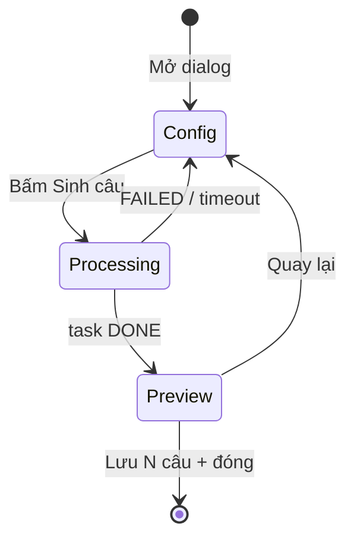

# Question Bank — Plan triển khai AI-1 (Topic → Bank)

> Cập nhật: **2026-06-30**  
> Trạng thái: **Đã triển khai** (2026-06-30)  
> Tổng quan: [`QUESTION_BANK_AI_GEN_PLAN.md`](./QUESTION_BANK_AI_GEN_PLAN.md) · Tiến độ: [`QUESTION_BANK_PROGRESS.md`](./QUESTION_BANK_PROGRESS.md)

---

## 1. Mục tiêu AI-1

Admin mở **Question Bank** → **AI Generate** → nhập **chủ đề** + metadata → LLM sinh câu → **preview + chọn** → **lưu thẳng bank** (`source=AI`, `isAIGenerated=true`).

| Làm | Không làm (phase sau) |
|-----|------------------------|
| Tab **Chủ đề** only | Tab bộ từ vựng (AI-3) |
| 3 bước: Cấu hình → Sinh → Preview & Lưu | Bước “Xem prompt” (AI-4) |
| 1 loại câu / lần: MCQ, TF, Fill Blank | Reading, Gap Fill MCQ |
| Loop `apiCreateQuestion` | `POST /questions/bulk` |
| Refresh stats + table sau lưu | Lịch sử task, regen 1 câu |
| BE | **Không đổi** — dùng API có sẵn |

---

## 2. Luồng UX



### Bước 0 — Cấu hình

| Field | UI | Map API / bank |
|-------|-----|----------------|
| Chủ đề * | `TextField` multiline | `topic` |
| CEFR | `Select` `QUESTION_CEFR_LEVELS` | `languageLevel` → `cefrLevel` khi lưu |
| Kỹ năng | `Select` `QUESTION_SKILLS` (bỏ option rỗng) | `skill` khi lưu |
| Danh mục | `Select` categories từ page | `categoryId` |
| Loại câu * | `Select` 3 option | `typeQuotas: { [type]: count }` |
| Số câu * | `number` 1–50, default 10 | cùng key trong `typeQuotas` |
| Độ khó | `Select` 1–5, default 2 | `difficulty` |
| Trạng thái lưu | `Select` DRAFT/PUBLISHED, default **DRAFT** | `status` |
| Ghi chú thêm | `TextField` optional | `additionalInstructions` |

Validation FE (trước gọi API):

- `topic.trim().length >= 3`
- `questionCount` ∈ [1, 50]
- `questionType` ∈ `MULTIPLE_CHOICE` | `TRUE_FALSE` | `FILL_BLANK`

### Bước 1 — Đang sinh

- `POST /api/v1/ai/tasks/question-generation`
- Poll `GET /api/v1/ai/tasks/{id}` mỗi `AI_TASK_POLL_INTERVAL_MS` (2s), max `AI_TASK_POLL_MAX_MS` (5 phút)
- UI: reuse `AiGenProcessingPanel` + `AiGenProcessingDecorations` + `AiGenFunFactsPanel` (giống `VocabularyAiGenDialog`)
- Không cho đóng dialog khi `processing` hoặc `saving`
- Timeout → `apiReportAiTaskPollTimeout(taskId)` + quay Config + Alert

### Bước 2 — Preview & Lưu

- Parse `task.outputJson.questions[]` → `normalizeDrafts` (giống exercise dialog)
- List: checkbox chọn, loại, `aiDraftSummaryLine`, chip lỗi validation
- Reuse `AiDraftPreviewRow` **chỉ khi** type MCQ/TF/Fill (filter drafts khác loại → cảnh báo “X câu bỏ qua”)
- Toolbar: Chọn tất cả / Bỏ chọn / đếm `selectedCount`
- Nút **「Lưu N câu vào Question Bank」**:
  1. `draftsToExerciseQuestions(selected drafts)`
  2. `saveAiQuestionsToBank(questions, meta)` — helper mới
  3. Toast/Alert: `Đã lưu 18/20 câu` + list lỗi ngắn nếu có
  4. `onSaved()` → parent refresh stats + search
  5. Đóng dialog

**Metadata khi lưu mỗi câu:**

```typescript
{
  source: "AI",
  aiGenerated: true,
  status: form.status,           // default DRAFT
  cefrLevel: form.languageLevel,
  skill: form.skill,
  topic: form.topic.trim(),
  categoryId: form.categoryId,
  difficulty: form.difficulty,
  tags: ["ai-gen", `topic:${slug(topic)}`],  // slug: lowercase, max 40 chars
}
```

---

## 3. API (không đổi BE)

### Tạo task

```http
POST /api/v1/ai/tasks/question-generation
```

```json
{
  "topic": "Travel and airports A2",
  "languageLevel": "A2",
  "typeQuotas": { "MULTIPLE_CHOICE": 10 },
  "difficulty": 2,
  "additionalInstructions": "Focus on check-in vocabulary"
}
```

- **Topic mode:** chỉ cần `topic` (không `documentId`)
- `questionCount` có thể bỏ — BE suy từ `typeQuotas`

### Poll

```http
GET /api/v1/ai/tasks/{taskId}
```

`status === "DONE"` → `outputJson.questions[]` kiểu `AiDraftQuestion[]`

### Lưu bank (từng câu)

```http
POST /api/v1/questions
```

Body từ `exerciseQuestionToQuestionForm(q, meta)` — đã có Phase 2.

---

## 4. File plan (FE only)

### Tạo mới

| File | Vai trò |
|------|---------|
| `admin/components/question/QuestionBankAiGenDialog.tsx` | Dialog chính 3 bước |
| `admin/components/question/QuestionBankAiGenConfigStep.tsx` | Form bước 0 (tách nếu dialog > 350 dòng) |
| `admin/components/question/QuestionBankAiGenPreviewStep.tsx` | Table preview + select all |
| `shared/lesson/questionBankAiGenSave.ts` | `saveAiQuestionsToBank()` |
| `shared/constants/questionBankAiGen.ts` | Defaults, `BANK_AI_GEN_TYPES`, labels |
| `styles/admin-question-bank-ai-gen.css` | Optional — hoặc reuse class `ai-gen-dialog` |

### Sửa

| File | Thay đổi |
|------|----------|
| `pages/admin/ManageQuestionsPage.tsx` | Thay stub → `QuestionBankAiGenDialog`; `onSaved` gọi `fetchStats` + `fetchRows` |
| `index.css` | Import CSS mới (nếu có) |

### Xóa / deprecate

| File | Hành động |
|------|-----------|
| `QuestionBankAiGenStubDialog.tsx` | **Xóa** sau khi dialog mới xong |

### Không sửa

- `AiAutoExerciseGenDialog.tsx` — giữ cho lesson; AI-1 **không** refactor chung hook (tránh scope creep)
- Backend Java
- `questionBankImport.ts` — giữ; logic save tương tự nhưng meta AI khác

---

## 5. Chi tiết component

### `QuestionBankAiGenDialog.tsx`

```typescript
type Step = "config" | "processing" | "preview";

type QuestionBankAiGenDialogProps = {
  open: boolean;
  onClose: () => void;
  categories: QuestionCategoryRecord[];
  onSaved: (result: BankImportBatchResult) => void;
};
```

State chính: `step`, form fields, `taskId`, `drafts`, `processing`, `saving`, `error`, poll elapsed.

**Copy có chọn lọc từ:**

- `VocabularyAiGenDialog` — 3 step, reset on close, processing panel
- `AiAutoExerciseGenDialog` — `buildTaskPayload`, poll effect, `normalizeDrafts`, `AiDraftPreviewRow`

**Không copy:** stepper 4 bước, prompt preview, history sidebar, `apiPatchAiTaskDraft`, `grade` field (không cần cho bank).

### `questionBankAiGenSave.ts`

```typescript
export type BankAiSaveMeta = QuestionFormMeta & {
  topic: string;
};

export async function saveAiQuestionsToBank(
  questions: ExerciseQuestion[],
  meta: BankAiSaveMeta,
): Promise<BankImportBatchResult>;
```

- Filter types: chỉ `QUESTION_BANK_EDITABLE_TYPES`
- Dùng `exerciseQuestionToQuestionForm`
- `source: "AI"`, `aiGenerated: true` bắt buộc
- Return `{ imported, failed, errors }` giống `questionBankImport`

### `questionBankAiGen.ts` constants

```typescript
export const BANK_AI_GEN_QUESTION_TYPES = [
  { value: "MULTIPLE_CHOICE", label: "Trắc nghiệm (MCQ)" },
  { value: "TRUE_FALSE", label: "Đúng / Sai" },
  { value: "FILL_BLANK", label: "Điền từ" },
] as const;

export const BANK_AI_GEN_DEFAULTS = {
  languageLevel: "A2",
  skill: "VOCABULARY",
  questionType: "MULTIPLE_CHOICE" as const,
  questionCount: 10,
  difficulty: 2,
  status: "DRAFT" as const,
};
```

### Preview — lọc loại không support

`draftsToExerciseQuestion` trả `null` cho type lạ → đếm `skippedInvalid`.

Nếu BE trả `READING_COMPREHENSION` dù user chọn MCQ (hiếm): hiện Alert và không hiện row đó.

`AiDraftPreviewRow` hỗ trợ Reading/Gap — AI-1 chỉ render row khi `draft.questionType` ∈ 3 loại trên.

---

## 6. Wire `ManageQuestionsPage`

```tsx
// Thay
const [openAiStub, setOpenAiStub] = useState(false);
// →
const [openAiGen, setOpenAiGen] = useState(false);

<QuestionBankHeaderActions onAiGenerate={() => setOpenAiGen(true)} ... />

<QuestionBankAiGenDialog
  open={openAiGen}
  onClose={() => setOpenAiGen(false)}
  categories={categories}
  onSaved={(result) => {
    void fetchStats();
    void fetchRows();
    if (result.imported > 0) {
      setError(""); // hoặc success snackbar nếu có
    }
  }}
/>
```

Có thể thêm `Alert` success tạm trên page: `Đã thêm ${result.imported} câu AI vào ngân hàng`.

---

## 7. Thứ tự implement (đề xuất)

| # | Việc | Ước lượng |
|---|------|-----------|
| 1 | `questionBankAiGen.ts` + `questionBankAiGenSave.ts` | 0.5h |
| 2 | `QuestionBankAiGenConfigStep.tsx` | 1h |
| 3 | `QuestionBankAiGenDialog` — config + start task + poll | 2h |
| 4 | `QuestionBankAiGenPreviewStep` + save | 1.5h |
| 5 | Wire `ManageQuestionsPage`, xóa stub | 0.5h |
| 6 | `npx tsc --noEmit` + manual test | 1h |

**Tổng:** ~1 ngày dev.

---

## 8. Acceptance criteria

### Chức năng

- [ ] Mở AI Generate từ header Question Bank
- [ ] Topic `Travel A2`, 10 MCQ, CEFR A2, skill Vocabulary → sinh xong → preview ≥ 1 câu
- [ ] Bỏ chọn 2 câu → lưu → bank có đúng số câu đã chọn
- [ ] Filter Nguồn = **AI** thấy câu vừa lưu
- [ ] Stats card **AI Generated** tăng sau lưu
- [ ] Câu lưu có `status=DRAFT`, `source=AI`, `isAIGenerated=true`, `topic` khớp form
- [ ] TF và Fill Blank: chọn loại → sinh → lưu → preview drawer bank hiển thị đúng

### Lỗi / edge

- [ ] Topic trống → không gọi API, hiện lỗi form
- [ ] Task FAILED → quay config, hiện `errorMessage`
- [ ] Poll timeout → thông báo, không crash
- [ ] Đóng dialog khi đang sinh → bị chặn
- [ ] Lưu 10 câu, 1 fail API → báo `9/10`, errors[0] có message
- [ ] 0 câu hợp lệ sau filter → nút Lưu disabled

### Regression

- [ ] New Question / Edit / Preview / Delete bank vẫn OK
- [ ] Exam save sync bank không đổi

---

## 9. Manual test script

1. Vào `/admin/questions`, ghi `aiGeneratedCount` trên stats.
2. AI Generate → topic `Animals for kids`, A2, MCQ × 5 → Sinh → đợi DONE.
3. Preview: bỏ chọn 1 câu → Lưu 4 câu.
4. Filter Nguồn = AI → thấy 4 câu, topic `Animals for kids`.
5. Stats AI Generated +4.
6. Mở preview 1 câu MCQ — đủ choices + đáp án.
7. Lặp với TRUE_FALSE × 3, FILL_BLANK × 3.
8. Topic 1 ký tự → validation chặn.
9. (Tuỳ chọn) Tắt mạng giữa poll → error hợp lý.

---

## 10. Rủi ro & giảm scope

| Rủi ro | Cách xử lý AI-1 |
|--------|------------------|
| Dialog quá giống Exercise AI, duplicate code | Chấp nhận copy có chọn lọc; extract hook `useQuestionGenTask` **sau** AI-1 nếu cần |
| LLM trả câu invalid | `validationErrors` trên draft + `draftsToExerciseQuestions` filter |
| User chọn Reading trong BE response | Không render row; Alert skipped |
| Lưu chậm 20 câu | Nút “Đang lưu…” + disable; bulk API = AI-4 |
| `tags` topic dài | Slug max 40 ký tự |

---

## 11. Sau AI-1 (preview)

| Phase | Việc |
|-------|------|
| AI-2 | Invalid reason UI rõ hơn; mix 2 loại `typeQuotas`; sửa nhanh trong preview |
| AI-3 | Tab bộ từ + BE `vocabularySetId` + CTA `VocabularyAiGenDialog` |
| AI-4 | Prompt preview, duplicate check |

---

## 12. Checklist tick khi code xong

Cập nhật [`QUESTION_BANK_PROGRESS.md`](./QUESTION_BANK_PROGRESS.md):

```markdown
- [x] AI-1: topic → bank (`QuestionBankAiGenDialog`)
```

Cập nhật [`QUESTION_BANK_AI_GEN_PLAN.md`](./QUESTION_BANK_AI_GEN_PLAN.md) §9 checklist.
