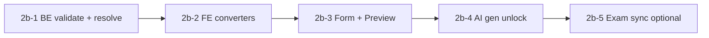

# Question Bank — Plan triển khai AI-2b (GAP_FILL_MCQ + READING)

> Cập nhật: **2026-06-30**  
> Trạng thái: **⏸ Tạm dừng — chỉ có plan, chưa code**  
> Tiền đề: Phase 1–2 ✅ · AI-1/2/3 ✅ · Phase 3 ✅  
> Tổng quan: [`QUESTION_BANK_PROGRESS.md`](./QUESTION_BANK_PROGRESS.md)  
> Phase 4 (semantic search / analytics): **không làm** — ngoài scope.

---

## ⏸ Ghi chú tạm dừng (2026-06-30)

**Quyết định:** Kết thúc arc Question Bank tại Phase 3; **không triển khai AI-2b** trong đợt này. Giữ plan để làm sau nếu cần.

**Lý do / vấn đề còn mở (product + kỹ thuật):**

1. **Độ phức tạp cao hơn 3 loại hiện tại** — GAP/READING dùng `contentJson` lồng nhau (nhiều blank hoặc passage + subQuestions), dễ lệch format giữa AI gen ↔ bank ↔ lesson ↔ exam.
2. **Ống dẫn chưa thống nhất** — `draftToExercise` (FE) đã parse GAP/READING nhưng bank BE (`validate`, `toExerciseQuestionMap`) và exam sync **chưa** → làm nửa vời dễ có câu “lưu được nhưng lesson không chạy”.
3. **Trùng UI nhưng khác ngữ cảnh** — Canvas có sẵn từ lesson/exam; gắn vào bank cần converter + test E2E `QUESTION_REF`, chưa có bandwidth manual test.
4. **AI gen vs bank editor** — Bật GAP/READING trong dialog AI mà chưa có form/preview đầy đủ → GV lưu câu khó sửa / khó debug.
5. **Phase 3 chưa manual test đủ** — Similar, rewrite fork, bulk AI, explain VI — nên ổn định trước khi mở thêm loại câu.
6. **Phase 4 đã bỏ** — không có analytics/duplicate để hỗ trợ vận hành bank lớn; ưu tiên product khác.

**Khi mở lại AI-2b:** làm **GAP_FILL_MCQ trước**, một vòng E2E (gen → bank → lesson), rồi READING. Xem §4–§12 bên dưới.

---

## 1. Vấn đề cần giải

AI và Exam đã sinh được **GAP_FILL_MCQ** và **READING_COMPREHENSION**, nhưng Question Bank **chưa vòng đời đầy đủ**:

| Khả năng | MCQ/TF/Fill | GAP_FILL_MCQ | READING |
|----------|-------------|--------------|---------|
| AI gen → `draftToExercise` | ✅ | ✅ | ✅ |
| Lưu vào bank (AI dialog) | ✅ | ❌ bị lọc `BANK_AI_GEN_TYPE_VALUES` | ❌ |
| Form tạo/sửa thủ công | ✅ | ❌ | ❌ |
| Preview drawer | ✅ | ❌ placeholder | ❌ placeholder |
| BE validate create/update | ✅ | ❌ | ❌ |
| `toExerciseQuestionMap` (lesson `QUESTION_REF`) | ✅ | ❌ trả `{}` | ❌ |
| Exam lưu đề → sync bank | ✅ | ❌ | ❌ |
| AI preview sửa nhanh (`QuestionBankAiDraftRow`) | ✅ | ❌ | ❌ |

**Mục tiêu AI-2b:** đóng khoảng trống trên — GV có thể **gen → preview → lưu → sửa → preview → dùng trong lesson** cho 2 loại câu THPT/đọc hiểu.

---

## 2. Quyết định đã chốt

| Chủ đề | Quyết định |
|--------|------------|
| Phạm vi loại câu | **GAP_FILL_MCQ** + **READING_COMPREHENSION** (không MATCHING / LISTEN trong 2b) |
| UI editor | **Tái sử dụng** `GapFillMcqQuestionCanvas`, `ReadingComprehensionQuestionCanvas` (đã có ở lesson/exam admin) |
| Data model bank | Giữ `promptText` + `contentJson` (không đổi schema DB / migration) |
| MCQ top-level `choices` | GAP/READING: `choices = null`; toàn bộ trong `contentJson` |
| Reading `presentation` | Mặc định `split`; lưu trong `contentJson.presentation` |
| AI gen dialog | Bật 2 loại trong dropdown; `readingSubQuestionCount` khi chọn Reading |
| Phase 4 | **Không làm** (search ngữ nghĩa, analytics, import PDF) |
| Explain VI (Phase 3c) | **Defer** — chỉ MCQ/TF/Fill; mở rộng sau 2b nếu cần |

---

## 3. Data contract (đồng bộ AI handler ↔ bank ↔ lesson)

### 3.1 GAP_FILL_MCQ

```json
{
  "questionType": "GAP_FILL_MCQ",
  "promptText": "He goes to school ___ every day.",
  "promptLang": "en",
  "explanation": "Giải thích tiếng Việt…",
  "contentJson": {
    "blanks": [
      {
        "id": "b1",
        "choices": [
          { "choiceKey": "a", "choiceText": "by", "correct": true },
          { "choiceKey": "b", "choiceText": "on", "correct": false },
          { "choiceKey": "c", "choiceText": "in", "correct": false },
          { "choiceKey": "d", "choiceText": "at", "correct": false }
        ]
      }
    ]
  }
}
```

- `promptText`: passage có `___` (số blank = `blanks.length`).
- Mỗi blank: **4 choices**, đúng **1** `correct: true`.
- Tham chiếu handler: `GapFillMcqQuestionTypeHandler.java`, FE: `gapFillMcqUtils.ts`, `draftToExercise.ts`.

### 3.2 READING_COMPREHENSION

```json
{
  "questionType": "READING_COMPREHENSION",
  "promptText": "Optional passage title",
  "promptLang": "en",
  "explanation": "Giải thích chung (optional)",
  "contentJson": {
    "passage": { "title": "…", "text": "…", "lang": "en" },
    "presentation": "split",
    "subQuestions": [
      {
        "id": "sq1",
        "promptText": "According to the passage…",
        "promptLang": "en",
        "choices": [
          { "choiceKey": "a", "choiceText": "…", "correct": true },
          { "choiceKey": "b", "choiceText": "…", "correct": false },
          { "choiceKey": "c", "choiceText": "…", "correct": false },
          { "choiceKey": "d", "choiceText": "…", "correct": false }
        ],
        "explanation": "Giải thích tiếng Việt cho câu con"
      }
    ]
  }
}
```

- Tối thiểu **2** sub-questions; mỗi sub: 4 choices, 1 đúng.
- Tham chiếu: `ReadingComprehensionQuestionTypeHandler.java`, `readingComprehensionUtils.ts`.

### 3.3 Exercise JSON (lesson `QUESTION_REF`)

Map từ bank DTO → cùng shape `ExerciseQuestion` đã dùng trong `ExercisePlayer` (reuse logic `draftToExercise` / exam payload).

---

## 4. Slice triển khai



| Slice | Nội dung | Ước lượng |
|-------|----------|-----------|
| **2b-1** | BE: `validateGapFillMcq`, `validateReading`, `toExerciseQuestionMap` | 0.5–1 ngày |
| **2b-2** | FE: `questionBankUtils` read/write + `createEmptyQuestionByType` | 0.5 ngày |
| **2b-3** | FE: `QuestionBankForm` + `PreviewDrawer` + ManageQuestions type switch | 1 ngày |
| **2b-4** | AI: `BANK_AI_GEN_*`, `bankDraftValidate`, `QuestionBankAiDraftRow` | 1 ngày |
| **2b-5** | Exam `ExamPaperQuestionBankSyncService` + manual E2E | 0.5 ngày |

**Khuyến nghị:** làm **GAP_FILL trước** (2b-1→3 cho GAP), ship + test, rồi **READING** (cùng pattern).

---

## 5. Chi tiết Backend (2b-1)

### File chính

`QuestionServiceImpl.java`

### 5.1 `validateRequest` — thêm nhánh

```java
case GAP_FILL_MCQ -> validateGapFillMcqContent(promptText, contentJson);
case READING_COMPREHENSION -> validateReadingContent(promptText, contentJson);
```

**GAP_FILL_MCQ rules:**

- `countBlankPlaceholders(promptText) >= 2` (hoặc ≥1 nếu product muốn lỏng — khuyến nghị **≥2** khớp AI handler).
- `blanks.length` = số `___` trong prompt.
- Mỗi blank: 4 choices, đúng 1 correct.

**READING rules:**

- `passage.text` không rỗng.
- `subQuestions.length` ≥ 2.
- Mỗi sub: `promptText` + 4 choices + 1 correct.

Có thể tách `QuestionContentValidator` util + unit test (copy logic từ handler normalize).

### 5.2 `toExerciseQuestionMap` — thêm

- `toGapFillMcqExerciseMap` — `blanks[]` với `choices`, `correctChoiceId` per blank.
- `toReadingComprehensionExerciseMap` — `passage`, `subQuestions[]`, `presentation`.

Nếu map rỗng → lesson `QUESTION_REF` **không hiển thị** câu (bug hiện tại nếu lưu tay được).

### 5.3 (Tuỳ chọn 2b-5) `ExamPaperQuestionBankSyncService`

Mở `SUPPORTED_TYPES` thêm 2 enum; map exercise node → `ReqQuestionDTO` (tham khảo exam section payload).

---

## 6. Chi tiết Frontend (2b-2 → 2b-3)

### 6.1 `questionBankUtils.ts`

| Hàm | Việc |
|-----|------|
| `QUESTION_BANK_EDITABLE_TYPES` | + `GAP_FILL_MCQ`, `READING_COMPREHENSION` |
| `createEmptyQuestionByType` | `createEmptyGapFillMcqQuestion`, `createEmptyReadingComprehensionQuestion` |
| `questionRecordToExerciseQuestion` | Parse `contentJson` → `GapFillMcqQuestion` / `ReadingComprehensionQuestion` |
| `exerciseQuestionToQuestionForm` | Serialize ngược → `contentJson` |

Reuse `validateGapFillMcqQuestion` / `validateReadingComprehensionQuestion` từ `exercisePayload.ts` trước submit form.

### 6.2 `QuestionBankForm.tsx`

```tsx
{questionType === "GAP_FILL_MCQ" && question.type === "GAP_FILL_MCQ" ? (
  <GapFillMcqQuestionCanvas question={question} onChange={onQuestionChange} />
) : null}
{questionType === "READING_COMPREHENSION" && question.type === "READING_COMPREHENSION" ? (
  <ReadingComprehensionQuestionCanvas question={question} onChange={onQuestionChange} />
) : null}
```

- Dropdown loại câu: thêm 2 option (filter `QUESTION_TYPE_FILTER_OPTIONS`).
- `ManageQuestionsPage`: `createEmptyQuestionByType` khi đổi type.

### 6.3 `QuestionBankPreviewDrawer.tsx`

Mở rộng `PreviewAnswerSection`:

- **GAP:** list blank → đáp án đúng (a/b/c/d + text).
- **READING:** đoạn văn rút gọn + list sub-questions + đáp án.

Có thể dùng read-only mini từ student component hoặc typography đơn giản (giống MCQ list).

### 6.4 `QuestionBankAiActionsMenu` / Explain

- Menu AI: dùng `QUESTION_BANK_EDITABLE_TYPES` mở rộng → Similar/Rewrite hoạt động (BE đã hỗ trợ).
- Explain: giữ nguyên 3 loại cũ; GAP/READING không hiện nút Explain (hoặc disable + tooltip “sắp có”).

---

## 7. Chi tiết AI gen (2b-4)

### 7.1 `questionBankAiGen.ts`

```ts
export const BANK_AI_GEN_QUESTION_TYPES = [
  // …existing…
  { value: "GAP_FILL_MCQ", label: "Cloze chọn A/B/C/D (THPT)" },
  { value: "READING_COMPREHENSION", label: "Đọc hiểu (passage + câu hỏi)" },
];
```

### 7.2 `QuestionBankAiGenDialog.tsx`

- Khi `questionType === "READING_COMPREHENSION"`: hiện field **Số câu con / đoạn** → map `readingSubQuestionCount` (đã có trên BE task API).
- Khi `GAP_FILL_MCQ`: optional ghi chú “số chỗ trống” qua `additionalInstructions` hoặc `readingSubQuestionCount` (BE đã dùng cho blank count).

### 7.3 `bankDraftValidate.ts`

Thêm `computeValidationErrors` cho:

- **GAP:** stem có `___`, blanks ≥2, mỗi blank 4 choices + 1 correct.
- **READING:** passage.text, subQuestions ≥2, mỗi sub valid MCQ.

### 7.4 `QuestionBankAiDraftRow.tsx`

- **GAP:** expand — sửa stem + 1–2 blank đầu (choices text + radio correct) — MVP.
- **READING:** expand — sửa passage (textarea) + stem sub đầu tiên; full editor mở form sau khi lưu.

`draftToExercise` **đã có** — không sửa trừ khi bug.

---

## 8. Acceptance criteria

### GAP_FILL_MCQ

- [ ] AI gen topic → preview → lưu N câu GAP vào bank (DRAFT).
- [ ] Mở form sửa: canvas cloze, lưu lại OK.
- [ ] Preview drawer hiện passage + đáp án từng blank.
- [ ] Lesson `QUESTION_REF` trỏ câu GAP → HS làm được trên player.
- [ ] AI Similar/Rewrite trên câu GAP (Phase 3) vẫn chạy.

### READING_COMPREHENSION

- [ ] AI gen Reading (topic hoặc vocab) → lưu bank.
- [ ] Form: sửa passage + sub-questions qua canvas.
- [ ] Preview: passage + subs + đáp án.
- [ ] Lesson `QUESTION_REF` resolve đúng.
- [ ] `readingSubQuestionCount` trong dialog ảnh hưởng output AI.

### Regression

- [ ] MCQ / TF / Fill + AI gen + bulk Phase 3 không đổi hành vi.

---

## 9. Rủi ro & giảm scope

| Rủi ro | Giảm scope |
|--------|------------|
| Reading editor nặng | Canvas có sẵn; draft row chỉ sửa nhanh tối thiểu |
| AI Reading chất lượng kém | Default `questionCount` thấp (1–3 passage); cảnh báo trong UI |
| `toExerciseQuestionMap` lệch exam payload | Một nguồn truth: copy từ exam inline JSON đã chạy production |
| Exam sync phức tạp | **2b-5 optional** — có thể ship 2b-1→4 trước, sync exam sau |
| Explain chưa có cho GAP/READING | Defer; không chặn 2b |

---

## 10. File dự kiến chạm

### Backend

- `QuestionServiceImpl.java` — validate + `toExerciseQuestionMap`
- `ExamPaperQuestionBankSyncService.java` — (2b-5) mở types
- `*Test.java` — validate gap/reading (khuyến nghị)

### Frontend

- `questionBankUtils.ts`
- `QuestionBankForm.tsx`
- `QuestionBankPreviewDrawer.tsx`
- `questionBankAiGen.ts`
- `bankDraftValidate.ts`
- `QuestionBankAiDraftRow.tsx`
- `QuestionBankAiGenDialog.tsx` (reading sub count UI)
- `ManageQuestionsPage.tsx` (type switch)

**Không tạo** canvas mới — import từ `admin/components/exercise/`.

---

## 11. Sau AI-2b (ngoài scope hiện tại)

- Cảnh báo **QUESTION_REF** khi sửa câu published.
- Explain VI cho GAP / Reading.
- Phase 4 — **không làm** theo quyết định product.

---

## 12. Thứ tự session đề xuất

1. **Session A:** 2b-1 GAP BE + 2b-2 GAP converters + test API Postman.
2. **Session B:** 2b-3 GAP form/preview + 2b-4 GAP AI unlock.
3. **Session C:** 2b-1→4 READING (lặp pattern).
4. **Session D:** Manual E2E + 2b-5 exam sync (nếu cần).

Khi bắt đầu code, tick mục AI-2b trong [`QUESTION_BANK_PROGRESS.md`](./QUESTION_BANK_PROGRESS.md).
