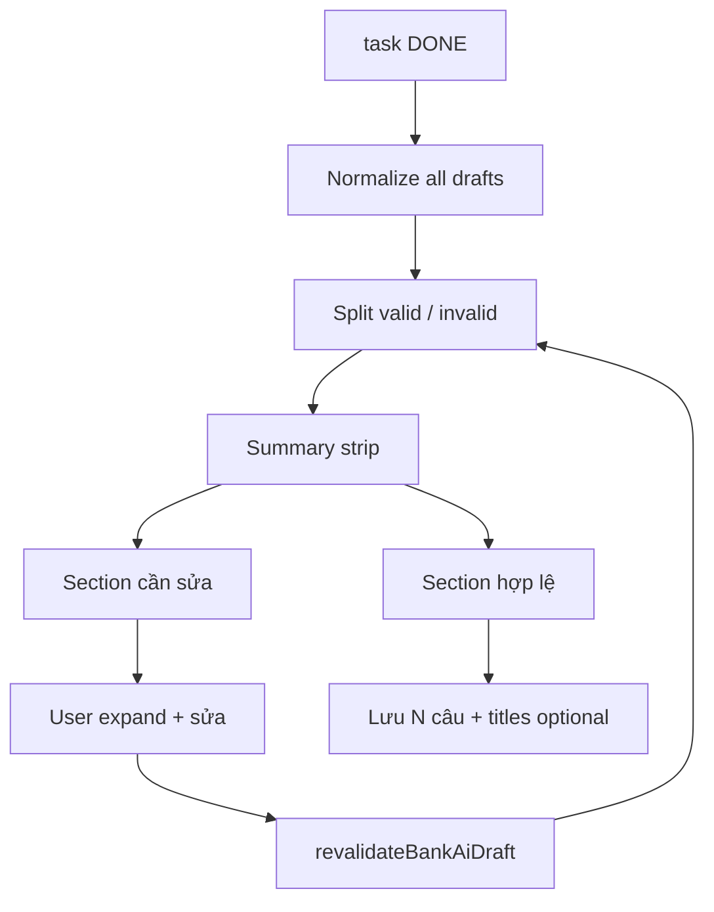

# Question Bank — Plan triển khai AI-2 (Preview polish)

> Cập nhật: **2026-06-30**  
> Trạng thái: **Đã triển khai** (2026-06-30)  
> Tiền đề: **AI-1** ✅ (`QuestionBankAiGenDialog`)  
> Tổng quan: [`QUESTION_BANK_AI_GEN_PLAN.md`](./QUESTION_BANK_AI_GEN_PLAN.md)

---

## 1. Scope đã chốt (PO)

| Làm trong AI-2 | Không làm |
|----------------|-----------|
| Hiện rõ câu **invalid** + `validationErrors` | Mix nhiều loại `typeQuotas` / lần |
| Preview đẹp hơn (tách valid / invalid, thống kê) | Metadata lưu bank (đã xong AI-1) |
| **Sửa nhanh** từng câu trong preview | AI-2b GAP_FILL_MCQ |
| *(Tuỳ chọn)* **Title** từng câu trước khi lưu | AI-3 vocab |

**Metadata** (`topic`, `cefrLevel`, `skill`, `category`, `difficulty`, `status`, `source=AI`, `tags`) — **đã có trong AI-1**, không lặp AI-2.

---

## 2. Hiện trạng (baseline)

`QuestionBankAiGenDialog` preview:

- Dùng `AiDraftPreviewRow` (shared với Exercise AI).
- Câu invalid: checkbox **disabled**, chip đỏ `validationErrors`, nền hồng nhạt.
- Câu unsupported type (Reading…) bị **lọc bỏ** trước preview — chỉ Alert số lượng skipped.
- Chưa có: strip tổng hợp valid/invalid, section riêng, re-validate sau sửa tay.
- `AiDraftPreviewRow` expand: sửa stem, MCQ choices, Reading passage — **chưa đủ TF / Fill Blank** cho bank.

---

## 3. Mục tiêu UX

### 3.1 Summary strip (đầu bước Preview)

```
✓ 8 câu hợp lệ  ·  ⚠ 2 câu lỗi  ·  đã chọn 6
```

- Nút **「Chỉ chọn hợp lệ」** / **「Xem câu lỗi」** (scroll tới section invalid).

### 3.2 Hai section (hoặc tabs nhỏ)

| Section | Nội dung |
|---------|----------|
| **Hợp lệ** | Checkbox, expand sửa, lưu được |
| **Cần sửa** | Luôn hiện (không ẩn); list `validationErrors` dạng `Alert`/`List`; checkbox off + disabled cho tới khi pass re-validate |

### 3.3 Re-validate sau sửa tay (FE)

Sau `onChange` draft:

- Gọi helper `revalidateBankAiDraft(draft)` — mirror rule tối thiểu của BE / `draftToExerciseQuestion`:
  - MCQ: ≥2 choices, 1 correct
  - TF: `contentJson.correctAnswer` boolean
  - Fill Blank: prompt có `___`, blanks có `acceptedAnswers`
- Cập nhật `validationErrors[]` local → câu có thể chuyển sang section hợp lệ.

File đề xuất: `shared/ai/questionGen/bankDraftValidate.ts`

### 3.4 Sửa nhanh (expand)

Tách component bank-specific (không phá Exercise):

```
admin/components/question/QuestionBankAiDraftRow.tsx
```

| Loại | Field sửa |
|------|-----------|
| Chung | Title *(optional)*, stem (`promptText`), explanation |
| MCQ | choices + đáp án đúng (reuse logic `AiDraftPreviewRow`) |
| TRUE_FALSE | Radio Đúng/Sai → `contentJson.correctAnswer` |
| FILL_BLANK | prompt + danh sách blank / accepted answers (đơn giản) |

Hoặc: mở rộng `AiDraftPreviewRow` với prop `variant="bank"` + TF/FillBlank blocks — ưu tiên **tách file** để Exercise không regression.

### 3.5 Title từng câu *(optional — có thể AI-2.1)*

- Field **「Tiêu đề ngắn」** trong expand (placeholder: rút gọn từ stem).
- State: `Record<tempId, string>` trong dialog hoặc `draft.title?` (FE-only, không có trên `AiDraftQuestion` API).
- Khi lưu: `saveAiQuestionsToBank` nhận `titles?: Record<string, string>` → map `meta.title` per `ExerciseQuestion.id` / tempId.

Default nếu trống: `truncatePrompt(stem, 80)` hoặc không set `title` (DB nullable).

---

## 4. File plan

### Tạo mới

| File | Vai trò |
|------|---------|
| `QuestionBankAiDraftRow.tsx` | Row preview + edit TF/Fill/MCQ + title |
| `QuestionBankAiPreviewStep.tsx` | Tách từ dialog: sections valid/invalid + summary |
| `bankDraftValidate.ts` | Re-validate FE sau edit |

### Sửa

| File | Thay đổi |
|------|----------|
| `QuestionBankAiGenDialog.tsx` | Dùng `QuestionBankAiPreviewStep`; bỏ filter ẩn invalid |
| `questionBankAiGenSave.ts` | Optional `titles` map per question |
| `aiGenLogger.ts` | Event `draft_revalidated`, `draft_fixed` |

### Không sửa

- Backend Java
- `AiAutoExerciseGenDialog` (giữ `AiDraftPreviewRow` cũ)

---

## 5. Luồng Preview (sau AI-2)



---

## 6. Acceptance criteria

- [ ] Preview hiện **cả** câu lỗi, không chỉ Alert skipped type.
- [ ] Mỗi câu lỗi: ≥1 dòng lý do đọc được (từ `validationErrors`).
- [ ] Sửa stem MCQ lỗi → re-validate → chuyển sang hợp lệ → chọn được → lưu OK.
- [ ] Sửa TF (đúng/sai) và Fill Blank cơ bản trong expand.
- [ ] Summary: đúng số valid / invalid / selected.
- [ ] *(Optional)* Nhập title → lưu bank → cột/list thấy title (nếu table hiển thị).
- [ ] Exercise AI preview không đổi hành vi (regression).

---

## 7. Thứ tự implement

| # | Việc | Ước lượng |
|---|------|-----------|
| 1 | `bankDraftValidate.ts` | 1h |
| 2 | `QuestionBankAiPreviewStep` + summary strip | 1.5h |
| 3 | `QuestionBankAiDraftRow` (MCQ + TF + Fill) | 2–3h |
| 4 | Wire dialog + save titles optional | 1h |
| 5 | Manual test + `tsc` | 0.5h |

**Tổng:** ~1 ngày (không title) · +0.5 ngày nếu bật title.

---

## 8. Quan hệ phase khác

| Phase | Khi nào |
|-------|---------|
| **AI-2** | Preview polish (plan này) |
| **AI-2b** | GAP_FILL_MCQ editor bank |
| **AI-3** | Bộ từ vựng → bank (plan riêng) |

Có thể làm **AI-3 song song** nếu preview AI-2 không chặn vocab flow — khuyến nghị xong AI-2 trước để vocab reuse cùng preview step.
