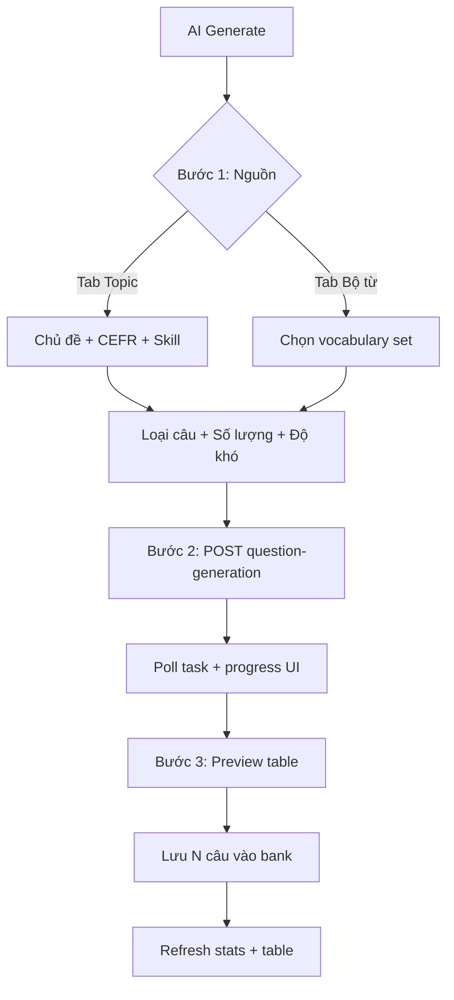

# Question Bank — Kế hoạch AI Generate

> Cập nhật: **2026-06-30** (rev.2 — bỏ upload doc; ưu tiên tích hợp vocab AI)  
> Trạng thái: **Plan** — chưa triển khai UI (stub `QuestionBankAiGenStubDialog`)  
> Liên quan: [`QUESTION_BANK_PROGRESS.md`](./QUESTION_BANK_PROGRESS.md) · [`VOCABULARY_AI_PROGRESS.md`](./VOCABULARY_AI_PROGRESS.md) · [`EXAM_PAPER_PLAN.md`](./EXAM_PAPER_PLAN.md)

---

## 1. Định vị sản phẩm

### Question Bank AI ≠ Exam Paper AI

| | **Exam Paper AI** | **Question Bank AI** |
|--|-------------------|----------------------|
| Câu hỏi của user | “Tôi cần **một đề thi** hoàn chỉnh” | “Tôi cần **kho câu** chủ đề X để dùng lại” |
| Output | `ExamPaperGenEnvelope` → nhiều **section** | `AiQuestionGenEnvelope` → **list câu phẳng** |
| Cấu trúc | Outline → slice doc → gen từng phần | **1 request** theo topic / 1 loại câu |
| Sau gen | Gắn vào đề → lưu đề → sync bank (`source=EXAM`) | **Lưu thẳng bank** (`source=AI`, `isAIGenerated=true`) |
| Độ phức tạp UI | 4 bước (Nguồn → Outline → Sinh → Áp dụng) | **3 bước** (Cấu hình → Sinh → Preview & Lưu) |

### Nguồn câu vào bank (đã chốt)

```
Tạo thủ công (New Question)
        │
Lưu đề thi ──────────────► source=EXAM  ✅ ExamPaperQuestionBankSyncService
        │
AI Generate — topic ─────► source=AI     ⏳ AI-1
        │
AI Generate — bộ từ ─────► source=AI     ⏳ AI-3 (tích hợp module Vocabulary)
        │                  tags: vocab-set:{id}
        │
Upload PDF/Word ─────────► ❌ KHÔNG làm trên Bank — dùng Exam Paper AI
```

**Không** import Excel/CSV trên bank (đã bỏ UI).

---

## 2. Engine hiện có — tái sử dụng tối đa

### Backend (đã có, không viết engine mới)

| Thành phần | Vai trò |
|------------|---------|
| `POST /api/v1/ai/tasks/question-generation` | Tạo async task |
| `GET /api/v1/ai/tasks/{id}` | Poll kết quả + progress |
| `POST .../question-generation/prompt-preview` | Xem prompt trước khi gen (Exam đã dùng) |
| `AiQuestionGenerationService` | Gọi OpenRouter, batch, validate |
| `AiQuestionTypeHandlerRegistry` | MCQ, TF, FillBlank, Reading, … |
| `AiTaskTypeEnum.QUESTION_GENERATION` | Queue worker |
| `ReqCreateQuestionGenTaskDTO` | `topic`, `typeQuotas`, `documentId`, `difficulty`, `languageLevel`, … |

**Topic mode** (`topic` không rỗng): BE tạo brief tổng hợp thay vì bắt buộc upload — **đúng use case bank**.

### Frontend (đã có, copy pattern)

| Tham chiếu | Lấy gì |
|------------|--------|
| `VocabularyAiGenDialog.tsx` | 3 bước: config → processing → preview |
| `AiGenProcessingPanel` | Progress, fun facts, timeout |
| `aiTaskPolling.ts` | Poll interval + max wait |
| `draftToExercise.ts` | `AiDraftQuestion` → `ExerciseQuestion` |
| `questionBankUtils.ts` | `exerciseQuestionToQuestionForm` → `apiCreateQuestion` |
| `AiAutoExerciseGenDialog.tsx` | Poll + preview drafts (lesson exercise — **không** lưu bank) |
| `VocabularyAiGenDialog.tsx` | AI sinh **bộ từ** (words) — bước trước khi sinh câu AI-3 |
| `VocabGenerateMcqDialog.tsx` | Sinh MCQ **rule-based** (không LLM) — giữ song song, gắn lesson |

### Lưu bank (MVP)

- **Không** cần API bulk mới: loop `apiCreateQuestion` từng câu đã chọn (giống `questionBankImport.ts`).
- Phase sau: `POST /questions/bulk` nếu cần transaction + báo lỗi gom.

---

## 3. Luồng UX đề xuất (chuẩn)



**Hai tab nguồn** trên cùng dialog (AI-1 chỉ tab Topic; AI-3 thêm tab Bộ từ).

### Bước 1 — Form cấu hình (fields)

| Field | Bắt buộc | Ghi chú |
|-------|----------|---------|
| Chủ đề / mô tả (`topic`) | ✅ | VD: `Animals A2`, `Passive voice B1` |
| CEFR (`languageLevel`) | Khuyến nghị | Map → `cefrLevel` khi lưu bank |
| Kỹ năng (`skill`) | Khuyến nghị | VOCABULARY, GRAMMAR, … |
| Danh mục (`categoryId`) | Optional | Dropdown `question_categories` |
| Loại câu | ✅ MVP: 1 select | MCQ / TF / Fill Blank |
| Số câu | ✅ | 1–50 (khớp BE `questionCount` max) |
| Độ khó (1–5) | Optional | Default 2 |
| Trạng thái lưu | Optional | Default `DRAFT` |
| Ghi chú thêm | Optional | → `additionalInstructions` |
| Tags bổ sung | Optional | `ai-gen`, `topic:animals` |

**Không** hiển thị outline / section — đó là của Exam.

### Bước 2 — Processing

- Gọi `apiCreateQuestionGenTask` với payload:

```json
{
  "topic": "Animals for kids",
  "languageLevel": "A2",
  "typeQuotas": { "MULTIPLE_CHOICE": 20 },
  "difficulty": 2,
  "categoryId": "uuid-optional",
  "additionalInstructions": "Focus on farm animals, simple vocabulary"
}
```

- Poll `apiGetAiTask` — reuse `AI_TASK_POLL_INTERVAL_MS` / timeout (có thể dùng cùng hằng số Exam hoặc tách `AI_QUESTION_BANK_POLL_MAX_MS`).
- Hiển thị `progressMessage`, `progressPercent` từ task.

### Bước 3 — Preview & Lưu

- Parse `outputJson` → `AiQuestionGenEnvelope.questions[]`
- `draftToExerciseQuestion` → filter null (câu invalid)
- Table: checkbox, loại, prompt rút gọn, đáp án đúng, nút “Sửa nhanh” (optional phase B)
- Nút **Lưu N câu vào Question Bank**:
  - `exerciseQuestionToQuestionForm(q, meta)` với:
    - `source: "AI"`
    - `aiGenerated: true`
    - `cefrLevel`, `skill`, `topic` (từ form), `categoryId`, `difficulty`, `status`
    - `tags`: `["ai-gen", "topic:..."]`
  - Loop `apiCreateQuestion`
- Kết quả: toast “Đã lưu 18/20 câu” + list lỗi nếu có

---

## 4. Chia phase triển khai (đã chốt với PO)

| Phase | Nội dung | Ước lượng |
|-------|----------|-----------|
| **AI-1** | Topic mode → preview → lưu bank | 3–5 ngày |
| **AI-2** | Preview: invalid rõ + sửa nhanh + title (optional) | ~1 ngày |
| **AI-2b** | GAP_FILL_MCQ + READING bank editor + lesson resolve | sau AI-3 — [`QUESTION_BANK_AI_2B_PLAN.md`](./QUESTION_BANK_AI_2B_PLAN.md) |
| **AI-3** | **Sinh từ bộ từ vựng** (LLM, tích hợp module Vocab) | 3–5 ngày |
| **AI-4** | Chất lượng: duplicate, prompt preview, regen 1 câu | 4–7 ngày |
| **AI-5** | Nâng cao: bulk job, preset, audit | dài hạn |

### ~~AI-3 upload tài liệu~~ — **BỎ**

Upload PDF/Word sinh câu **không** làm trên Question Bank. Lý do:

- Exam Paper AI đã cover use case “có tài liệu → sinh câu → sync bank khi lưu đề”.
- Trùng UX, tốn token, dễ nhầm với Exam flow.
- Nếu cần câu từ doc: **lưu đề** hoặc mở Exam AI.

---

### Phase AI-1 — MVP (3–5 ngày) ← làm trước

**Scope**

- [ ] Thay `QuestionBankAiGenStubDialog` → `QuestionBankAiGenDialog`
- [ ] Tab **Chủ đề** only (tab Bộ từ = AI-3)
- [ ] **1 loại câu / lần**: MCQ (default), có thể bật TF + Fill Blank nếu `draftToExercise` đã support
- [ ] Preview + chọn all/none + lưu bank
- [ ] Metadata: CEFR, skill, category, difficulty, status=DRAFT
- [ ] Refresh `QuestionBankStatsRow` sau lưu (`aiGeneratedCount`)

**Không làm AI-1**

- Tab bộ từ vựng (AI-3)
- Prompt preview step (AI-4)
- Duplicate check (AI-4)
- Bulk API
- Sửa inline từng câu trong preview

**Acceptance**

- [ ] Gen 10 MCQ topic `Travel A2` → preview → lưu → thấy trong bank, filter Nguồn=AI
- [ ] Stats card AI Generated tăng
- [ ] Task fail / timeout có thông báo rõ

---

### Phase AI-2 — Preview polish ✅

**Plan:** [`QUESTION_BANK_AI_2_PLAN.md`](./QUESTION_BANK_AI_2_PLAN.md) — **đã code**

### Phase AI-3 — Sinh từ bộ từ vựng (LLM)

**Plan:** [`QUESTION_BANK_AI_3_PLAN.md`](./QUESTION_BANK_AI_3_PLAN.md)

Tích hợp với module Vocabulary + engine `question-generation` (LLM), **không** nhầm với `VocabGenerateMcqDialog` (rule-based, gắn lesson).

#### Phân biệt 3 luồng vocab hiện có

| Luồng | Công nghệ | Output | Đích lưu |
|-------|-----------|--------|----------|
| `VocabularyAiGenDialog` | LLM | Danh sách **từ** (wordEn, meaningVi…) | `vocabulary_sets` |
| `VocabGenerateMcqDialog` (+ Listen/Spelling) | **Rule** (`vocabActivityGenerator.ts`) | Bài tập cố định | Block **lesson** |
| **AI-3 (mới)** | LLM (`question-generation`) | Câu hỏi đa dạng (MCQ, TF, Fill…) | **Question Bank** |

#### Điểm vào UI (3 cửa, 1 dialog lõi — **tất cả đều LLM**)

1. **Question Bank** — tab **「Từ bộ từ」** trên `QuestionBankAiGenDialog`:
   - Autocomplete/paging chọn `vocabularySetId` (API `POST /vocabulary-sets/search`)
   - Pre-fill: `topic` = tên bộ từ, `skill` = VOCABULARY, `languageLevel` từ metadata bộ (nếu có)
   - Preview chip 5–10 từ đầu của bộ

2. **Manage Vocabulary Sets** — menu card **「Sinh câu AI → Question Bank」**:
   - Mở cùng dialog với `initialVocabularySetId` + items đã load
   - Đặt cạnh menu MCQ/Listen hiện tại (rule-based **giữ nguyên**, **không** dùng cho bank)

3. **Sau `VocabularyAiGenDialog` lưu bộ mới** — CTA **「Sinh câu AI vào Question Bank」** ✅ đã chốt:
   - Chỉ hiện khi bộ vừa lưu thành công (có `vocabularySetId` + ≥ N từ)
   - Mở **cùng** `QuestionBankAiGenDialog` tab Bộ từ, pre-fill set vừa tạo
   - **Bắt buộc** gọi `POST /ai/tasks/question-generation` — **không** shortcut qua `VocabGenerateMcqDialog` / `vocabActivityGenerator`
   - Lý do PO: sinh câu rule-based (1 từ = 1 MCQ nghĩa cố định) **không đủ giá trị** cho bank; cần LLM để đa dạng ngữ cảnh, distractor, loại câu

#### Pipeline “AI từ → AI câu → bank” (giá trị sản phẩm)

```text
Bước 1  VocabularyAiGenDialog     LLM vocabulary-set-generation  →  lưu bộ từ
Bước 2  CTA hoặc menu card        LLM question-generation        →  preview câu
Bước 3  Lưu bank                  source=AI, tags vocab-set:{id}
```

**Không** gộp bước 1+2 thành 1 task BE — hai task riêng (đã có engine từng phần, user có thể review từ trước khi sinh câu).

#### Luồng kỹ thuật

```text
FE: chọn vocabularySetId
  → GET /vocabulary-sets/{id} (items)
  → POST /ai/tasks/question-generation {
       vocabularySetId,          // field mới BE
       topic: set.title,
       languageLevel,
       typeQuotas: { MULTIPLE_CHOICE: N },
       additionalInstructions: "Use vocabulary from the set; vary distractors"
     }
  → poll → preview → lưu bank:
       source=AI, aiGenerated=true,
       topic=set.title,
       tags=["ai-gen", "vocab-set:{id}"]
```

#### Backend (AI-3 — cần mở rộng nhẹ)

| Việc | Chi tiết |
|------|----------|
| `ReqCreateQuestionGenTaskDTO.vocabularySetId` | UUID optional; validate tồn tại + quyền |
| `AiTaskProcessingService` | Nếu có `vocabularySetId`: load members → build **synthetic document** (word list + meaning + example) thay vì `documentId` |
| `AiQuestionPromptAssembler` | Block “Vocabulary set context” — format bảng từ, yêu cầu chỉ dùng / ưu tiên từ trong list |
| Topic mode vẫn chạy | `vocabularySetId` null → như hiện tại |

**Không** tạo task type mới — vẫn `QUESTION_GENERATION`.

#### FE shared component

```
QuestionBankAiGenDialog.tsx          # dialog lõi (topic + vocab tabs)
  └── props: initialVocabularySetId?, onSaved?
VocabAiQuestionBankDialog.tsx        # thin wrapper từ Vocabulary Sets page (optional)
```

Tái dùng poll/preview/save từ AI-1; chỉ khác bước config (chọn bộ thay vì gõ topic).

#### Quy tắc nghiệp vụ

- Số câu ≤ số từ trong bộ × hệ số (VD max 2 câu/từ) — validate FE + BE.
- Bộ < 4 từ: cảnh báo “nên ≥ 4 từ để MCQ có đáp án nhiễu”.
- Câu lưu bank **không** auto-gắn lesson (khác `VocabGenerateMcqDialog`).
- Filter bank: `topic` hoặc tag `vocab-set:{id}` để tìm lại.

#### Acceptance AI-3

- [ ] Chọn bộ “Travel A2” 20 từ → gen 15 MCQ (LLM) → lưu bank → filter Nguồn=AI + tag vocab-set
- [ ] Từ card bộ từ → mở dialog pre-filled → cùng kết quả
- [ ] **Sau AI sinh bộ từ** → CTA 「Sinh câu AI vào Question Bank」→ mở dialog → gen LLM → lưu bank
- [ ] CTA **không** gọi `generateMcqFromVocabItems` / rule-based
- [ ] Bộ 2 từ → cảnh báo, vẫn cho gen nếu user xác nhận
- [ ] `VocabGenerateMcqDialog` rule-based vẫn hoạt động (không regression)

---

### Phase AI-4 — Chất lượng & tránh trùng (4–7 ngày)

- [ ] **Trước khi lưu:** so khớp `promptText` với bank hiện có (keyword / similarity đơn giản)
- [ ] UI: “3 câu trùng 85%” → Skip / Lưu anyway / Xem cặp
- [ ] **Prompt preview** (reuse `apiPreviewQuestionGenPrompt`)
- [ ] Regenerate 1 câu trong preview (gọi task nhỏ `questionCount=1`) — optional

---

### Phase AI-5 — Nâng cao (dài hạn)

- [ ] Per-question AI actions sau khi đã trong bank (Similar, Rewrite, …)
- [ ] Batch job: “Gen 50 MCQ qua đêm”
- [ ] Lưu `aiTaskId` trên question metadata để audit
- [ ] Template presets: “IELTS Reading B2”, “Kids vocab A1”

---

## 5. Phức tạp có thể phát sinh — và cách xử lý

| Rủi ro | Mức | Giảm scope |
|--------|-----|------------|
| LLM trả câu invalid | Cao | `draftToExercise` filter; hiện cảnh báo “X câu bỏ qua” |
| Gen 50 câu timeout | Trung bình | Default 10–20; batch BE đã có (`AiQuestionBatchPlanner`) |
| Lưu từng câu một phần fail | Trung bình | AI-1: báo `saved/failed`; AI-4+: bulk API transaction |
| Trùng câu trong bank | Trung bình | AI-4 duplicate UI; không chặn MVP |
| Bộ từ quá ngắn / MCQ nhiễu kém | Trung bình | Cảnh báo UI; prompt yêu cầu paraphrase distractor |
| Nhầm rule-based vs AI vocab | Trung bình | Label rõ: menu “MCQ nhanh (rule)” vs “Sinh câu AI → Bank” |
| User gen Reading phức tạp | Cao | **Không** bật Reading trong bank AI-1/2 (subQuestions, passage) |
| Nhầm với Exam flow | Thấp | UI/dialog tách biệt, copy khác, không có Outline step |
| Cost OpenRouter | Trung bình | Giới hạn `questionCount`, log activity, feature flag |
| Metadata không vào prompt | Thấp | `languageLevel` + `additionalInstructions` đã vào BE |

### Loại câu — khuyến nghị mở theo giai đoạn

| Loại | Bank editor | AI gen → bank | Ghi chú |
|------|-------------|---------------|---------|
| MULTIPLE_CHOICE | ✅ | ✅ AI-1 | |
| TRUE_FALSE | ✅ | ✅ AI-2 | |
| FILL_BLANK | ✅ | ✅ AI-2 | |
| GAP_FILL_MCQ | ❌ | ⏳ | Cần editor + test kỹ |
| MATCHING | ❌ | ⏳ | |
| READING_COMPREHENSION | ❌ | ⏳ | Passage + subQuestions — khác bank model |
| LISTEN_* / SPELLING | ❌ | ⏳ | Cần audio pipeline |

---

## 6. Thiết kế kỹ thuật FE

### File mới (dự kiến)

```
course_english_frontend/src/admin/components/question/
├── QuestionBankAiGenDialog.tsx      # thay stub
├── QuestionBankAiGenConfigStep.tsx  # form bước 1 (optional tách)
├── QuestionBankAiGenPreviewStep.tsx # table bước 3
└── questionBankAiGenTypes.ts        # form state, defaults
```

### State machine

```typescript
type AiGenStep = "config" | "processing" | "preview";

type QuestionBankAiGenForm = {
  sourceMode: "topic" | "vocabularySet";
  topic: string;
  vocabularySetId: string;
  languageLevel: string;
  skill: string;
  categoryId: string;
  questionType: AiGenQuestionType;
  questionCount: number;
  difficulty: number;
  status: QuestionStatus;
  additionalInstructions: string;
};
```

### Hook tái sử dụng

- Cân nhắc `useQuestionGenTask()` shared giữa Exam section gen và Bank (poll + parse envelope) — **không bắt buộc AI-1**.

---

## 7. Thiết kế kỹ thuật BE (tối thiểu)

### AI-1: Không đổi BE

Chỉ FE gọi API có sẵn + `apiCreateQuestion`.

### AI-3: BE mở rộng

| API / field | Chi tiết |
|-------------|----------|
| `ReqCreateQuestionGenTaskDTO.vocabularySetId` | Load set + members → synthetic doc text |
| `AiQuestionPromptAssembler` | Section vocab list trong prompt |

### Mở rộng sau (AI-4+)

| API | Khi nào |
|-----|---------|
| `POST /questions/bulk` | Lưu 20–50 câu atomic |
| `POST /questions/check-duplicates` | Trước khi lưu |

### Mapping lưu bank

```text
AiDraftQuestion
  → draftToExerciseQuestion()
  → exerciseQuestionToQuestionForm(q, {
       source: "AI",
       aiGenerated: true,
       cefrLevel, skill, topic, categoryId, difficulty, status, tags
     })
  → apiCreateQuestion()
```

---

## 8. So sánh các nút AI liên quan

| Màn | Input | Công nghệ | Output | Lưu đâu |
|-----|-------|-----------|--------|---------|
| Exam — AI từ tài liệu | PDF + outline | LLM | Cả đề (sections) | ExamPaper → sync bank |
| Vocab — AI sinh bộ từ | Topic + số từ | LLM | Word list | `vocabulary_sets` |
| Vocab — Sinh MCQ (menu card) | Bộ từ đã có | **Rule** | MCQ cố định | Block **lesson** |
| Exercise — AI auto gen | Topic + quotas | LLM | Câu bài tập | Block **lesson** |
| **Bank — AI Generate (topic)** | Topic + loại + số câu | LLM | List câu | **Question Bank** |
| **Bank — AI từ bộ từ (AI-3)** | `vocabularySetId` | LLM | List câu | **Question Bank** |

---

## 9. Checklist triển khai AI-1

**Plan file-by-file:** [`QUESTION_BANK_AI_1_PLAN.md`](./QUESTION_BANK_AI_1_PLAN.md)

### Frontend

- [ ] `QuestionBankAiGenDialog.tsx` (3 steps)
- [ ] Wire `ManageQuestionsPage` thay stub
- [ ] `apiCreateQuestionGenTask` + poll
- [ ] Preview table + select + bulk save
- [ ] Error/timeout UX
- [ ] Refresh stats + list sau lưu

### Backend

- [ ] (none for AI-1)

### Test

- [ ] Topic A2, 10 MCQ → lưu → bank filter AI
- [ ] Bỏ chọn 2 câu → chỉ lưu phần còn lại
- [ ] Task failed → quay config, không crash page

---

## 10. Quyết định đã chốt

| # | Quyết định | Kết quả |
|---|------------|---------|
| 1 | Upload doc trên Bank? | **Không** — dùng Exam AI |
| 2 | Vocab → bank? | **Có** — AI-3, LLM `question-generation`, tích hợp module Vocab |
| 3 | Rule-based MCQ vocab? | **Giữ** — gắn lesson, không thay bằng AI |
| 4 | Status mặc định lưu AI | **DRAFT** (GV review) |
| 5 | Loại câu MVP | **MCQ + TF + Fill Blank** (engine đã có) |
| 6 | CEFR/skill bắt buộc? | Khuyến nghị, không block submit |
| 7 | CTA sau AI sinh bộ từ? | **Có** — mở `QuestionBankAiGenDialog` (tab Bộ từ), **chỉ LLM** |
| 8 | Sinh câu vocab vào bank bằng rule? | **Không** — rule chỉ gắn lesson; bank = LLM |

### Còn mở (tuỳ implement)

- `POST /questions/bulk` làm cùng AI-3 hay đợi AI-4?

---

## 11. Cập nhật tiến độ

Khi bắt đầu code, tick mục **Phase AI-*** trong [`QUESTION_BANK_PROGRESS.md`](./QUESTION_BANK_PROGRESS.md) Phase 2b / Phase 3.
