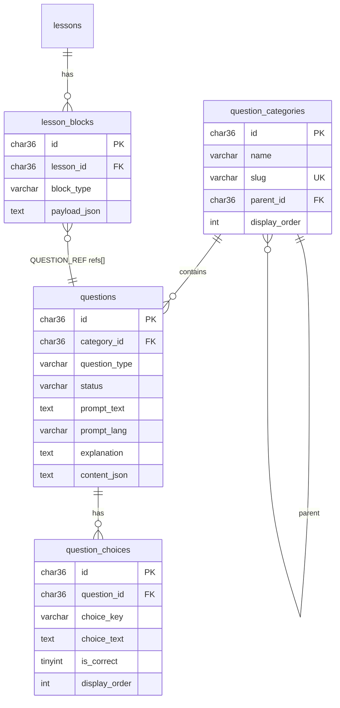

# Question Bank — Thiết kế DB (Phase 2.1)

> Cập nhật: **2025-06-06**  
> Liên quan: [`LESSON_AUTHORING_PROGRESS.md`](./LESSON_AUTHORING_PROGRESS.md), [`promt.md`](../promt.md) Method 3

---

## 1. Bài toán

Phase 1 lưu câu hỏi **nhúng** trong `lesson_blocks.payload_json` (block `EXERCISE_SET`).

Phase 2 cần **ngân hàng câu hỏi tập trung**:

- GV soạn / import câu một lần
- Nhiều lesson **tham chiếu** cùng câu qua block `QUESTION_REF`
- Sửa câu trong bank → mọi lesson dùng ref đó cập nhật (sau F5 / reload lesson detail)

---

## 2. Hai cách lưu câu trong lesson

| Cách | Block type | Dữ liệu câu | Chia sẻ | Dùng khi |
|------|------------|-------------|---------|----------|
| **Nhúng** | `EXERCISE_SET` | `questions[]` đầy đủ trong payload | Không | Bài tập riêng lesson, import CSV/Excel, soạn nhanh |
| **Tham chiếu** | `QUESTION_REF` | Chỉ `refs[]` = UUID câu trong bank | Có | GV chọn từ thư viện, tái sử dụng |

Cả hai **cùng tồn tại** — không migrate `EXERCISE_SET` cũ sang bank (có thể thêm tool “đẩy vào bank” sau).

---

## 3. Sơ đồ quan hệ



---

## 4. Bảng chi tiết

### 4.1 `question_categories`

Phân loại theo `promt.md`: Vocabulary, Grammar, Reading, Listening.

| Cột | Kiểu | Ghi chú |
|-----|------|---------|
| `id` | CHAR(36) PK | UUID |
| `name` | VARCHAR(128) | Hiển thị UI (Tiếng Việt) |
| `slug` | VARCHAR(64) UK | `vocabulary`, `grammar`, … |
| `parent_id` | CHAR(36) FK nullable | Cây danh mục (phase sau) |
| `display_order` | INT | Thứ tự sidebar filter |
| `created_at` … `voided` | | Giống `BaseObject` |

### 4.2 `questions`

Một hàng = một câu trong bank. Khớp type FE `ExerciseQuestionType`.

| Cột | Kiểu | Ghi chú |
|-----|------|---------|
| `id` | CHAR(36) PK | UUID — dùng trong `refs[]` |
| `category_id` | CHAR(36) FK nullable | Filter thư viện |
| `question_type` | VARCHAR(32) | `MULTIPLE_CHOICE` (MVP), sau: `MATCHING`, … |
| `status` | VARCHAR(20) | `DRAFT` \| `PUBLISHED` \| `ARCHIVED` |
| `prompt_text` | TEXT | Nội dung câu hỏi (EN) |
| `prompt_lang` | VARCHAR(8) | Mặc định `en` |
| `explanation` | TEXT nullable | Giải thích sau chấm |
| `content_json` | TEXT nullable | Dữ liệu theo type (matching pairs, audio assetId…) |
| `difficulty` | TINYINT nullable | 1–5 (tuỳ chọn) |
| `tags_json` | TEXT nullable | `["grade-6","unit-3"]` — tuỳ chọn |
| audit + `voided` | | Soft delete |

**Mapping → FE `MultipleChoiceQuestion`:**

```text
questions.id           → question.id
question_type          → question.type
prompt_text, prompt_lang → question.prompt
question_choices[]     → question.choices + correctChoiceId
explanation            → question.explanation
```

### 4.3 `question_choices`

Chỉ dùng cho MCQ (và tương tự có options). Tách bảng để CRUD rõ, validate đúng 1 đáp án.

| Cột | Kiểu | Ghi chú |
|-----|------|---------|
| `id` | CHAR(36) PK | |
| `question_id` | CHAR(36) FK | CASCADE khi xóa cứng (không dùng — chỉ soft delete) |
| `choice_key` | VARCHAR(8) | `a`, `b`, `c`, `d` — khớp `correctChoiceId` |
| `choice_text` | TEXT | Nội dung đáp án |
| `is_correct` | TINYINT(1) | Đúng một choice = 1 cho MCQ |
| `display_order` | INT | Thứ tự hiển thị |
| audit + `voided` | | |

Unique: `(question_id, choice_key)`.

### 4.4 `QUESTION_REF` payload (không thêm bảng junction — MVP)

Lưu trong `lesson_blocks.payload_json`, cùng pattern `EXERCISE_SET`:

```json
{
  "title": "Luyện từ vựng",
  "instruction": "Chọn đáp án đúng",
  "presentation": "stepped",
  "shuffleQuestions": true,
  "shuffleOptions": true,
  "passScorePercent": 80,
  "refs": [
    "c3000001-0000-4000-8000-000000000001",
    "c3000001-0000-4000-8000-000000000002"
  ]
}
```

- Thứ tự câu = thứ tự mảng `refs`
- Không lưu snapshot câu trong block → sửa bank là lesson đổi theo

**Tại sao không dùng `lesson_block_question_refs` ngay?**

- Ít bảng, editor chỉ cần PATCH `payload_json` như hiện tại
- Đủ cho MVP; junction table hữu ích khi cần query ngược “câu X dùng ở lesson nào” — phase sau

---

## 5. Resolve refs (BE — Phase 2.2)

`GET /lessons/{id}/detail` (student + admin):

1. Đọc blocks `QUESTION_REF`
2. Parse `refs[]` từ payload
3. Load `questions` + `question_choices` (chỉ `status=PUBLISHED`, `voided=0`)
4. Gắn `resolvedQuestions[]` vào response block (field computed, không ghi DB)

Player / `flattenExerciseBlocks` dùng `resolvedQuestions` giống `EXERCISE_SET.questions[]`.

Câu bị xóa / ARCHIVED: bỏ qua hoặc placeholder “Câu không còn khả dụng” (quyết định ở 2.2).

---

## 6. So sánh với `EXERCISE_SET` inline

| | EXERCISE_SET | QUESTION_REF |
|--|--------------|--------------|
| Nguồn câu | payload `questions[]` | bank UUID `refs[]` |
| Sửa câu | Sửa trong lesson editor | Sửa trong `/admin/questions` |
| Import CSV | Có (Phase 1B) | Import vào bank (Phase 2.2) |
| Player | `flattenExerciseBlocks` ✅ | Cần resolve refs (2.2) |

---

## 7. Migration & seed

| File | Nội dung |
|------|----------|
| `migrations/002_question_bank.sql` | CREATE 3 bảng + 4 category mặc định |
| `seed_question_bank_demo.sql` | (sau) vài câu MCQ mẫu + block QUESTION_REF demo |

Chạy:

```bash
mysql -u root -p course_english < course_english_backend/migrations/002_question_bank.sql
```

---

## 8. Bước tiếp (2.1 còn lại)

- [x] Thiết kế schema + migration SQL
- [x] JPA: `QuestionCategory`, `Question`, `QuestionChoice`
- [x] Repository + `QuestionService` CRUD
- [x] Enum `QuestionTypeEnum`, `QuestionStatusEnum`
- [ ] `seed_question_bank_demo.sql` — câu mẫu + block QUESTION_REF demo
