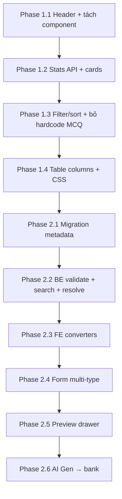

# Question Bank — Kế hoạch chi tiết Phase 1 & 2

> Cập nhật: **2026-06-30**  
> Trạng thái: **Chưa triển khai** — chỉ plan  
> Tổng quan 4 phase: [`QUESTION_BANK_PROGRESS.md`](./QUESTION_BANK_PROGRESS.md)  
> Vision UI: [`promt.md`](../promt.md)  
> Schema gốc: [`QUESTION_BANK_DB_DESIGN.md`](./QUESTION_BANK_DB_DESIGN.md)

---

## Nguyên tắc

| Giữ / reuse | Mở rộng |
|-------------|---------|
| `Question`, `QuestionChoice`, `QuestionCategory` entity hiện có | UI dashboard + metadata + multi-type |
| `AdminCatalogPageHeader`, `AdminCatalogToolbar`, `AdminCatalogGridTable` | Stats cards, preview drawer |
| `McqQuestionCanvas`, `TrueFalseQuestionCanvas`, `FillBlankQuestionCanvas` (đã có trong lesson editor) | Gắn vào `QuestionBankForm` |
| AI question gen (`AiTask`, `ReqCreateQuestionGenTaskDTO`, type handlers) | Nút **AI Generate** trên trang bank |
| Import CSV/Excel MCQ (`QuestionBankImportDialog`) | Giữ; Word/PDF = stub Phase 1 |
| `content_json` cho payload theo type (đã dùng trong AI handlers) | TRUE_FALSE, FILL_BLANK lưu qua `content_json` |

**Không làm trong Phase 1–2:** semantic search, bulk AI, duplicate detection, usage analytics thật (Phase 3–4).

---

## Hiện trạng code (baseline)

### Frontend

| File | Vấn đề |
|------|--------|
| `ManageQuestionsPage.tsx` | Chỉ CRUD MCQ; hardcode `questionType: "MULTIPLE_CHOICE"` khi search |
| `QuestionBankForm.tsx` | Chỉ `McqQuestionCanvas` |
| `questionBankUtils.ts` | Chỉ `questionToMcq` / `mcqToQuestionForm` |
| `question.ts` (API types) | Đã khai báo đủ `QuestionType` nhưng UI chưa dùng |

### Backend

| Thành phần | Vấn đề |
|------------|--------|
| `Question` entity | Có `difficulty`, `tagsJson`, `contentJson`; **chưa có** `title`, `cefrLevel`, `skill`, `topic`, `source`, `isAIGenerated` |
| `ResQuestionDTO` | Chưa expose `createdBy`, metadata mới |
| `ReqSearchQuestionDTO` | Chỉ `keyword`, `categoryId`, `questionType`, `status` |
| `QuestionServiceImpl.validateRequest` | Chỉ validate MCQ choices |
| `toExerciseQuestionMap` | Chỉ resolve MCQ → lesson `QUESTION_REF` chưa chạy TF/FillBlank |
| `QuestionController` | Chưa có `/stats` |

### Đã sẵn sàng (tái sử dụng)

- `QuestionTypeEnum`: 10 loại (MCQ, TRUE_FALSE, FILL_BLANK, …)
- AI type handlers: `TrueFalseQuestionTypeHandler`, `FillBlankQuestionTypeHandler` — quy ước `contentJson`
- Student player: `TrueFalseQuestion.tsx`, `FillBlankQuestion.tsx`
- Admin canvas: `TrueFalseQuestionCanvas.tsx`, `FillBlankQuestionCanvas.tsx`

---

## Phase 1 — Dashboard UI + Search/Filter/Sort + Stats

**Mục tiêu:** Trang bank trông như SaaS dashboard; teacher lọc/sắp xếp được; CRUD MCQ không vỡ.

**Ước lượng:** ~3–5 ngày (1 dev full-stack).

### 1.0 — Cấu trúc file FE (tách nhỏ page)

```
course_english_frontend/src/
├── pages/admin/
│   └── ManageQuestionsPage.tsx          # orchestrator — giảm dần logic
├── admin/components/question/
│   ├── QuestionBankStatsRow.tsx         # NEW — 4–6 stat cards
│   ├── QuestionBankHeaderActions.tsx    # NEW — New / AI / Import
│   ├── QuestionBankFilters.tsx        # NEW — search + filters + sort
│   ├── QuestionBankTable.tsx            # NEW — columns + row actions
│   ├── QuestionBankForm.tsx             # giữ — Phase 2 mở rộng type
│   ├── QuestionBankImportDialog.tsx     # giữ
│   └── QuestionBankAiGenStubDialog.tsx  # NEW Phase 1 — stub hoặc wire AI
├── shared/constants/
│   └── questionBank.ts                  # NEW — type labels, icons, sort options
└── styles/admin/
    └── admin-question-bank.css          # NEW — stats cards, hover
```

Import CSS trong `index.css` (giống `admin-vocabulary-sets.css`).

### 1.1 — Header + actions

**`ManageQuestionsPage`**

- Đổi title: **Question Bank** / subtitle: *Central repository of reusable English questions…*
- Dùng `AdminCatalogPageHeader` prop `action` → `QuestionBankHeaderActions`

**`QuestionBankHeaderActions`**

| Nút | Phase 1 |
|-----|---------|
| **New Question** | Mở dialog form (MCQ như hiện tại) |
| **✨ AI Generate** | Mở `QuestionBankAiGenStubDialog` — form tối thiểu: topic, count, types; gọi `apiCreateQuestionGenTask` nếu kịp, không thì banner "Coming soon" |
| **Import Excel / CSV** | Giữ `QuestionBankImportDialog` |
| **Import Word/PDF** | Dialog stub: "Tính năng Phase 4" |

> **Gợi ý nhanh:** Copy pattern poll từ `ExamPaperAiFromDocDialog.tsx` / `VocabularyAiGenDialog.tsx` — đã có `apiCreateQuestionGenTask`, `draftToExercise`, lưu bank qua `apiCreateQuestion`.

### 1.2 — Statistics cards

**Backend — migration không cần**

```
GET /api/v1/questions/stats
```

**`ResQuestionStatsDTO`**

```java
long total;
Map<String, Long> byStatus;    // DRAFT, PUBLISHED, ARCHIVED
Map<String, Long> byType;      // MULTIPLE_CHOICE, TRUE_FALSE, ...
long aiGeneratedCount;         // 0 nếu chưa có cột — Phase 2 bật
```

**`QuestionRepository`**

- `countByVoidedFalse()`
- `countByStatusAndVoidedFalse(...)` hoặc native `GROUP BY status`
- `countByQuestionTypeAndVoidedFalse(...)` hoặc `GROUP BY question_type`

**Frontend — `QuestionBankStatsRow`**

6 cards gợi ý:

| Card | Nguồn |
|------|-------|
| Total | `total` |
| Published | `byStatus.PUBLISHED` |
| Draft | `byStatus.DRAFT` |
| MCQ | `byType.MULTIPLE_CHOICE` |
| True/False | `byType.TRUE_FALSE` |
| AI Generated | `aiGeneratedCount` (0 tạm) |

Layout: grid responsive, icon MUI, soft shadow — tham chiếu card vocab trong `promt.md`.

**FE API:** `apiGetQuestionStats()` trong `shared/api/question.ts`.

### 1.3 — Search, filter, sort

**Bỏ hardcode** trong `fetchData`:

```ts
// XÓA dòng này:
questionType: "MULTIPLE_CHOICE",
```

**State mới trên page**

```ts
filterQuestionType: "" | QuestionType
filterDifficulty: "" | "1" | "2" | "3" | "4" | "5"
sortBy: "createdAt,desc" | "updatedAt,desc"  // Phase 1
```

**`QuestionBankFilters`**

- Search box lớn (placeholder: `environment B1`, `grammar passive voice`…)
- Select: Loại câu, Danh mục, Trạng thái, Độ khó (optional nếu BE chưa filter difficulty → Phase 1 chỉ UI disabled hoặc client-side sau)
- Select: Sort — Mới nhất / Sửa gần đây

**Backend — mở rộng tối thiểu**

`ReqSearchQuestionDTO` + `CatalogSearchSpecs`:

- [ ] `Integer difficulty` (equals)
- [ ] Sort: đã có qua `ReqPagingSearchDTO.sort` — verify `PagingSearchUtil` map `updatedAt,desc`

**Table columns Phase 1**

| Cột | Nội dung |
|-----|----------|
| # | STT |
| Câu hỏi | `promptText` truncate 120 ký tự |
| Loại | Chip + icon từ `questionBank.ts` |
| Danh mục | `categoryName` |
| Độ khó | `difficulty` → ★☆☆☆☆ |
| Trạng thái | chip |
| Cập nhật | `updatedAt` relative |
| Thao tác | Preview (disabled/stub Phase 1), Edit, Delete |

### 1.4 — Checklist Phase 1

#### Backend

- [ ] `ResQuestionStatsDTO.java`
- [ ] `QuestionService.getStats()` + impl aggregate
- [ ] `QuestionController` `GET /stats`
- [ ] `ReqSearchQuestionDTO.difficulty` + `CatalogSearchSpecs.questionDifficultyEquals`
- [ ] `ResQuestionDTO.createdBy` (expose từ `BaseObject`)
- [ ] Unit test: stats empty DB, stats with seed

#### Frontend

- [ ] Tách components (1.0)
- [ ] `questionBank.ts` constants
- [ ] `admin-question-bank.css`
- [ ] `apiGetQuestionStats`
- [ ] Refactor `ManageQuestionsPage` dùng components mới
- [ ] Bỏ hardcode MCQ filter; default = tất cả loại
- [ ] Cột loại + độ khó + updatedAt
- [ ] `QuestionBankAiGenStubDialog` (stub OK)
- [ ] Import Word/PDF stub dialog
- [ ] Manual test: search, filter type/status, sort, CRUD MCQ, import CSV

### 1.5 — Acceptance Criteria Phase 1

- [ ] Trang load < 2s với ~500 câu (pagination 10/20)
- [ ] Stats khớp DB
- [ ] Filter `questionType` = TRUE_FALSE trả đúng (kể cả khi chưa có câu TF → empty)
- [ ] Tạo/sửa/xóa MCQ vẫn OK
- [ ] Mobile: filter wrap, table dùng `AdminCatalogGridTable` mobile roles

---

## Phase 2 — Metadata + Preview Drawer + Multi-type (MCQ, TF, Fill Blank)

**Mục tiêu:** Câu hỏi là educational object có metadata; preview không cần mở form; tạo/sửa ít nhất MCQ + TRUE_FALSE + FILL_BLANK.

**Ước lượng:** ~1.5–2 tuần.

**Phụ thuộc Phase 1:** layout components, filter type, stats.

### 2.0 — Quy ước lưu trữ theo type

| Type | `prompt_text` | `question_choices` | `content_json` |
|------|---------------|-------------------|----------------|
| MULTIPLE_CHOICE | Câu hỏi | a/b/c/d + `is_correct` | null hoặc extra |
| TRUE_FALSE | Câu khẳng định | **không dùng** | `{ "correctAnswer": true \| false }` |
| FILL_BLANK | Câu có `___` | **không dùng** | `{ "blanks": [{ "id":"b1", "acceptedAnswers":["went"] }], "caseSensitive": false }` |

Khớp AI handlers: `TrueFalseQuestionTypeHandler`, `FillBlankQuestionTypeHandler`.

**`title`:** optional VARCHAR — nếu null, UI derive `promptText.slice(0, 80)`.

### 2.1 — Migration DB

**File:** `migrations/031_question_bank_metadata.sql`

```sql
ALTER TABLE `questions`
  ADD COLUMN `title`           VARCHAR(255) DEFAULT NULL AFTER `status`,
  ADD COLUMN `cefr_level`      VARCHAR(8)   DEFAULT NULL COMMENT 'A1..C2',
  ADD COLUMN `skill`           VARCHAR(32)  DEFAULT NULL COMMENT 'vocabulary|grammar|reading|listening|writing|speaking',
  ADD COLUMN `topic`           VARCHAR(128) DEFAULT NULL,
  ADD COLUMN `source`          VARCHAR(32)  NOT NULL DEFAULT 'MANUAL' COMMENT 'MANUAL|IMPORT|AI|LESSON|EXAM',
  ADD COLUMN `is_ai_generated` TINYINT(1)   NOT NULL DEFAULT 0;

CREATE INDEX `idx_questions_cefr`   ON `questions` (`cefr_level`);
CREATE INDEX `idx_questions_skill`  ON `questions` (`skill`);
CREATE INDEX `idx_questions_topic`  ON `questions` (`topic`);
CREATE INDEX `idx_questions_source` ON `questions` (`source`);
```

**Enums BE mới**

- `QuestionSourceEnum`: MANUAL, IMPORT, AI, LESSON, EXAM
- `QuestionSkillEnum`: VOCABULARY, GRAMMAR, READING, LISTENING, WRITING, SPEAKING
- `CefrLevelEnum`: A1, A2, B1, B2, C1, C2

**FE constants** — `shared/constants/questionBank.ts`:

```ts
export const QUESTION_CEFR_LEVELS = ["A1","A2","B1","B2","C1","C2"];
export const QUESTION_SKILLS = [...];
export const QUESTION_SOURCES = [...];
```

### 2.2 — Backend API mở rộng

#### Entity + DTO

`Question.java` — thêm fields migration.

`ReqQuestionDTO` / `ResQuestionDTO` — thêm:

```
title?, cefrLevel?, skill?, topic?, source?, isAIGenerated?
createdBy, updatedBy
```

`ReqSearchQuestionDTO` — thêm:

```
cefrLevel?, skill?, topic?, source?, tags? (contains — phase 2b)
isAIGenerated?
```

`CatalogSearchSpecs` — filter tương ứng.

#### Validation `QuestionServiceImpl`

- [ ] `TRUE_FALSE`: validate `contentJson.correctAnswer` boolean
- [ ] `FILL_BLANK`: validate số `___` = số blanks; mỗi blank có `acceptedAnswers`
- [ ] `MULTIPLE_CHOICE`: giữ validate hiện tại
- [ ] Khi `type != MCQ` → không require choices

#### Resolve cho lesson (`toExerciseQuestionMap`)

Mở rộng build JSON cho player:

- [ ] `TRUE_FALSE` → `{ type, prompt, correctChoiceId: "true"|"false", ... }`
- [ ] `FILL_BLANK` → map từ `content_json.blanks`

> Cần để `QUESTION_REF` block dùng câu TF/FillBlank trong lesson.

#### AI → Bank

Khi lưu câu từ AI task:

- `source = AI`, `isAIGenerated = true`
- Copy `difficulty`, `tags` từ draft nếu có

Wire trong flow `QuestionBankAiGenDialog` (thay stub Phase 1).

#### Stats Phase 2

`aiGeneratedCount` = `COUNT WHERE is_ai_generated = 1`.

### 2.3 — Frontend: converters

**File:** `shared/lesson/questionBankUtils.ts` — mở rộng:

```ts
questionToExerciseQuestion(record): ExerciseQuestion
exerciseQuestionToQuestionForm(q, meta): QuestionFormPayload
```

Hoặc tách:

```
questionBankConverters/
  mcqConverter.ts
  trueFalseConverter.ts
  fillBlankConverter.ts
```

Map `QuestionRecord` ↔ `TrueFalseQuestion` / `FillBlankQuestion` (types đã có trong `exercise/types.ts`).

`QuestionFormPayload.contentJson` — gửi object stringify hoặc BE nhận JsonNode (align với API hiện tại: string).

### 2.4 — Form editor multi-type

**`QuestionBankForm.tsx` refactor**

```
┌─ Metadata row: type, category, status, difficulty, cefr, skill, topic, tags
├─ Title (optional)
└─ Type-specific canvas:
     MULTIPLE_CHOICE  → McqQuestionCanvas
     TRUE_FALSE       → TrueFalseQuestionCanvas
     FILL_BLANK       → FillBlankQuestionCanvas
```

**`ManageQuestionsPage`**

- State: `questionType` + `ExerciseQuestion` union thay vì chỉ `mcq`
- `openCreate`: dialog chọn type trước (hoặc default MCQ + dropdown đổi type khi tạo mới)
- `submitForm`: route qua converter theo type

### 2.5 — Preview drawer

**`QuestionBankPreviewDrawer.tsx`**

- MUI `Drawer` anchor right, width ~480px
- Click row / nút Preview → `apiGetQuestionById` → render read-only:
  - **Player preview:** reuse `ExercisePlayer` mode review **hoặc** component read-only nhẹ hơn (khuyến nghị: extract `QuestionPreviewPanel` từ `ExerciseReviewScreen` logic)
- Sections:
  - Câu hỏi + đáp án + explanation
  - Metadata chips: type, difficulty, CEFR, skill, topic, tags, source, AI badge
  - Footer: Edit, Close
- Related questions: placeholder "Phase 4"
- Statistics: placeholder `usageCount —`, `correctRate —` (chưa có data)

### 2.6 — Table metadata Phase 2

Thêm cột / chip inline:

- CEFR, Skill, Topic (truncate)
- Badge **AI** nếu `isAIGenerated`
- Filter bar: thêm CEFR, Skill, Topic, Source

### 2.7 — Import (stretch Phase 2)

| Format | Phase 2 |
|--------|---------|
| CSV/Excel MCQ | Giữ |
| CSV/Excel TF | Optional — 1 sheet template mới |
| Fill Blank | Optional |

Nếu không kịp: ghi backlog, không block AC.

### 2.8 — Checklist Phase 2

#### Backend

- [ ] Migration `031_question_bank_metadata.sql`
- [ ] Enums + entity fields
- [ ] DTO request/response + search filters
- [ ] `validateRequest` per type
- [ ] `toExerciseQuestionMap` TF + FillBlank
- [ ] Set `source`/`isAIGenerated` on AI save path
- [ ] Stats `aiGeneratedCount` thật
- [ ] Manual test Postman: CRUD 3 types

#### Frontend

- [ ] `questionBank.ts` — skills, cefr, sources, type icons
- [ ] Converters MCQ / TF / FillBlank
- [ ] `QuestionBankForm` multi-type
- [ ] `QuestionBankPreviewDrawer`
- [ ] Table + filter metadata
- [ ] `QuestionBankAiGenDialog` — lưu draft vào bank (thay stub)
- [ ] `api` types update
- [ ] Manual E2E: tạo TF + FillBlank → preview → publish → QUESTION_REF lesson resolve

### 2.9 — Acceptance Criteria Phase 2

- [ ] Tạo/sửa/xóa **MCQ + TRUE_FALSE + FILL_BLANK** qua UI
- [ ] Preview drawer hiển thị đúng đáp án từng type
- [ ] Filter theo `questionType`, `cefrLevel`, `skill`, `status` hoạt động
- [ ] Câu AI lưu bank có `isAIGenerated=true`, stats card cập nhật
- [ ] Lesson `QUESTION_REF` resolve được TF/FillBlank (smoke test 1 lesson)
- [ ] Câu cũ (chỉ MCQ) không cần migrate — metadata null OK

---

## Thứ tự triển khai đề xuất



**Song song được:** Phase 1 FE layout có thể làm trước khi stats API xong (fallback `—`).

---

## Rủi ro & giảm scope

| Rủi ro | Giảm scope |
|--------|------------|
| `toExerciseQuestionMap` phức tạp | Phase 2 chỉ TF + FillBlank; Matching để Phase 2b |
| AI Gen dialog lớn | Phase 1 stub; Phase 2 copy rút gọn từ Exam AI dialog |
| Filter `tags` JSON | Phase 2b — Phase 2 chỉ filter cột scalar |
| `usageCount` / `correctRate` | Placeholder UI; bảng aggregate Phase 4 |
| Preview reuse `ExercisePlayer` nặng | Component preview read-only riêng |

---

## Liên kết module khác

- **ExamPaper** (`EXAM_PAPER_PLAN.md`): section dùng inline `questions[]` hoặc pick từ bank — `QuestionBankPickerDialog` đã có, Phase 2 nên hiển thị metadata trong picker.
- **Vocabulary AI** (`VOCABULARY_AI_PROGRESS.md`): sinh MCQ từ bộ từ → lưu bank với `source=AI`.
- **Lesson QUESTION_REF**: phụ thuộc `toExerciseQuestionMap` Phase 2.

---

## Cập nhật progress

Khi bắt đầu code, tick checklist trong [`QUESTION_BANK_PROGRESS.md`](./QUESTION_BANK_PROGRESS.md) Phase 1–2 và ghi ngày hoàn thành từng mục.
