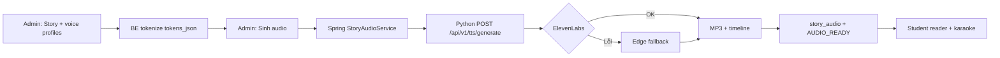

# AI Reading Studio — Plan & Progress

> Tham chiếu sản phẩm: [`promt.md`](../promt.md)  
> **Canonical reader payload:** JSON `tokens[]` (AI chỉ sinh plain text; BE tokenize sau khi lưu)  
> **Tokenizer MVP:** `lower(trim) + strip edge punctuation` — exact surface form only  
> **Cập nhật:** 2026-07-02 — Báo cáo tiến độ Phase 1 + Phase 2 (MVP audio/karaoke)

---

## Báo cáo tiến độ (snapshot 2026-07-02)

### Tóm tắt nhanh

| Phase | Trạng thái | Ghi chú |
|-------|------------|---------|
| **1 — Reading Core** | ✅ **Code xong** | CRUD, AI gen, reader, notebook, cover, translations — chờ xác nhận E2E |
| **2 — Listen & Karaoke (MVP)** | ✅ **Code xong** | Python TTS + alignment + player + karaoke — chờ E2E ổn định |
| **2.1 — Voice catalog** | ✅ **Code xong** | `tts_voice_catalog`, profile UI, `voice_profile_json` |
| **2.2 — ElevenLabs** | ✅ **Code xong** | Provider Python + ElevenLabs-first, Edge fallback + log |
| **2.3 — Multi-speaker** | 📋 **Chưa làm** | AI `speech.lines[]`, sinh từng câu, ghép audio |
| **3 — AI Context** | 📋 Chưa làm | Text selection, Ask AI theo story |
| **4 — Review+** | 📋 Chưa làm | Notebook review modes, analytics, pronunciation |

### Đánh giá: đã ổn chưa?

**Code:** Đủ để chạy luồng MVP end-to-end (Admin sinh story → sinh audio → Student nghe karaoke).

**Chưa chốt production** cho đến khi hoàn tất checklist E2E bên dưới:

- [ ] Chạy đủ migrations `032` → `036`
- [ ] Python `:8100` + Spring `SPEECH_PLATFORM_ENABLED=true` chạy ổn định
- [ ] Sinh audio ElevenLabs thành công (hoặc fallback Edge có log `[StoryAudio]`)
- [ ] Student play audio + highlight từ/câu khớp timeline
- [ ] Phase 1 reader + notebook smoke test

---

## Luồng hiện tại (đang chạy)



**Chiến lược TTS hiện tại:**

1. Đọc `stories.voice_profile_json` → ưu tiên profile `NARRATOR` (hoặc profile đầu tiên có trong JSON)
2. **Thử ElevenLabs trước** (voice từ catalog)
3. **Lỗi** → fallback **Edge TTS** (cùng `profile_key` trong catalog)
4. Log prefix `[StoryAudio]` trên Spring Boot

**Giới hạn hiện tại:** Một giọng đọc **cả story** (narrator mode). Chưa sinh từng câu / nhiều nhân vật.

---

## Tổng quan phase

| Phase | Mục tiêu | Trạng thái |
|-------|----------|------------|
| **1 — Reading Core** | CRUD story, AI gen, tokenizer JSON, reader, dictionary popup, notebook | ✅ Code xong |
| **2 — Listen & Karaoke** | Python TTS, timeline, audio player, admin sinh audio | ✅ Code xong (MVP) |
| **2.1 — Voice catalog** | Bảng voices + chọn profile trên form story | ✅ Code xong |
| **2.2 — ElevenLabs** | Provider + fallback Edge | ✅ Code xong |
| **2.3 — Multi-speaker** | AI speech manifest, per-sentence TTS, concat | 📋 Kế hoạch |
| **3 — AI Context** | Text selection toolbar, Ask AI theo story | 📋 Chưa làm |
| **4 — Review+** | Notebook review modes, analytics, pronunciation | 📋 Chưa làm |

---

## Migrations (chạy theo thứ tự)

```bash
mysql -u root -p course_english < course_english_backend/migrations/032_stories.sql
mysql -u root -p course_english < course_english_backend/migrations/033_story_audio.sql
mysql -u root -p course_english < course_english_backend/migrations/034_story_cover_image.sql
mysql -u root -p course_english < course_english_backend/migrations/035_story_translations.sql
mysql -u root -p course_english < course_english_backend/migrations/036_tts_voice_catalog.sql
```

| Migration | Nội dung |
|-----------|----------|
| `032_stories.sql` | `stories`, `student_notebook_entries` |
| `033_story_audio.sql` | `story_audio` (audio URL, timelines, cache hash) |
| `034_story_cover_image.sql` | `stories.cover_image_url` |
| `035_story_translations.sql` | `stories.translations_json` (song ngữ / glossary) |
| `036_tts_voice_catalog.sql` | `tts_voice_catalog`, `stories.voice_profile_json` |

---

## Phase 1 — Reading Core

### Outcomes

- GV tạo / AI sinh story (plain text), gắn optional `vocabularySetId`.
- BE tokenize → lưu `tokens_json`, trả `reader-payload` cho FE.
- HS đọc story: typography đẹp, click từ → popup từ điển, lưu notebook.
- **Bổ sung đã làm:** cover image AI/upload, translations/glossary, word enrich AI (popup).

### Data model — `stories` (mở rộng)

| Cột | Kiểu | Ghi chú |
|-----|------|---------|
| `id` | CHAR(36) PK | UUID |
| `title` | VARCHAR(255) | |
| `slug` | VARCHAR(255) UNIQUE | URL student |
| `content` | TEXT | Plain text only |
| `level` | VARCHAR(16) | A1–C2 |
| `reading_time_minutes` | INT | Ước lượng |
| `prompt` | TEXT | Prompt AI (nếu có) |
| `cover_image_url` | VARCHAR(1024) | Migration 034 |
| `vocabulary_set_id` | CHAR(36) FK | Optional |
| `status` | VARCHAR(20) | `DRAFT` \| `PUBLISHED` \| `ARCHIVED` |
| `processing_status` | VARCHAR(32) | `PENDING` \| `TOKENIZED` \| `AUDIO_READY` |
| `tokens_json` | TEXT | JSON — canonical render |
| `translations_json` | TEXT | Migration 035 |
| `voice_profile_json` | TEXT | Migration 036 — map profile → voice |
| `is_ai_generated` | TINYINT(1) | |
| audit + `voided` | | |

#### `student_notebook_entries`

| Cột | Kiểu | Ghi chú |
|-----|------|---------|
| `id` | CHAR(36) PK | |
| `student_id` | CHAR(36) | JWT user id |
| `word_id` | CHAR(36) FK | → `vocabulary_words` |
| `story_id` | CHAR(36) FK | → `stories` |
| `context_sentence` | TEXT | Câu chứa từ |
| `review_status` | VARCHAR(20) | `NEW` \| `REVIEWED` (phase 4) |
| audit + `voided` | | UNIQUE(`student_id`, `word_id`, `story_id`) |

### Token JSON contract

```json
{
  "tokens": [
    { "type": "text", "value": "Tom showed his " },
    {
      "type": "word",
      "text": "passport",
      "wordIndex": 5,
      "vocabularyId": "uuid-or-null",
      "isVocab": true
    },
    { "type": "text", "value": " before entering the gate." }
  ],
  "sentences": [
    {
      "sentenceIndex": 0,
      "startWordIndex": 0,
      "endWordIndex": 12,
      "text": "Tom showed his passport..."
    }
  ]
}
```

### API (Phase 1 + mở rộng)

| Method | Path | Mô tả |
|--------|------|--------|
| POST | `/api/v1/stories/search` | List (`publishedOnly` cho student) |
| GET | `/api/v1/stories/{id}` | Chi tiết admin |
| POST | `/api/v1/stories` | Tạo (+ auto tokenize) |
| PUT | `/api/v1/stories/{id}` | Sửa (+ re-tokenize nếu content/vocab đổi) |
| DELETE | `/api/v1/stories/{id}` | Xóa mềm |
| POST | `/api/v1/stories/ai-preview` | Sync preview AI story (plain text) |
| POST | `/api/v1/stories/ai-cover-preview` | AI sinh ảnh cover |
| GET | `/api/v1/stories/{id}/reader-payload` | Reader payload theo id |
| GET | `/api/v1/stories/slug/{slug}/reader-payload` | Reader payload theo slug |
| GET | `/api/v1/stories/lookup-word?word=` | Popup: vocab DB → dictionary |
| POST | `/api/v1/stories/lookup-word/enrich` | AI enrich nghĩa Việt (popup) |
| POST | `/api/v1/student/notebook` | Lưu từ notebook |
| POST | `/api/v1/student/notebook/search` | Danh sách notebook |
| DELETE | `/api/v1/student/notebook/{id}` | Xóa entry |

### Frontend routes (Phase 1)

| Route | Page |
|-------|------|
| `/admin/stories` | `ManageStoriesPage` — list + editor + AI + audio |
| `/student/stories` | `StudentStoryListPage` |
| `/student/stories/notebook` | `StudentNotebookPage` |
| `/student/stories/:storySlug` | `StoryReaderPage` — reader + player |

### Checklist Phase 1

#### Backend
- [x] Migration `032_stories.sql`
- [x] Migration `034_story_cover_image.sql`
- [x] Migration `035_story_translations.sql`
- [x] Entity `Story`, `StudentNotebookEntry`
- [x] `StoryTokenizerService` + `StoryWordKeyUtil`
- [x] `StoryService` CRUD + tokenize + reader payload
- [x] `AiStoryPreviewService` (sync OpenRouter)
- [x] `StoryCoverImageService`, `StoryTranslationMergeService`
- [x] `StoryWordAiEnrichService`
- [x] `StudentNotebookService` + controller
- [x] `StoryController`
- [x] Unit test tokenizer + word key util
- [ ] Manual test E2E Phase 1

#### Frontend
- [x] `shared/api/story.ts`, `notebook.ts`
- [x] Admin `ManageStoriesPage` + `StoryAiGenDialog`
- [x] Student list + `StoryReaderPage` + `StoryWordPopup` + notebook save
- [x] `StudentNotebookPage`
- [x] Routes + admin/student nav
- [x] `styles/student/story-reader.css`, `admin-manage-stories.css`

#### Acceptance Criteria Phase 1
- [ ] Chạy migrations `032`, `034`, `035`
- [ ] GV tạo story thủ công → publish → HS thấy trong list
- [ ] Từ trong vocab set highlight khi đọc
- [ ] Click từ → popup nghĩa + IPA (nếu có)
- [ ] Save notebook → hiện trong `/student/stories/notebook`
- [ ] AI preview sinh plain text, không HTML

---

## Phase 2 — Listen & Karaoke (MVP)

### Outcomes

- Python microservice `reading_text/` — `POST /api/v1/tts/generate`
- Providers: **Edge TTS** + **ElevenLabs** + **faster-whisper** alignment
- BE `StoryAudioService` async → cache theo `content_hash`
- FE `StoryAudioPlayer` + karaoke highlight từ/câu + auto-scroll
- Admin: nút **Sinh audio**, poll status, nghe thử

### Python service (`reading_text/`)

| Endpoint | Mô tả |
|----------|--------|
| `GET /health` | Health + providers đã register |
| `POST /api/v1/tts/generate` | TTS + alignment + upload → `SpeechResult` |
| `GET /api/v1/tts/voices` | List voices (edge / elevenlabs) |

**Storage:** `STORAGE_LOCAL_ROOT=C:/DucNguyen/course-english-storage`  
**Public URL:** `http://localhost:8100/files/tts/{uuid}.mp3`

### Spring integration

```
StoryController → StoryAudioService → SpeechGenerationService
  → SpeechPlatformAdapter → SpeechPlatformClient → Python :8100
```

| API | Mô tả |
|-----|--------|
| `POST /api/v1/stories/{id}/generate-audio` | Queue async sinh audio |
| `GET /api/v1/stories/{id}/audio` | Trạng thái + `audioUrl` |
| `GET /api/v1/stories/voice-catalog` | Danh sách voice cho admin form |

**Config BE:** `SPEECH_PLATFORM_ENABLED=true`, `SPEECH_PLATFORM_BASE_URL=http://localhost:8100`

### Voice profile JSON (Phase 2.1)

Lưu trên `stories.voice_profile_json`:

```json
{
  "NARRATOR": { "provider": "elevenlabs", "voiceId": "dHd5gvgSOzSfduK4CvEg" },
  "MALE_ADULT": { "provider": "elevenlabs", "voiceId": "IRHApOXLvnW57QJPQH2P" },
  "FEMALE_ADULT": { "provider": "elevenlabs", "voiceId": "tnVKC6NjwhdRxoQIfKue" }
}
```

Catalog seed trong `036_tts_voice_catalog.sql` (Edge + ElevenLabs: Adam, Ed, Lyan, Lauren, Cherry Twinkle, …).

**Profile keys:** `NARRATOR`, `MALE_ADULT`, `FEMALE_ADULT`, `BOY_CHILD`, `GIRL_CHILD`

> Hiện tại sinh audio chỉ dùng **một giọng narrator** cho cả story. Các profile khác chuẩn bị cho Phase 2.3 multi-speaker.

### Checklist Phase 2 (MVP)

#### Python (`reading_text/`)
- [x] FastAPI skeleton + config + storage local
- [x] Edge TTS provider
- [x] ElevenLabs TTS provider
- [x] faster-whisper alignment + word/sentence timeline
- [x] `POST /api/v1/tts/generate`
- [x] pytest (14 tests khi last run)
- [ ] Manual test ElevenLabs với API key thật

#### Backend
- [x] Migration `033_story_audio.sql`
- [x] Migration `036_tts_voice_catalog.sql`
- [x] `integration/speech/` port-adapter pattern
- [x] `StoryAudioService` + async worker
- [x] `StorySpeechRequestAssembler` (voice profile + ElevenLabs-first)
- [x] `StoryVoiceCatalogService` + API voice-catalog
- [x] Reader payload attach `audioUrl`, timelines
- [x] Log `[StoryAudio]` + Edge fallback
- [ ] Manual E2E: Admin sinh audio → HS karaoke

#### Frontend
- [x] `apiGenerateStoryAudio`, `apiGetStoryAudioStatus`
- [x] Admin: Sinh audio + poll + nghe thử
- [x] Admin: Voice casting profiles (5 dropdown)
- [x] `StoryAudioPlayer.tsx`
- [x] `storyKaraoke.ts` — map `currentTime` → word/sentence index
- [x] `StoryReaderContent` highlight + auto-scroll
- [x] `story-reader.css` player + active word styles

#### Acceptance Criteria Phase 2
- [ ] Chạy migrations `033`, `036`
- [ ] Python `:8100` + BE enabled
- [ ] Admin chọn Narrator = Ed → Sinh audio → `AUDIO_READY`
- [ ] `story_audio.tts_provider` = `elevenlabs` (hoặc `edge` nếu fallback)
- [ ] Student play → karaoke highlight khớp
- [ ] Đổi content hoặc voice → invalidate cache, sinh lại

---

## Phase 2.3 — Multi-speaker (kế hoạch tiếp theo)

**Chưa implement.** Thiết kế đã chốt hướng:

| Thành phần | Mô tả |
|------------|--------|
| `speech_mode` | `NARRATOR` \| `DIALOGUE` \| `MIXED` \| `AUTO` |
| `speech_manifest_json` | AI trả `speakers[]` + `lines[]` (ai nói câu nào) |
| BE validator | Map `lines` ↔ `sentences` từ tokenizer |
| Python | TTS per-sentence + concat MP3 + merge timeline offset |
| Admin Cast Review | Duyệt cast trước khi sinh audio |

---

## Phase 3 — AI Context

- Text selection floating toolbar (Translate, Explain, Grammar, Save note)
- Ask AI scoped to `story.content` + selected excerpt
- Tái dùng `AiChatService` với `contextType=STORY`

---

## Phase 4 — Review & Future

- Notebook → flashcard / MCQ
- Reading analytics, daily story, recommendations
- Whisper shadowing, pronunciation scoring

---

## Quyết định kỹ thuật (đã chốt)

| Chủ đề | Quyết định |
|--------|------------|
| Reader format | JSON `tokens[]` canonical; không HTML từ AI |
| Tokenizer | Exact `lower(trim) + strip edge punctuation` only |
| Story vs Lesson | Module riêng `/student/stories` |
| TTS | Python microservice; BE master `wordIndex` |
| TTS strategy | ElevenLabs first → Edge fallback + log |
| Voice catalog | DB `tts_voice_catalog`; AI không chọn `voice_id` |
| Voice profile | JSON `{ provider, voiceId }` per profile key |
| Audio storage | `C:/DucNguyen/course-english-storage` (local) |
| Unknown word | vocab DB → dictionary → AI enrich (popup) |
| Multi-speaker | Phase 2.3 — chưa làm |

---

## File map

### Backend — Phase 1

| File | Vai trò |
|------|---------|
| `migrations/032_stories.sql` | Schema stories + notebook |
| `migrations/034_story_cover_image.sql` | Cover URL |
| `migrations/035_story_translations.sql` | Translations JSON |
| `domain/Story.java`, `StudentNotebookEntry.java` | Entities |
| `service/story/StoryTokenizerService.java` | Tokenize + vocab match |
| `service/story/AiStoryPreviewService.java` | AI gen preview |
| `service/impl/StoryServiceImpl.java` | CRUD + reader payload |

### Backend — Phase 2

| File | Vai trò |
|------|---------|
| `migrations/033_story_audio.sql` | `story_audio` |
| `migrations/036_tts_voice_catalog.sql` | Voice catalog + `voice_profile_json` |
| `integration/speech/` | Port-adapter → Python |
| `service/impl/StoryAudioServiceImpl.java` | Async gen + cache + fallback log |
| `service/story/StorySpeechRequestAssembler.java` | Voice resolve + request build |
| `service/story/StoryVoiceCatalogServiceImpl.java` | API voice catalog |
| `domain/TtsVoiceCatalog.java` | Entity catalog |

### Python — `reading_text/`

| File | Vai trò |
|------|---------|
| `app/main.py` | FastAPI app |
| `app/api/tts.py` | TTS endpoints |
| `app/providers/edge/edge_provider.py` | Edge TTS |
| `app/providers/elevenlabs/elevenlabs_provider.py` | ElevenLabs TTS |
| `app/providers/faster_whisper/alignment_provider.py` | Word/sentence timeline |
| `app/services/speech_service.py` | Orchestrate TTS → align → storage |

### Frontend

| File | Vai trò |
|------|---------|
| `pages/admin/ManageStoriesPage.tsx` | Admin CRUD + audio + voice profiles |
| `admin/components/story/StoryAiGenDialog.tsx` | AI preview |
| `student/stories/StoryReaderPage.tsx` | Reader + player |
| `student/stories/StoryReaderContent.tsx` | Render tokens + karaoke |
| `student/stories/StoryAudioPlayer.tsx` | Audio controls |
| `student/stories/storyKaraoke.ts` | Timeline → active index |
| `student/stories/StoryWordPopup.tsx` | Dictionary popup |
| `shared/api/story.ts` | Story + audio + voice API |

---

## Hướng dẫn test nhanh (E2E)

1. Chạy migrations `032`–`036`
2. Start Python: `reading_text/` → port `8100`
3. Start Spring Boot với `SPEECH_PLATFORM_ENABLED=true`
4. Start FE
5. Admin: tạo story → chọn voice profiles → **Lưu** → **Sinh audio**
6. Đợi `AUDIO_READY` (hoặc xem log `[StoryAudio]`)
7. Student: mở story → Play → kiểm tra highlight từ/câu

**Log cần xem (Spring):**

```
[StoryAudio] Start generation storyId=... primaryProvider=elevenlabs ...
[StoryAudio] Primary provider succeeded ...   (hoặc fallback to edge)
[StoryAudio] Ready storyId=... provider=... voice=... duration=...
```
