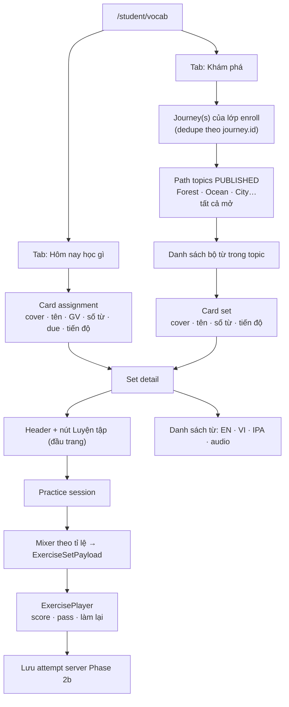

# Plan & tiến độ: Student Vocabulary Learning

Cập nhật lần cuối: 2026-07-10

## Mục tiêu

Học sinh học từ vựng theo **2 nguồn**, không quản lý thư viện từ (Word Library chỉ dành Admin):

1. **Hôm nay học gì (Assigned)** — bộ từ GV gán cho lớp, sắp xếp theo thời gian gán.
2. **Khám phá (Explore)** — HS thấy **Journey đã publish và được gán cho lớp mình**: path theo **topic** → danh sách bộ từ trong topic → Learn + Practice giống Assigned.

Vào một bộ: xem **danh sách từ** + nút **Luyện tập luôn ở đầu trang**. Luyện tập = session **random nhiều dạng theo tỉ lệ**, chấm điểm + làm lại giống lesson (`ExercisePlayer`).

Tham chiếu ý tưởng rộng hơn (Favorites / Review / AI…): [`promt.md`](../promt.md) — **chưa** nằm trong phạm vi plan này.

Tham chiếu UI Journey (Explore): mock “Your Journey” / “Your Learning Journey” — path theo topic (island/card); **MVP: mọi topic mở hết** (không khóa tuần tự).

---

## Trạng thái tổng quan

| Phase | Nội dung | Trạng thái |
|-------|----------|-----------|
| **Plan** | Chốt luồng 2 tab + Learn → Practice + assignment + multi-Journey | 📋 Đang thiết kế — chờ bổ sung |
| **1 — FE shell + Practice** | 2 tab UI, Learn list, mixer + ExercisePlayer (Explore tạm flat / mock) | ✅ Code xong — chờ test thủ công |
| **2a — Assignment** | Schema + API gán **bộ từ** cho lớp + tab Assigned thật | ✅ Code xong — chạy migration `040` + test |
| **2b — Practice attempts** | Lưu điểm / làm lại / progress trên card | ✅ Code xong — chạy migration `041` + test |
| **2c — Journey + Topic** | Multi-journey, topic bảng riêng, N:N set↔topic, gán journey→lớp, Admin trong menu Từ vựng | ✅ Code xong — chạy migration `042` + test |
| **3 — Polish** | Due badge, Continue CTA, completed check trên node, config tỉ lệ | ✅ Code xong — chờ test thủ công |

**Hiện trạng codebase (baseline trước plan):**

- [x] Admin: `/admin/vocabulary-sets`, `/admin/vocabulary-words`
- [x] HS: `/student/vocab` + `/student/vocab/:setId` (list publish + flashcard/list)
- [x] `vocabActivityGenerator` (MCQ, Matching, Listen choose, Spelling, Listen type)
- [x] `ExercisePlayer` + result screen + lesson practice attempts
- [x] Gán bộ từ → lớp (assignment) — migration `040`, API + Admin dialog + HS Assigned tab
- [x] Mixed practice session trên trang vocab
- [x] Vocab practice attempts
- [x] Journey / Topic / gán journey → lớp

**Phase 1 đã ship (2026-07-10):**

- [x] `VocabCenterPage` — 2 tab Hôm nay học gì | Khám phá
- [x] Tab Assigned — empty state (chờ Phase 2a)
- [x] Tab Khám phá — flat list publish (tạm)
- [x] Set detail — list từ + nút **Luyện tập** đầu trang (`?mode=practice`)
- [x] `buildVocabPracticeSession.ts` — mixer theo tỉ lệ MVP
- [x] `ExercisePlayer` + `persistAttempts={false}` (chưa lưu server)

---

## Quyết định đã chốt

| Mục | Quyết định |
|-----|------------|
| Cấu trúc HS | **2 phần**: Assigned (“Hôm nay học gì”) + Explore (“Khám phá”) |
| Assigned list | Nhiều bộ chưa xong cùng lúc; sort `assigned_at` **mới nhất trước** |
| Gate luyện tập | Nút **Luyện tập ở đầu trang**; **không** bắt buộc xem hết list |
| Practice | Mixed random theo tỉ lệ (không chỉ flashcard) |
| Score / retry | Giống lesson (`passScorePercent` mặc định 80, Làm lại) |
| Explore | **Journey** → **Topic** → list bộ từ → Learn/Practice |
| Topic model | **Bảng riêng** `vocabulary_topics` (không dùng tag/subject) |
| Nhiều Journey | Hệ thống có **nhiều journey**; mỗi journey có thể **publish** |
| CRUD Journey/Topic | **Admin + Teacher** |
| Teacher scope Journey | Teacher **chỉ** tạo/sửa/gán journey liên quan **lớp mình**; Admin thấy/sửa mọi journey |
| Gán bộ từ (Assigned) | **Admin + Teacher** |
| Set trong topic | Admin/Teacher được chọn set **DRAFT + PUBLISHED** vào topic; **HS chỉ thấy/luyện set `PUBLISHED`** (set DRAFT ẩn dù topic đã PUBLISHED) |
| Layout Journey | **PC = ngang**; **mobile = dọc** |
| Journey ↔ lớp | **1 lớp ↔ tối đa 1 journey**; gán mới → **replace** journey cũ của lớp đó |
| HS nhiều lớp | Hiện **tất cả journey** của các lớp đã enroll; **dedupe theo `journey.id`** (cùng journey gán 2 lớp → chỉ hiện 1) |
| Admin UX | Quản lý Journey/Topic **trong menu Bộ từ vựng** (cùng khu vực sets/words) |
| Tạo nội dung | Tạo **topic** trong journey → **chọn các bộ từ** đưa vào topic |
| Topic status | Topic có **DRAFT \| PUBLISHED** — HS chỉ thấy topic `PUBLISHED` |
| Set ↔ Topic | **N:N** — một bộ từ có thể thuộc **nhiều topic** |
| Lock topic | **Mở hết** mọi topic **PUBLISHED** trong journey (không linear unlock MVP) |
| Explore ≠ Lộ trình bài học | `/student/path` = lesson path; Explore = vocab journey riêng |
| Flashcard | Không còn mode chính; list từ = bước Learn; practice = ExercisePlayer |

---

## Luồng sản phẩm



### Phân cấp dữ liệu (Admin → HS)

```text
vocabulary_journeys          (nhiều journey, DRAFT | PUBLISHED)
  ├── gán lớp: vocabulary_journey_classrooms  (1 lớp = 1 journey)
  └── vocabulary_topics      (topic thuộc 1 journey; DRAFT | PUBLISHED)
        └── vocabulary_topic_members  (topic ↔ vocabulary_sets N:N)
              └── vocabulary_sets (1 set có thể nằm nhiều topic)
```

### Explore — Learning Journey (chi tiết)

**Admin / Teacher (menu Bộ từ vựng):**

1. Tạo **Journey** (title, cover, status draft/publish).
2. Trong journey: tạo **Topic** (Forest, Ocean… — illustration, màu, thứ tự, status **DRAFT \| PUBLISHED**).
3. Trong topic: **chọn bộ từ** có sẵn đưa vào (multi-select; **DRAFT + PUBLISHED**; set đã dùng topic khác vẫn chọn được).
4. **Gán journey → lớp** — **mỗi lớp tối đa 1 journey**; gán mới → **replace** link cũ của lớp đó. Chỉ lớp được gán + journey `PUBLISHED` thì HS thấy.
5. **Teacher** chỉ thao tác journey/lớp thuộc quyền mình; **Admin** không giới hạn.

**HS — Khám phá:**

- Gom journey từ **mọi lớp** đã ghi danh; **dedupe theo `journey.id`** (cùng id chỉ hiện một lần).
- 1 journey → vào thẳng path; **nhiều journey khác id** → list chọn journey rồi vào path.
- Path: **mobile = dọc**, **PC = ngang**; chỉ topic **PUBLISHED** — **tất cả mở**.
- Topic `DRAFT` không hiện trên path HS.
- Tap topic → list bộ từ trong topic (**chỉ set `PUBLISHED`**; set DRAFT không hiện / không luyện).
- Tap bộ từ → Set detail + Learn/Practice (reuse Assigned).

```text
Admin/Teacher: Journey "Grade 6 Vocab Path"
  ├─ Topic: Forest (Animals) PUBLISHED  → Sets: Animals A1, Forest creatures
  ├─ Topic: Ocean (Travel)  DRAFT      → (HS chưa thấy)
  └─ Gán lớp: Lớp 6A (replace nếu 6A đã có journey khác)

HS enroll 6A + 6B
  ├─ 6A → Journey A
  └─ 6B → Journey B  (id khác A)
Khám phá: hiện Journey A + Journey B (list chọn)

HS enroll 6A + 6B cùng gắn Journey A
Khám phá: chỉ hiện Journey A một lần (dedupe id)
```

**Tách biệt với `/student/path`:** Lộ trình bài học = unit/lesson theo môn. Explore Journey = catalog chủ đề từ vựng theo journey gán lớp. Không gộp một path.

---

## Tỉ lệ dạng câu (MVP — hard-code)

| Type | Ratio | Generator sẵn | Fallback |
|------|-------|---------------|----------|
| MULTIPLE_CHOICE | 30% | `generateMcqFromVocabItems` | — |
| MATCHING | 25% | `generateMatchingFromVocabItems` | &lt; 4 từ → MCQ |
| LISTEN_CHOOSE | 20% | `generateListenChooseFromVocabItems` | không audio → MCQ |
| SPELLING | 15% | `generateSpellingFromVocabItems` | — |
| LISTEN_TYPE | 10% | `generateListenTypeFromVocabItems` | không audio → SPELLING |

- `questionCount = min(itemCount, 16)`
- Shuffle mỗi lần vào / Làm lại
- `passScorePercent = 80`

> Có thể chỉnh tỉ lệ / số câu sau khi bổ sung mục dưới.

---

## Phase 1 — FE shell + Learn → Practice

**Mục tiêu:** Demo flow Learn → Practice; tab Assigned empty; Explore **tạm flat list** `PUBLISHED` (Journey UI ở Phase 2c — tránh block practice engine).

### Checklist

#### UI trung tâm

- [x] `VocabCenterPage` — 2 tab: **Hôm nay học gì** | **Khám phá**
- [x] Tab Khám phá — tạm flat list `usePublishedVocabSets` / `VocabSetCard` (placeholder trước Journey)
- [x] Tab Assigned — empty state (“Chưa có bộ từ được giao”) cho đến Phase 2a
- [ ] `VocabSetCard` — variant `assigned` | `explore` (fields khác nhau) — Phase 2a

#### Set detail

- [x] `VocabSetPracticePage` — header + **nút Luyện tập đầu trang**
- [x] Body mặc định: `VocabWordList` (IPA + audio)
- [x] Bỏ/ẩn tab Flashcard song song (không còn mode chính)
- [x] Mode practice: `?mode=practice`

#### Mixer + player

- [x] `student/vocab/buildVocabPracticeSession.ts` — build `ExerciseSetPayload` theo tỉ lệ
- [x] Gắn `ExercisePlayer` + `ExerciseResultScreen`
- [x] Làm lại → shuffle session mới (trong player)
- [x] Phase 1: chưa persist attempt (`persistAttempts={false}`)

### File map (Phase 1)

| File | Việc |
|------|------|
| `student/vocab/VocabCenterPage.tsx` | 2 tabs |
| `student/vocab/VocabSetCard.tsx` | CTA “Học →” |
| `student/vocab/VocabSetPracticePage.tsx` | Learn + Practice CTA |
| `student/vocab/buildVocabPracticeSession.ts` | **mới** — mixer |
| `lessonPlayer/exercise/ExercisePlayer.tsx` | prop `persistAttempts` |
| styles vocab (`vq-vocab-*`) | tab + practice header |

### AC Phase 1

- [x] 2 tab trên `/student/vocab`
- [x] Khám phá (flat) → mở set → list từ + nút Luyện tập đầu trang
- [x] Luyện tập: mixed questions, chấm điểm, Làm lại shuffle lại
- [x] Assigned tab: empty state rõ ràng
- [ ] Manual test E2E trên UI
---

## Phase 2a — Assignment (GV gán lớp)

### Schema đề xuất

```sql
-- vocabulary_set_assignments
id CHAR(36) PK
vocabulary_set_id CHAR(36) FK → vocabulary_sets
classroom_id CHAR(36) FK → classrooms
assigned_by CHAR(36) FK → users
assigned_at DATETIME(6) NOT NULL
due_at DATETIME(6) NULL
note VARCHAR(512) NULL
status VARCHAR(20) NOT NULL DEFAULT 'ACTIVE'  -- ACTIVE | CANCELLED
audit + voided
KEY (classroom_id, assigned_at)
```

> Unique `(set, classroom)` vs cho phép gán lại: **chưa chốt** — xem mục bổ sung.

### API đề xuất

| Method | Path | Mô tả |
|--------|------|--------|
| POST | `/api/v1/vocabulary-set-assignments` | GV gán set → classroom (+ due_at) |
| POST | `/api/v1/vocabulary-set-assignments/search` | Admin/GV list |
| DELETE | `/api/v1/vocabulary-set-assignments/{id}` | Hủy gán (soft) |
| GET | `/api/v1/student/vocab/assigned` | HS: theo lớp enroll, sort `assigned_at DESC` |
| GET | `/api/v1/student/vocab/assigned/{assignmentId}` | Detail + items + best attempt |

### Admin UI

- [ ] Dialog / action trên `ManageVocabularySetsPage`: chọn lớp + due date → gán

### Checklist

- [x] Migration assignment (`040_vocabulary_set_assignments.sql`)
- [x] Entity / Repo / Service / Controller
- [x] Student assigned list API (`GET /student/vocab/assigned`)
- [x] Wire tab Assigned thật (`useAssignedVocabSets`)
- [x] Card: teacherName, assignedAt, dueAt, itemCount
- [x] Admin dialog gán lớp trên `ManageVocabularySetsPage`
- [ ] Manual test E2E (chạy migration + gán + HS xem)

### AC Phase 2a

- [x] GV/Admin gán bộ từ cho lớp (Teacher chỉ lớp mình)
- [x] HS tab Assigned thấy đúng lớp, sort thời gian
- [x] Explore không đổi hành vi list publish
- [ ] Manual test E2E
---

## Phase 2b — Practice attempts

### Schema đề xuất

```sql
-- vocabulary_practice_attempts  (mirror lesson_practice_attempts)
id, user_id, vocabulary_set_id, assignment_id NULL,
correct_count, total_count, score_percent, passed, pass_score_percent,
elapsed_ms, answers_snapshot_json, completed_at, audit + voided
KEY (user_id, vocabulary_set_id)
KEY (assignment_id, completed_at)
```

`assignment_id` NULL = luyện từ Explore.

### API đề xuất

| Method | Path | Mô tả |
|--------|------|--------|
| POST | `/api/v1/student/vocab/practice-attempts` | Lưu điểm |
| GET | `/api/v1/student/vocab/practice-attempts/latest` | Banner lần làm gần nhất |

### Checklist

- [x] Migration attempts (`041_vocabulary_practice_attempts.sql`)
- [x] Service lưu / đọc latest + summary (mirror lesson)
- [x] `ExercisePlayer` onComplete → POST attempt (`vocabularySetId`)
- [x] Card Assigned: bestScore / passed / lastStudiedAt
- [x] Explore cũng lưu attempt (không gắn assignment)
- [ ] Manual test E2E (migration + luyện + card điểm)

### AC Phase 2b

- [x] Luyện Assigned lưu attempt; card hiện điểm / đã đạt
- [x] Làm lại tạo attempt mới
- [x] Explore luyện được và có lịch sử điểm
- [ ] Manual test E2E
---

## Phase 2c — Journey + Topic (multi-journey, gán lớp)

**Mục tiêu:** Admin quản lý Journey/Topic trong menu Bộ từ vựng; HS Khám phá thấy journey đã publish + gán lớp mình; topic mở hết; set↔topic N:N.

### Schema đề xuất

```sql
-- vocabulary_journeys
id CHAR(36) PK
title VARCHAR(255) NOT NULL
description TEXT NULL
cover_image_url VARCHAR(512) NULL
status VARCHAR(20) NOT NULL DEFAULT 'DRAFT'  -- DRAFT | PUBLISHED | ARCHIVED
display_order INT NOT NULL DEFAULT 0
audit + voided

-- vocabulary_journey_classrooms  (journey ↔ classroom)
-- Quy tắc: 1 classroom_id chỉ gắn 1 journey ACTIVE (UNIQUE classroom_id)
-- Gán mới cho lớp đã có journey → REPLACE (xóa/void link cũ, tạo link mới)
id CHAR(36) PK
journey_id CHAR(36) FK → vocabulary_journeys
classroom_id CHAR(36) FK → classrooms
UNIQUE (classroom_id)  -- 1 lớp = 1 journey; gán mới = replace
audit + voided

-- vocabulary_topics  (thuộc 1 journey)
id CHAR(36) PK
journey_id CHAR(36) FK → vocabulary_journeys
slug VARCHAR(128) NULL
title VARCHAR(255) NOT NULL
subtitle VARCHAR(255) NULL          -- vd. Animals, Travel
cover_image_url VARCHAR(512) NULL
theme_color VARCHAR(32) NULL
display_order INT NOT NULL DEFAULT 0
status VARCHAR(20) NOT NULL DEFAULT 'DRAFT'  -- DRAFT | PUBLISHED
audit + voided
KEY (journey_id, display_order)

-- vocabulary_topic_members  (topic ↔ set N:N — 1 set nhiều topic)
id CHAR(36) PK
topic_id CHAR(36) FK → vocabulary_topics
vocabulary_set_id CHAR(36) FK → vocabulary_sets
display_order INT NOT NULL DEFAULT 0
UNIQUE (topic_id, vocabulary_set_id)
audit + voided
```

> Không thêm `topic_id` đơn trên `vocabulary_sets` — quan hệ chỉ qua `vocabulary_topic_members`.

### Admin UI (menu Bộ từ vựng)

Gợi ý sidebar / sub-nav cùng khu vực sets & words:

| Màn | Việc |
|-----|------|
| **Journeys** | List/card journey; tạo/sửa; publish; gán lớp |
| **Journey editor** | Topics trong journey (kéo thứ tự); thêm topic |
| **Topic editor** | Meta topic + multi-select bộ từ vào topic |

- [ ] Route admin: vd. `vocabulary-journeys`, `vocabulary-journeys/:id`
- [ ] Sidebar: mục dưới nhóm Từ vựng
- [ ] Dialog/picker chọn nhiều `vocabulary_sets` khi edit topic (**DRAFT + PUBLISHED**)
- [ ] Dialog gán classroom(s) khi publish / từ row journey
- [ ] Teacher: filter/scope chỉ lớp mình; Admin: full list

### API đề xuất

| Method | Path | Mô tả |
|--------|------|--------|
| CRUD | `/api/v1/vocabulary-journeys` | Admin journey |
| PUT | `/api/v1/vocabulary-journeys/{id}/classrooms` | Replace danh sách lớp gán |
| CRUD | `/api/v1/vocabulary-topics` | Topic trong journey |
| PUT | `/api/v1/vocabulary-topics/{id}/members` | Replace bộ từ trong topic (N:N) |
| GET | `/api/v1/student/vocab/journeys` | Journey `PUBLISHED` của mọi lớp enroll; **dedupe theo journey.id** |
| GET | `/api/v1/student/vocab/journeys/{id}` | Topics (order) + progress optional |
| GET | `/api/v1/student/vocab/topics/{id}/sets` | Bộ từ trong topic — **chỉ `PUBLISHED`** |

### HS UI

1. Tab Khám phá → API journeys (multi-class, dedupe id).
2. **0 journey** → empty state; **1 journey** → vào thẳng path; **>1** → list chọn journey.
3. `VocabExploreJourney` — chỉ topic `PUBLISHED`, **tất cả mở**; layout **PC ngang / mobile dọc**.
4. Tap topic → list sets **PUBLISHED only** → Set detail (Learn + Practice Phase 1). Set DRAFT không hiện / không luyện.

Optional: check “đã luyện / đạt” trên node topic (derive từ attempts 2b) — **không** khóa topic.

### Checklist

- [x] Migration journeys + journey_classrooms + topics + topic_members (`042`)
- [x] Entity / Repo / Service / Controller
- [x] Admin + Teacher: Journeys list + editor + gán lớp + topic + chọn sets
- [x] Teacher scope: chỉ journey/lớp mình; Admin full access
- [x] Enforce **1 lớp = 1 journey**; gán lại = **replace**
- [x] Student: journeys mọi lớp enroll → **dedupe journey.id** → path chỉ topic PUBLISHED → sets chỉ PUBLISHED
- [x] Responsive journey: ngang (PC) / dọc (mobile)
- [x] Journey DRAFT / topic DRAFT không hiện HS; set DRAFT trong topic PUBLISHED cũng **không** hiện/luyện
- [ ] Manual test E2E

### AC Phase 2c

- [x] Admin **và** Teacher tạo/sửa journey, topic, chọn bộ từ
- [x] Teacher không sửa được journey/lớp ngoài scope; Admin được
- [x] Topic DRAFT không hiện HS; PUBLISHED hiện trên path
- [x] Set DRAFT trong topic PUBLISHED: HS **không** thấy / **không** luyện
- [x] Publish journey + gán lớp → chỉ HS lớp đó thấy; **1 lớp không gắn 2 journey**; gán lại = **replace**
- [x] HS nhiều lớp: hiện mọi journey khác id; cùng id chỉ hiện 1 lần
- [x] Path topic PUBLISHED **mở hết**; PC ngang / mobile dọc
- [ ] Manual test E2E
---

## Phase 3 — Polish (sau 1–2 ổn)

- [x] Due badge (quá hạn / còn X ngày)
- [x] CTA Continue: chưa đạt → “Làm lại”; đã đạt → “Ôn lại”
- [x] System config: `VOCABULARY_PRACTICE_MAX_QUESTIONS` + `VOCABULARY_PRACTICE_PASS_SCORE` (tỉ lệ dạng câu giữ hard-code MVP)
- [x] Deep link story “View all vocab” → set / Explore
- [x] Journey: animation path; completed check trên node (không khóa)
- [ ] (Optional) Flashcard nhẹ trong Learn — không thay practice
- [ ] Manual test E2E
---

## Ngoài phạm vi (backlog — từ `promt.md`)

Giữ để không quên; **không** làm trong Phase 1–2 trừ khi bổ sung vào plan:

| Ý tưởng | Ghi chú |
|---------|---------|
| Favorites (set + word) | Có thể mở rộng notebook sau |
| Review / SRS / AI mastery | Cần `student_vocab_word_progress` |
| Completed tab riêng | Có thể derive từ attempts |
| Word detail (synonyms, collocations, AI Q&A) | Enrich / LinguistAI context |
| AI Conversation / AI Quiz on-demand | Đã có gen câu từ set ở admin |
| Teacher portal tách khỏi Admin | Hiện GV dùng admin panel |
| Gộp Explore Journey với `/student/path` | **Không** — hai mục đích khác nhau |
| Linear unlock topic | Đã chốt **mở hết** MVP; backlog sau nếu cần |

---

## Mục cần bổ sung vào plan (trước khi code)

> Đánh dấu khi đã chốt. Thêm dòng mới nếu phát sinh.

### Sản phẩm / UX

- [ ] Copy / tên tab cuối cùng (VI): “Hôm nay học gì” vs “Được giao” / “Assigned”?
- [ ] Assigned card: bắt buộc hiện **tên GV** không? (cần `assigned_by` → display name)
- [ ] Due date: bắt buộc khi gán hay optional?
- [ ] Một lớp bị gán **cùng một set** lần 2: hủy bản cũ / cho phép nhiều / upsert?
- [ ] Sau khi **đạt** assignment: vẫn hiện trong “Hôm nay” hay chuyển sang nhóm “Đã xong” trong cùng tab?
- [ ] Route practice: `?mode=practice` vs path riêng `/vocab/:setId/practice`?
- [x] Topic = bảng riêng; nhiều journey publish; gán journey→lớp; set↔topic N:N; topic mở hết; Admin trong menu Bộ từ vựng
- [x] **1 lớp = 1 journey**; gán lại = **replace**
- [x] Topic status: **DRAFT \| PUBLISHED** (HS chỉ thấy PUBLISHED)
- [x] CRUD Journey/Topic: **Admin + Teacher**
- [x] Teacher chỉ sửa journey/lớp **của mình**; Admin full
- [x] HS nhiều lớp: hiện **tất cả journey** của các lớp enroll; **dedupe theo journey.id**
- [x] Set trong topic: Admin chọn **DRAFT + PUBLISHED**; HS chỉ thấy/luyện set **PUBLISHED**
- [x] Layout journey: **PC ngang / mobile dọc**
- [ ] Topic subtitle: bắt buộc nhập hay optional?

### Practice engine

- [ ] Chốt `questionCount` (16?) và có cho GV chỉnh per-assignment không?
- [ ] Chốt / chỉnh bảng tỉ lệ MVP ở trên
- [ ] Matching: 1 câu lớn vs nhiều câu nhỏ (`pairsPerQuestion`)
- [ ] Bộ &lt; N từ: vẫn cho luyện hay hiện “Cần thêm từ”?
- [ ] Pass score: cố định 80 hay config?

### Admin / quyền

- [x] Ai được gán **bộ từ** (Assigned): **Admin + Teacher**
- [x] Ai CRUD **Journey/Topic**: **Admin + Teacher**
- [x] Teacher: chỉ CRUD journey/lớp **của mình**; Admin full
- [ ] UI gán bộ từ (Assigned): dialog trên Manage Sets, hay màn Classroom riêng?
- [ ] Thông báo in-app khi có bộ từ / journey mới? (optional)

### Kỹ thuật

- [ ] Số migration tiếp theo (sau `039_…`) khi implement
- [ ] Document riêng `VOCABULARY_JOURNEY_DB_DESIGN.md`? (khuyến nghị — schema đã dày)
- [ ] Verify `ExercisePlayer` chạy standalone (không phụ thuộc lesson blocks)
- [ ] Asset illustration topic: upload cover hay preset theme pack?

---

## Thứ tự triển khai (khi bắt tay làm)

```text
Sprint A — Phase 1
  1. Tab shell Assigned | Explore (Explore tạm flat / empty journey)
  2. Set detail: list + nút Luyện tập đầu
  3. buildVocabPracticeSession + ExercisePlayer (chưa persist)

Sprint B — Phase 2a
  4. Migration assignment bộ từ → lớp + API + student assigned list
  5. Wire tab Assigned thật

Sprint C — Phase 2b
  6. Migration + API practice attempts
  7. Score banner / Làm lại persist / progress trên card

Sprint D — Phase 2c
  8. Migration journeys + topics + members + journey↔classroom
  9. Admin menu Bộ từ vựng: Journey / Topic / chọn sets / gán lớp
  10. HS Khám phá: journey của lớp → path topic (mở hết) → sets → Learn/Practice
```

**Chưa bắt đầu code** cho đến khi các mục “Cần bổ sung” còn lại quan trọng được chốt (ít nhất: unique gán lại Assigned — cùng set lần 2; due optional/bắt buộc).

---

## Liên kết

| Doc | Vai trò |
|-----|---------|
| [`promt.md`](../promt.md) | Vision rộng (5 tab, AI Review…) — north star |
| [`VOCABULARY_SET_DB_DESIGN.md`](./VOCABULARY_SET_DB_DESIGN.md) | Schema sets / words / members |
| [`VOCABULARY_AI_PROGRESS.md`](./VOCABULARY_AI_PROGRESS.md) | AI sinh bộ từ (admin) |
| [`VOCABULARY_LIBRARY_DICTIONARY_PROGRESS.md`](./VOCABULARY_LIBRARY_DICTIONARY_PROGRESS.md) | Thư viện từ + dictionary enrich |
| `course_english_frontend/docs/REVIEW.html` | Checklist module vocab HS (baseline) |
| Mock UI Journey | “Your Journey” / “Your Learning Journey” (topic islands) |

---

## Changelog plan

| Ngày | Thay đổi |
|------|----------|
| 2026-07-10 | Tạo file: 2 tab Assigned + Explore, Learn → mixed Practice, gate CTA đầu trang, Phase 1–3 + mục chờ bổ sung |
| 2026-07-10 | Explore = Learning Journey theo topic → list bộ từ → Learn/Practice; thêm Phase 2c; tách khỏi `/student/path`; Phase 1 Explore tạm flat list |
| 2026-07-10 | Chốt: topic bảng riêng; nhiều journey publish; gán journey→lớp; Admin trong menu Bộ từ vựng; tạo topic rồi chọn sets; set↔topic N:N; topic mở hết; schema journey/topic/members |
| 2026-07-10 | Chốt: CRUD journey Admin+Teacher; **1 lớp = 1 journey**; topic DRAFT\|PUBLISHED (HS chỉ thấy PUBLISHED) |
| 2026-07-10 | Chốt: HS nhiều lớp → hiện mọi journey (dedupe `journey.id`); gán journey cho lớp đã có = **replace** |
| 2026-07-10 | Chốt: gán Assigned Admin+Teacher; Teacher scope journey = lớp mình; set DRAFT được vào topic; layout PC ngang / mobile dọc |
| 2026-07-10 | Chốt: topic PUBLISHED + set DRAFT → HS **không** thấy / **không** luyện set đó |
| 2026-07-10 | **Phase 1 code:** 2 tab + Learn/Practice mixer + `persistAttempts` flag; Assigned empty; Explore flat |
| 2026-07-10 | **Phase 2a code:** `040` assignments; Admin+Teacher gán lớp; HS Assigned list; Teacher scope lớp mình |
| 2026-07-10 | **Phase 2b code:** `041` practice attempts; POST/GET/summary; ExercisePlayer persist vocab; card điểm |
| 2026-07-10 | **Phase 2c code:** `042` journeys/topics/members; Admin editor; HS Explore path PC ngang/mobile dọc |
| 2026-07-10 | **Phase 3 code:** due badge; CTA Làm lại/Ôn lại; config maxQuestions+passScore; journey completed+anim; story deep link |
