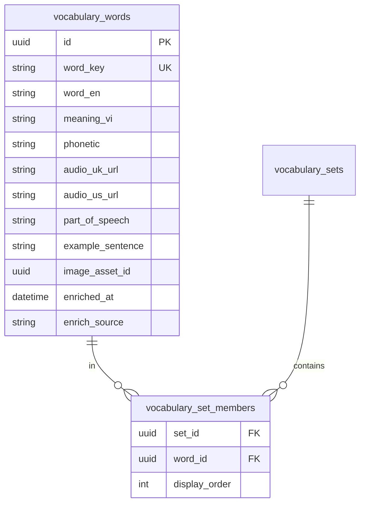

# Tiến độ Vocabulary Library + Dictionary API

> Cập nhật: **2026-06-08**  
> Tham chiếu: [`promt.md`](../promt.md) (Vocabulary Library, Automatic Enrichment) · [`VOCABULARY_SET_DB_DESIGN.md`](./VOCABULARY_SET_DB_DESIGN.md) · [`VOCABULARY_BLOCK_DESIGN.md`](./VOCABULARY_BLOCK_DESIGN.md)  
> Làm **lần lượt** — Phase 1 → 5 trước; Phase 6–7 sau khi MVP chạy ổn.

---

## Mục tiêu

| # | Mục tiêu | Lý do |
|---|----------|-------|
| 1 | **1 từ = 1 asset** trong thư viện trung tâm | Tránh trùng `apple` ở 50 bộ từ |
| 2 | **IPA + audio UK/US = URL** — enrich **1 lần** / từ | Scale Dictionary API; không upload file phát âm |
| 3 | **Bộ từ chỉ tham chiếu** (`set_members`) | Đúng `promt.md`; sửa IPA/audio 1 chỗ → mọi lesson cập nhật |
| 4 | **GV chỉ nhập** `word_en` + `meaning_vi` | Hệ thống tự lấy phiên âm & audio |

---

## Kiến trúc mục tiêu

```text
vocabulary_words          ← Thư viện (Knowledge Asset)
    ↑
vocabulary_set_members    ← Nhóm + thứ tự trong bộ
    ↑
vocabulary_sets           ← Bộ từ (Fruits, School…)
```



### So với hiện tại

| | Hiện tại (`003`) | Mục tiêu (`008`) |
|--|------------------|------------------|
| Từ trùng giữa các set | Nhiều row `vocabulary_items` | 1 row `vocabulary_words` |
| Enrich Dictionary | Chưa có | Cache `enriched_at` — 0 API call nếu đã có |
| Resolve lesson | `vocabulary_items WHERE set_id` | `members JOIN words` — 1 query, ~30 row |
| Audio | `audio_asset_id` placeholder | `audio_uk_url`, `audio_us_url` (URL ngoài) |

### Hiệu năng (không lo ở scale dự án)

- JOIN 20–50 row/bộ từ: **< 2 ms** với index `(set_id, display_order)`, `UK(word_key)`.
- Bottleneck thực tế: **Dictionary API** (network), không phải số bảng.
- Bắt buộc: **1 query JOIN** trong `buildResolvedVocabularyJson` — không N+1 JPA.

---

## Tổng quan phase

| Phase | Nội dung | Trạng thái |
|-------|----------|------------|
| **1** | Migration `008` + entity + repository | ✅ **XONG** |
| **2** | `DictionaryLookupService` + package `integration/` | ✅ **XONG** |
| **3** | BE: find-or-create, enrich, resolve JOIN | ✅ **XONG** |
| **4** | Admin: thư viện từ + enrich + picker trong set | ✅ **XONG** |
| **5** | HS: hiển thị IPA + nút 🔊 UK/US | ✅ **XONG** |
| **6** | Migrate data `vocabulary_items` → library; deprecate bảng cũ | ✅ **XONG** |
| **7** | Generator Listen And Choose (dùng audio có sẵn) | ⬜ Tương lai |

---

## Phase 1 — Schema & Entity

**Mục tiêu:** Bảng mới + JPA entity; chưa đổi API public.

### Migration `008_vocabulary_library.sql`

- [x] `CREATE TABLE vocabulary_words`
  - `word_key` VARCHAR(255) **UNIQUE** — `lower(trim(word_en))`
  - `word_en`, `meaning_vi`, `phonetic`
  - `audio_uk_url`, `audio_us_url` VARCHAR(512)
  - `part_of_speech`, `example_sentence`
  - `image_asset_id`, `enriched_at`, `enrich_source`
  - audit + `voided`
- [x] `CREATE TABLE vocabulary_set_members`
  - `set_id`, `word_id`, `display_order`
  - `UNIQUE(set_id, word_id)` — không trùng từ trong 1 bộ
  - `INDEX(set_id, display_order)`, `INDEX(word_id)`
- [x] Script migrate từ `vocabulary_items` (dedupe `word_key`, insert members)
- [x] ~~Giữ `vocabulary_items` read-only tạm~~ → đã xóa Phase 6

### Backend entity

- [x] `VocabularyWord.java`
- [x] `VocabularySetMember.java`
- [x] `VocabularyWordRepository` — `findByWordKey`, `findByWordKeyIn`
- [x] `VocabularySetMemberRepository` — `findBySetIdOrderByDisplayOrder`
- [x] `VocabularyWordKeyUtil` — `lower(trim(word_en))`
- [x] `VocabularySet.members` — quan hệ OneToMany (song song `items` cũ)

### File deliverable

| Vai trò | Đường dẫn |
|---------|-----------|
| Migration | `course_english_backend/migrations/008_vocabulary_library.sql` |
| Entity | `domain/VocabularyWord.java`, `VocabularySetMember.java` |
| Repository | `repository/VocabularyWordRepository.java`, `VocabularySetMemberRepository.java` |
| Util | `util/VocabularyWordKeyUtil.java` |

---

## Phase 2 — Dictionary API ✅

**Mục tiêu:** BE proxy Free Dictionary API; package mở rộng cho nhiều provider sau.

> Kiến trúc thư mục: [`INTEGRATION_ARCHITECTURE.md`](./INTEGRATION_ARCHITECTURE.md)  
> Sample JSON: [`data.md`](../data.md) · [API apple](https://api.dictionaryapi.dev/api/v2/entries/en/apple)

### Cấu trúc package

```text
integration/
├── common/                    # HTTP, ExternalApiException
├── dictionary/
│   ├── model/VocabularyEnrichmentData.java
│   ├── port/DictionaryLookupPort.java
│   ├── service/DictionaryLookupService.java
│   └── freedictionary/        # Provider dictionaryapi.dev
│       ├── dto/               # JSON khớp data.md
│       ├── FreeDictionaryClient.java
│       ├── FreeDictionaryMapper.java
│       └── FreeDictionaryLookupAdapter.java
```

### Nguồn MVP

- **Free Dictionary API:** `GET /api/v2/entries/en/{word}` — array JSON
- Không cần API key
- Map: `phonetic`, `phonetics[].audio` (`-uk.mp3` / `-us.mp3`), `meanings[].partOfSpeech` (ưu tiên noun)

### Checklist

- [x] `DictionaryLookupPort` — interface đổi provider
- [x] `VocabularyEnrichmentData` — DTO chuẩn hoá nội bộ
- [x] `FreeDictionaryClient` — RestClient, 404 → empty
- [x] `FreeDictionaryMapper` — map theo `data.md`
- [x] `DictionaryLookupService` — facade cho Phase 3
- [x] `NoOpDictionaryLookupAdapter` — khi `enabled=false`
- [x] `application.properties` + env override
- [x] Unit test `FreeDictionaryMapperTest` + fixture JSON

### Cấu hình

```properties
integration.dictionary.free-dictionary.enabled=true
integration.dictionary.free-dictionary.base-url=https://api.dictionaryapi.dev
integration.dictionary.free-dictionary.connect-timeout-ms=3000
integration.dictionary.free-dictionary.read-timeout-ms=8000
```

### File deliverable

| Vai trò | Đường dẫn |
|---------|-----------|
| Kiến trúc | `docs/INTEGRATION_ARCHITECTURE.md` |
| Common | `integration/common/*` |
| Facade | `integration/dictionary/service/DictionaryLookupService.java` |
| Provider | `integration/dictionary/freedictionary/*` |
| Test | `src/test/.../FreeDictionaryMapperTest.java` |

---

## Phase 3 — Backend API & Resolve ✅

**Mục tiêu:** Find-or-create từ; enrich lazy; resolve bộ từ bằng 1 JOIN.

### Luồng enrich khi lưu từ

```text
findOrCreate(word_en, meaning_vi)
  → tìm vocabulary_words theo word_key
  → đã có + enriched_at → trả luôn (0 API call)
  → mới hoặc chưa enriched_at → DictionaryLookupService → lưu IPA + audio URLs
```

### `VocabularyWordService`

- [x] `findOrCreate(String wordEn, String meaningVi)` → `VocabularyWord`
- [x] `enrich(UUID wordId, force)` — skip nếu `enriched_at != null` (trừ `force=true`)
- [x] `enrichBatch(List<UUID> wordIds, force)`
- [x] `lookupPreview` — preview không lưu
- [x] `search` / `getById` / `create`

### Cập nhật `VocabularySetService`

- [x] `create` / `update`: lưu `vocabulary_set_members` qua `findOrCreate`
- [x] `buildResolvedVocabularyJson`: `JOIN FETCH` 1 query (`findResolvedBySetId`)
- [x] Response JSON: `audioUkUrl`, `audioUsUrl`, `partOfSpeech`
- [x] ~~Fallback `vocabulary_items`~~ → đã gỡ Phase 6
- [x] `enrichAll(setId, force)` — chỉ từ chưa `enriched_at` khi `force=false`
- [x] `LessonPublishValidator` — đếm members (fallback items)

### API endpoints

| Method | Path | Mô tả |
|--------|------|--------|
| POST | `/api/v1/vocabulary-words/search` | List thư viện |
| GET | `/api/v1/vocabulary-words/{id}` | Chi tiết 1 từ |
| POST | `/api/v1/vocabulary-words` | Tạo từ + auto enrich |
| POST | `/api/v1/vocabulary-words/{id}/enrich?force=` | Enrich lại |
| POST | `/api/v1/vocabulary-words/lookup` | Preview `{ wordEn }` |
| POST | `/api/v1/vocabulary-sets/{id}/enrich-all?force=` | Enrich cả bộ |

### File deliverable

| Vai trò | Đường dẫn |
|---------|-----------|
| Service | `service/VocabularyWordService.java`, `impl/VocabularyWordServiceImpl.java` |
| Controller | `controller/VocabularyWordController.java` |
| Resolve | `impl/VocabularySetServiceImpl.java` |
| Repository | `VocabularySetMemberRepository.findResolvedBySetId` |

---

## Phase 4 — Admin UI ✅

**Mục tiêu:** GV nhập word + meaning; hệ thống lấy IPA/audio; chọn từ có sẵn vào bộ.

### Thư viện từ `/admin/vocabulary-words`

- [x] Trang list: search, cột IPA, audio UK/US, POS
- [x] Tạo từ + auto enrich · Chi tiết + **Enrich lại**
- [x] Preview audio inline (`VocabularyAudioPreview`)

### Cập nhật form bộ từ `/admin/vocabulary-sets`

- [x] Blur ô Word → `POST /vocabulary-words/lookup` → preview IPA + audio
- [x] **Chọn từ thư viện** — `VocabularyWordPicker`
- [x] **Enrich cả bộ** — `POST /vocabulary-sets/{id}/enrich-all`
- [x] IPA vẫn sửa tay; POS hiện helper text
- [x] Import CSV + Lưu → BE find-or-create + enrich

### Types FE

- [x] `shared/api/vocabularyWord.ts`
- [x] `VocabularyItemRecord` + `ResolvedVocabularyItem` — audio UK/US, POS

### File deliverable

| Vai trò | Đường dẫn |
|---------|-----------|
| Trang thư viện | `pages/admin/ManageVocabularyWordsPage.tsx` |
| Picker | `admin/components/vocabulary/VocabularyWordPicker.tsx` |
| Audio preview | `admin/components/vocabulary/VocabularyAudioPreview.tsx` |
| Form bộ từ | `admin/components/vocabulary/VocabularySetForm.tsx` |
| API client | `shared/api/vocabularyWord.ts` |
| Route + nav | `routes.tsx`, `AdminSidebar.tsx`, `paths.ts` |

---

## Phase 5 — Student UI ✅

**Mục tiêu:** HS thấy IPA và nghe phát âm UK/US trên flashcard & list.

### `VocabularyFlashcard` / `VocabularyBlock`

- [x] Hiển thị `phonetic` (`showPhonetic`)
- [x] Nút 🔊 UK / US — `VocabularyAudioButtons`
- [x] `HTMLAudioElement` — play `audioUkUrl` / `audioUsUrl`
- [x] Không có URL → ẩn nút; click audio không lật flashcard (`stopPropagation`)

### CSS

- [x] `.vocabulary-audio-buttons`, `.vocabulary-audio-btn` trong `lesson-reader.css`

### `vocabularyPayload.ts`

- [x] Parse `audioUkUrl`, `audioUsUrl`, `partOfSpeech` (Phase 4)

### File deliverable

| Vai trò | Đường dẫn |
|---------|-----------|
| Audio buttons | `student/lessonPlayer/vocabulary/VocabularyAudioButtons.tsx` |
| Flashcard | `VocabularyFlashcard.tsx` |
| List | `VocabularyBlock.tsx` |

### Kiểm thử E2E (manual)

- [ ] Admin enrich `apple` → Publish set → Publish lesson
- [ ] HS tab Bài học: thấy `/ˈæp.əl/` + 🔊 UK/US phát được
- [ ] Flashcard: bấm 🔊 không lật thẻ

---

## Phase 6 — Migration & Deprecate ✅

**Mục tiêu:** Chuyển hết data; gỡ `vocabulary_items`.

- [x] `VocabularySetService` chỉ đọc `members` — bỏ nhánh legacy
- [x] `LessonPublishValidator` chỉ đếm `vocabulary_set_members`
- [x] Xóa entity `VocabularyItem` + `VocabularyItemRepository`
- [x] Bỏ `List<VocabularyItem> items` trên `VocabularySet` entity
- [x] Migration `009_drop_vocabulary_items.sql`
- [x] Cập nhật `seed_vocabulary_set_demo.sql` → words + members
- [x] Cập nhật `VOCABULARY_SET_DB_DESIGN.md` → schema library

**Lệnh DB (sau khi đã chạy 008):**

```bash
mysql -u … -p course_english < course_english_backend/migrations/009_drop_vocabulary_items.sql
```

---

## Phase 7 — Generator Listen And Choose (tương lai)

> Sau Phase 5 — dùng `audio_uk_url` / `audio_us_url` có sẵn.

- [ ] `vocabActivityGenerator.ts` — thêm `LISTEN_CHOOSE`
- [ ] Player HS — block nghe + chọn đáp án
- [ ] Publish validation cho block type mới

---

## Workflow GV (sau khi xong Phase 4–5)

```text
/admin/vocabulary-words  (tuỳ chọn — duyệt thư viện)
→ /admin/vocabulary-sets → Tạo bộ từ
   · Nhập apple + Quả táo → hệ thống enrich IPA + audio
   · Hoặc "Chọn từ có sẵn" từ thư viện
→ Publish bộ từ
→ Lesson Editor → + Bộ từ vào bài
→ Publish lesson
→ HS: flashcard/list + 🔊 UK/US
```

---

## Rủi ro & xử lý

| Rủi ro | Xử lý |
|--------|--------|
| Dictionary API down / rate limit | Cache `enriched_at`; retry; GV nhập IPA tay |
| URL audio hết hạn | Phase sau: mirror vào storage; MVP dùng URL trực tiếp |
| Cùng `word_en`, nghĩa khác (bank / bờ sông) | Hiếm MVP; phase sau: `sense_key` hoặc `meaning_override` trên member |
| Từ không có trong API (tên riêng) | 404 → chỉ lưu word + meaning, không enrich |

---

## Lệnh DB (khi implement xong Phase 1)

```bash
mysql -u … -p course_english < course_english_backend/migrations/008_vocabulary_library.sql
```

---

## Lịch sử

| Ngày | Ghi chú |
|------|---------|
| 2026-06-08 | Tạo doc tiến độ — kiến trúc 3 bảng + Dictionary enrich |
| 2026-06-08 | Phase 1 ✅ | Migration `008`, entity, repository, migrate data |
| 2026-06-08 | Phase 2 ✅ | Package `integration/`, Free Dictionary client + mapper + test |
| 2026-06-08 | Phase 3 ✅ | VocabularyWordService, members save, JOIN resolve, API endpoints |
| 2026-06-08 | Phase 4 ✅ | Admin thư viện từ, picker, lookup blur, enrich cả bộ |
| 2026-06-08 | Phase 5 ✅ | HS flashcard + list: IPA + 🔊 UK/US |
| 2026-06-08 | Phase 6 ✅ | Gỡ `vocabulary_items`, migration `009`, cleanup BE |

---

**Tóm tắt:** Schema library ✅ · Dictionary ✅ · BE resolve ✅ · Admin UI ✅ · HS 🔊 ✅ · Legacy gỡ ✅ · **Tiếp theo: Phase 7 Listen And Choose · E2E manual**
